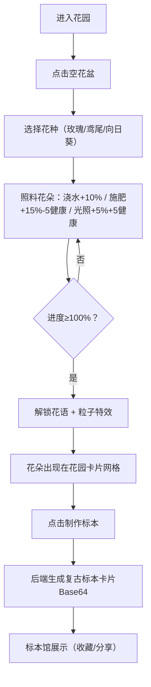

## 1. 产品概述

虚拟花语密码与数字标本馆是一款让用户化身花语使者，通过种植和照料虚拟花朵解锁花语密码，并将花朵制作成可分享数字标本卡片的全栈Web应用。融合了种植养成、花语文化与数字收藏的趣味体验。

- 目标用户：喜欢花卉文化、数字收藏、轻度养成类游戏的用户
- 产品价值：将传统文化与数字体验结合，创造兼具教育性与趣味性的交互产品

## 2. 核心功能

### 2.1 功能模块

1. **花园视图**：展示空花盆网格与已解锁花朵卡片，支持分页浏览
2. **种植盆交互**：选择种子、浇水、施肥、光照控制，显示生长进度与健康度
3. **花语解锁展示**：花朵成熟时展示花语与粒子光晕特效
4. **标本制作**：将已解锁花朵制作成复古风格数字标本卡片
5. **标本馆**：虚拟列表展示所有标本，支持收藏与分享
6. **实时协同提示**：轮询展示其他用户的解锁动态

### 2.2 页面详情

| 页面名称 | 模块名称 | 功能描述 |
|---------|---------|---------|
| 花园主页 | 花盆网格 | 自适应Grid布局，空花盆点击种植，已解锁花朵卡片展示 |
| 花园主页 | 种植控制面板 | 种子选择、浇水、施肥、光照按钮与进度条 |
| 花园主页 | 花语解锁弹窗 | 花语文字 + 粒子光晕特效 |
| 标本馆 | 标本虚拟列表 | 复古风格标本卡片，支持收藏与分享链接生成 |
| 全局 | 协同提示条 | 右下角滑入展示其他用户解锁动态 |

## 3. 核心流程

用户从空花盆开始，选择种子后每日通过浇水、施肥、光照照料花朵，当生长进度达到100%时自动解锁花语。解锁后可将花朵制作成数字标本卡片，在标本馆中收藏和分享。

## 4. 用户界面设计

### 4.1 设计风格

- **主色调**：草绿 #7DCEA0、花土 #8B5A2B、复古米白 #FFF8E7
- **渐变背景**：淡绿 #EAF7E1 → 浅蓝 #D4E9F7 线性渐变
- **按钮**：圆角矩形 border-radius:12px，悬停上浮 translateY(-2px) + 阴影加深
- **卡片**：纸纹纹理叠加，底部滑入 + opacity 0→1 过渡 ease-out 0.3s
- **字体**：标题采用优雅衬线体，正文清晰易读无衬线体
- **动效**：花盆/卡片悬停 scale(1.05) + 光泽扫过动画

### 4.2 页面设计概览

| 页面名称 | 模块名称 | UI元素 |
|---------|---------|-------|
| 花园主页 | 花盆网格 | CSS Grid minmax(150px,1fr)，花盆圆形直径120px，泥土色盆口 |
| 花园主页 | 种植面板 | 进度条、健康度指示、三个操作按钮（水滴/肥料/阳光图标） |
| 花园主页 | 花朵卡片 | Canvas像素风花朵插图、花名、花语、解锁时间 |
| 标本馆 | 标本卡片 | 复古边框 #D4A76A、米白底 #FFF8E7、收藏心形按钮、分享链接 |
| 全局 | 提示条 | 半透明深色底 #2A2A3A、浅文字 #EEEEFF、右下角滑入淡出 |

### 4.3 响应式设计

- 桌面端：三列网格，花盆直径120px
- 平板端：两列网格
- 手机端：单列网格，花盆直径80px
