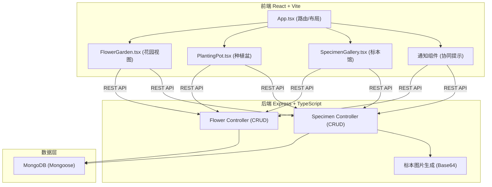
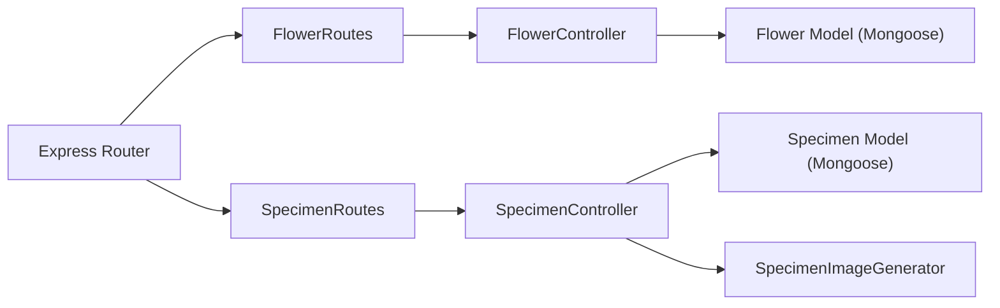
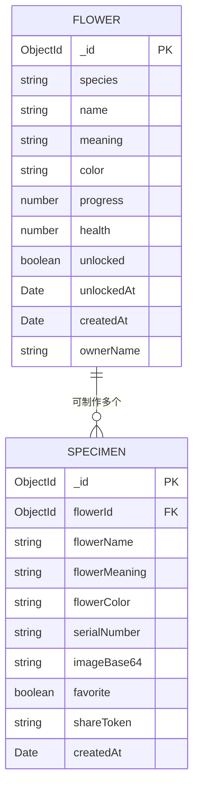

## 1. 架构设计



## 2. 技术选型

- **前端**：React 18.2.0 + React DOM 18.2.0 + TypeScript 5.5.0 + Vite 5.4.0
- **构建工具**：Vite 5.4.0，@vitejs/plugin-react 4.0.0，开发端口 5173
- **后端**：Express 4.18.0 + TypeScript，服务端口 3001
- **数据库**：MongoDB + Mongoose 8.0.0
- **跨域**：cors 2.8.5
- **状态管理**：React useState/useEffect + Context
- **路由**：原生条件渲染（单页多视图切换）

## 3. 前端路由/视图定义

| 视图 | 说明 |
|-----|-----|
| garden | 花园视图，花盆网格 + 种植交互 |
| gallery | 标本馆视图，虚拟列表展示标本 |

## 4. API 定义

### 4.1 Flower API

```typescript
// 数据模型
interface Flower {
  _id: string;
  species: 'rose' | 'iris' | 'sunflower';
  name: string;
  meaning: string;
  color: string;
  progress: number;      // 0-100
  health: number;        // 0-100
  unlocked: boolean;
  unlockedAt?: Date;
  createdAt: Date;
  ownerName: string;
}

// GET    /api/flowers?page=1&limit=20       获取花朵列表（分页）
// POST   /api/flowers                        创建新花朵（种植）
// PATCH  /api/flowers/:id                    更新花朵（浇水/施肥/光照）
// GET    /api/flowers/latest                 获取最近解锁的花朵（协同提示）
```

### 4.2 Specimen API

```typescript
// 数据模型
interface Specimen {
  _id: string;
  flowerId: string;
  flowerName: string;
  flowerMeaning: string;
  flowerColor: string;
  serialNumber: string;    // 唯一序列号
  imageBase64: string;     // 复古边框标本图
  favorite: boolean;
  shareToken: string;
  createdAt: Date;
}

// GET    /api/specimens                     获取所有标本
// POST   /api/specimens                      制作标本（由花朵生成）
// PATCH  /api/specimens/:id                  更新标本（收藏状态）
// GET    /api/specimens/:id/share            获取分享链接
```

## 5. 后端架构



## 6. 数据模型

### 6.1 ER 图



### 6.2 种子初始数据

| species | name | meaning | color |
|---------|------|---------|-------|
| rose | 红玫瑰 | 热情与爱 | #FF3366 |
| iris | 蓝鸢尾 | 优雅与希望 | #5B8DEF |
| sunflower | 黄向日葵 | 阳光与忠诚 | #FFC93C |

## 7. 项目文件结构

```
.
├── package.json
├── vite.config.js
├── tsconfig.json
├── index.html
├── server/
│   └── src/
│       └── app.ts              # Express服务 + 全部后端逻辑
└── src/
    ├── App.tsx                 # 主组件 + 路由 + 全局样式
    └── components/
        ├── FlowerGarden.tsx    # 花园视图
        ├── PlantingPot.tsx     # 种植盆组件
        └── SpecimenGallery.tsx # 标本馆视图
```
