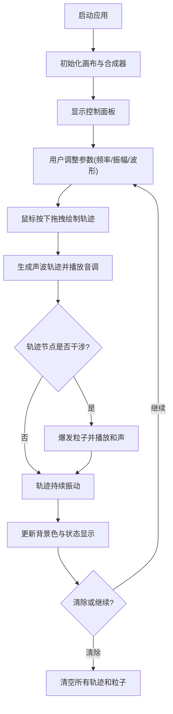

## 1. 产品概述

虚拟声波雕塑是一款基于浏览器的创意交互应用，让用户以声波雕刻家的身份，通过鼠标拖拽在画布上绘制声波轨迹，创造视觉与听觉融合的艺术作品。目标用户为音乐爱好者、数字艺术家及普通创意用户，产品价值在于提供低门槛、高沉浸感的视听创意体验。

## 2. 核心功能

### 2.1 功能模块
1. **主画布**：声波轨迹绘制、节点发光、振动动画、干涉粒子爆发、背景动态渐变
2. **合成器**：Web Audio API 驱动的多音色正弦/方波/锯齿波生成器，支持多轨混音
3. **控制面板**：频率滑块、振幅滑块、波形选择器、生成新轨迹按钮、清除所有按钮
4. **状态显示**：页面标题区域实时显示活跃轨迹数与干涉次数

### 2.2 页面详情
| 页面名称 | 模块名称 | 功能描述 |
|---------|---------|---------|
| 主应用页 | 画布绘制模块 | 鼠标拖拽生成声波轨迹，轨迹颜色按拖拽方向从暖色到冷色渐变，轨迹节点持续振动发光 |
| 主应用页 | 干涉检测模块 | 两条以上轨迹节点间距小于5px时触发干涉，爆发彩色粒子并播放和声 |
| 主应用页 | 合成器模块 | 基于 Web Audio API 生成多音色声波，支持音量与波形切换 |
| 主应用页 | 控制面板模块 | 频率(20-2000Hz)、振幅(0-1)调节，波形选择，快速生成与清除功能 |
| 主应用页 | 动态背景模块 | 背景色根据轨迹数量平滑渐变，边框发光效果 |

## 3. 核心流程

用户启动应用后，通过控制面板调整参数，在画布上按下鼠标拖拽绘制声波轨迹，每条轨迹持续振动并播放对应音调；多条轨迹交织时产生干涉粒子与和声；背景色随轨迹数量动态变化；用户可随时清除画布或一键生成随机轨迹。

## 4. 用户界面设计

### 4.1 设计风格
- **主色调**：霓虹科幻风，暖色 #ff4466 → 冷色 #4488ff 渐变
- **背景色**：深蓝 #0a0f2a → 深紫红 #2a0a15 动态渐变
- **按钮风格**：圆角6px，背景 #ff6688，悬停 #ff88aa，点击缩放0.95
- **字体**：现代无衬线字体，支持霓虹发光效果
- **布局风格**：画布居中(960x640)，右侧固定控制面板(220px宽)
- **动画过渡**：所有交互元素 200ms ease-out 平滑过渡

### 4.2 页面设计概述
| 页面名称 | 模块名称 | UI 元素 |
|---------|---------|---------|
| 主应用页 | 画布区域 | 960x640 居中画布，2px 发光边框，动态渐变背景，轨迹与粒子动画 |
| 主应用页 | 控制面板 | 半透明深色背景 #1a1a2e(0.85透明度)，圆角8px，含滑块/下拉/按钮 |
| 主应用页 | 状态显示 | 页面顶部标题区域显示"活跃轨迹: N | 干涉次数: M" |

### 4.3 响应性
桌面端优先，画布固定尺寸960x640居中显示，控制面板固定于画布右侧。

### 4.4 性能要求
- 基础帧率：60FPS
- 轨迹数>8且粒子>200时：≥30FPS
