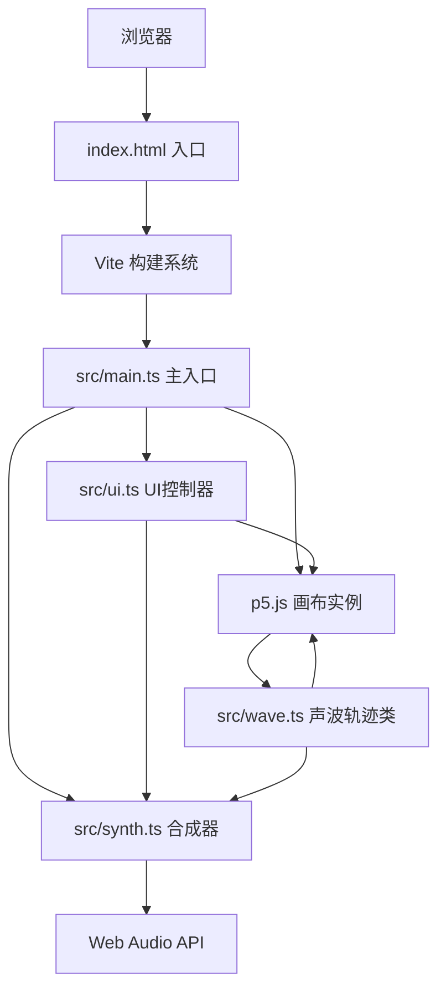

## 1. 架构设计



## 2. 技术描述
- **前端框架**：p5.js@1.9.0 + TypeScript@5.5.0
- **构建工具**：Vite@5.4.0（端口 3000）
- **音频引擎**：Web Audio API（原生）
- **样式方案**：内联 CSS + p5.js GUI 元素
- **初始化工具**：手动配置 package.json / vite.config.js / tsconfig.json

## 3. 项目文件结构
| 文件路径 | 用途 |
|---------|------|
| package.json | 项目依赖与脚本配置（p5@1.9.0、typescript@5.5.0、vite@5.4.0） |
| vite.config.js | Vite 构建配置，端口 3000 |
| tsconfig.json | TypeScript 严格模式配置 |
| index.html | 入口页面，挂载画布与控制面板 |
| src/main.ts | 主入口，p5.js 实例模式，初始化画布与交互循环 |
| src/wave.ts | Wave 类：频率/振幅/相位/颜色属性，波形绘制，音调播放，干涉检测 |
| src/synth.ts | Synth 类：Web Audio API 封装，正弦/方波/锯齿波生成，多轨混音，音量控制 |
| src/ui.ts | UIController 类：频率/振幅滑块，波形选择器，生成/清除按钮，参数同步 |

## 4. 核心类与接口定义

### 4.1 Wave 类 (src/wave.ts)
```typescript
interface WavePoint {
  x: number;
  y: number;
  baseY: number;
}

interface Particle {
  x: number;
  y: number;
  vx: number;
  vy: number;
  life: number;
  maxLife: number;
  color: string;
  size: number;
}

declare class Wave {
  points: WavePoint[];
  frequency: number;
  amplitude: number;
  phase: number;
  color: string;
  waveform: 'sine' | 'square' | 'sawtooth';
  synth: Synth;
  oscillator: OscillatorNode | null;
  gainNode: GainNode | null;
  nodes: { x: number; y: number; offset: number }[];

  constructor(points: WavePoint[], frequency: number, amplitude: number, color: string, waveform: string, synth: Synth);
  update(time: number): void;
  draw(p: p5): void;
  getNodes(): { x: number; y: number }[];
  checkInterference(other: Wave): { x: number; y: number; color: string }[] | null;
  triggerInterferenceSound(frequencies: number[]): void;
  stop(): void;
}
```

### 4.2 Synth 类 (src/synth.ts)
```typescript
declare class Synth {
  audioContext: AudioContext;
  masterGain: GainNode;
  volume: number;

  constructor();
  setVolume(v: number): void;
  createOscillator(frequency: number, type: OscillatorType, gain?: number): { osc: OscillatorNode; gain: GainNode };
  playHarmony(frequencies: number[], type: OscillatorType, duration?: number): void;
  getLCM(numbers: number[]): number;
}
```

### 4.3 UIController 类 (src/ui.ts)
```typescript
declare class UIController {
  frequency: number;
  amplitude: number;
  waveform: 'sine' | 'square' | 'sawtooth';
  onGenerate: (() => void) | null;
  onClear: (() => void) | null;
  onChange: ((params: { frequency: number; amplitude: number; waveform: string }) => void) | null;

  constructor(containerId: string);
  getParams(): { frequency: number; amplitude: number; waveform: string };
}
```

## 5. 性能优化策略
- **对象池**：Particle 对象复用，避免频繁 GC
- **空间划分**：干涉检测使用网格空间索引，降低 O(n²) 复杂度
- **帧率节流**：粒子数量 >200 时降低粒子更新频率
- **音频优化**：复用 OscillatorNode，及时 stop 不再使用的节点
- **绘制优化**：离屏 canvas 缓存静态轨迹，仅重绘振动部分
