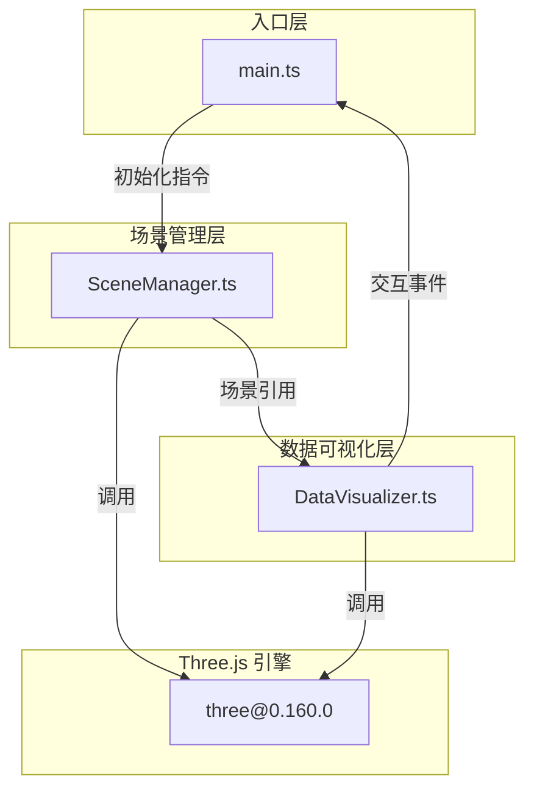

## 1. 架构设计

纯前端三维可视化应用，采用模块化分层架构：



### 模块职责与数据流向

| 模块 | 职责 | 输入 | 输出 |
|-----|------|------|------|
| main.ts | 应用入口，初始化管理器，启动交互与渲染循环 | 无 | 调用 SceneManager 初始化，传递场景引用给 DataVisualizer，绑定窗口事件 |
| SceneManager.ts | 管理 Three.js 场景、相机、光照、控制器、城市建筑、星空背景 | main.ts 的初始化指令 | 输出 scene/camera/renderer/controls 引用给 DataVisualizer |
| DataVisualizer.ts | 管理情绪光团、交互逻辑（悬停/拖拽/融合）、筛选、轨迹、粒子、标签、统计 | SceneManager 的场景引用，main.ts 的事件回调 | 更新光团状态、触发视觉反馈、输出统计数据 |

## 2. 技术说明

- **前端框架**：无 UI 框架，纯 TypeScript + Three.js
- **构建工具**：Vite@5.4.0
- **语言**：TypeScript@5.5.0（严格模式，target: ES2020）
- **3D 引擎**：three@0.160.0 + @types/three@0.160.0
- **后端**：无，纯前端应用
- **数据库**：无，数据为前端模拟生成

## 3. 路由定义

单页面应用，无路由。

| 路由 | 用途 |
|-----|------|
| / | 主场景（唯一页面） |

## 4. 数据模型

### 4.1 情绪类型定义

```typescript
type EmotionType = 'anger' | 'calm' | 'joy' | 'anxiety' | 'sadness';

interface EmotionConfig {
  type: EmotionType;
  name: string;      // 中文名称：愤怒/平静/喜悦/焦虑/忧郁
  color: string;     // 十六进制颜色值
}

const EMOTION_CONFIGS: EmotionConfig[] = [
  { type: 'anger',   name: '愤怒', color: '#ff6688' },
  { type: 'calm',    name: '平静', color: '#88aaff' },
  { type: 'joy',     name: '喜悦', color: '#88ff88' },
  { type: 'anxiety', name: '焦虑', color: '#ffaa66' },
  { type: 'sadness', name: '忧郁', color: '#dd88ff' },
];
```

### 4.2 情绪光团数据模型

```typescript
interface EmotionOrb {
  id: string;
  mesh: THREE.Mesh;           // 球体网格
  type: EmotionType;
  color: THREE.Color;
  intensity: number;          // 情绪强度 0-100
  baseRadius: number;         // 基础半径 0.15-0.4
  pulsePhase: number;         // 脉动相位 0-2π
  pulsePeriod: number;        // 脉动周期 2-5 秒
  basePosition: THREE.Vector3;// 原始位置
  isHovered: boolean;
  isDragging: boolean;
  targetOpacity: number;      // 目标透明度（用于筛选过渡）
  currentOpacity: number;
}
```

### 4.3 交互状态

```typescript
interface InteractionState {
  hoveredOrb: EmotionOrb | null;
  draggedOrb: EmotionOrb | null;
  dragTrail: THREE.Vector3[];         // 拖拽轨迹点
  lastTrailSampleTime: number;        // 上次轨迹采样时间
  selectedEmotions: Set<EmotionType>; // 筛选选中的情绪类型
}
```

## 5. 文件结构

```
project-root/
├── package.json              # 依赖与启动脚本
├── vite.config.js            # Vite 构建配置（端口3000）
├── tsconfig.json             # TypeScript 配置（严格模式 ES2020）
├── index.html                # 入口页面（全屏canvas）
└── src/
    ├── main.ts               # 入口：初始化、事件绑定、渲染循环
    ├── SceneManager.ts       # 场景管理：相机/光照/城市/星空
    └── DataVisualizer.ts     # 光团管理：生成/交互/筛选/统计
```

### 文件调用关系

```
main.ts
  ├── 导入 SceneManager
  │     └── SceneManager.init() → 返回 { scene, camera, renderer, controls }
  ├── 导入 DataVisualizer
  │     └── DataVisualizer.init(scene, camera, renderer)
  ├── 绑定 window.resize
  └── 启动 requestAnimationFrame 循环
        ├── SceneManager.update(delta) → 城市自转
        └── DataVisualizer.update(delta, fps) → 光团脉动/交互/统计更新

SceneManager.ts
  ├── 创建 THREE.Scene, PerspectiveCamera, WebGLRenderer
  ├── 创建 AmbientLight + PointLight
  ├── 创建 OrbitControls
  ├── buildCity() → 生成低多边形建筑群（EdgesGeometry 发光边缘）
  ├── buildStars() → 生成 200 颗 Points 星点
  └── update(delta) → cityGroup.rotation.y += 0.002

DataVisualizer.ts
  ├── init(scene, camera, renderer)
  │     ├── createOrbs() → 生成 80 个随机情绪光团
  │     ├── setupRaycaster() → 鼠标拾取
  │     ├── setupEventListeners() → mousemove/mousedown/mouseup
  │     ├── createUIPanels() → 筛选面板+统计面板
  │     └── createLabelSprite() → 悬停标签
  ├── update(delta, fps)
  │     ├── updateOrbPulses(fps) → 脉动更新（FPS低时降频）
  │     ├── updateHoverEffects() → 悬停视觉反馈
  │     ├── updateDragTrail() → 拖拽轨迹采样
  │     ├── updateOpacityTransitions() → 筛选透明度过渡
  │     ├── updatePulseRings() → 脉冲环动画
  │     ├── updateParticles() → 粒子爆发动画
  │     └── updateStatsPanel() → 每秒更新统计数据
  ├── handleHover(intersect) → 悬停光团
  ├── handleDragStart(intersect) → 开始拖拽
  ├── handleDragMove() → 拖拽移动（射线投射到平面）
  ├── handleDragEnd() → 结束拖拽 + 融合检测
  ├── toggleEmotionFilter(type) → 切换情绪筛选
  └── fuseOrbs(orbA, orbB) → 光团融合 + 粒子爆发
```
