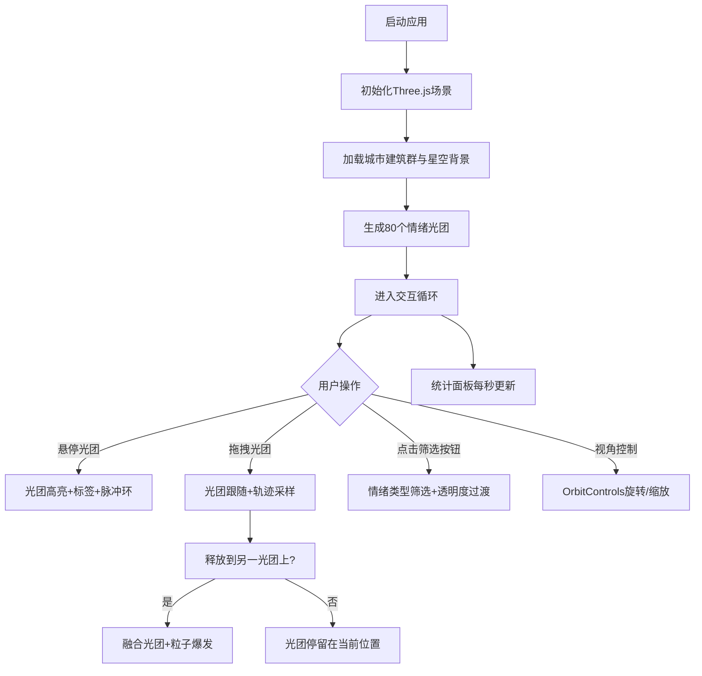

## 1. 产品概述

赛博未来城市情绪数据全息操控可视化应用——用户以"数据编织师"身份，通过手势（鼠标悬停、拖拽、点击）在三维城市模型上空筛选、聚合与重新排列情绪光团，动态揭示城市整体情绪地图与流动趋势。

- 核心目的：以沉浸式三维交互方式直观呈现城市市民情绪数据的分布、聚合与变化
- 目标用户：数据分析师、城市管理者、交互艺术体验者
- 产品价值：将抽象的情绪数据转化为可操控、可感知的视觉化体验，帮助用户发现情绪流动规律

## 2. 核心功能

### 2.1 功能模块

1. **三维城市底景模块**：赛博风格半透明建筑群、发光边缘效果、缓慢自转、星空背景
2. **情绪光团系统**：80个随机分布的情绪球体、颜色编码情绪类型、脉动光晕动画
3. **悬停交互模块**：光团放大高亮、文字标签显示、其他光团变暗、脉冲环扩散
4. **拖拽融合模块**：光团跟随鼠标、拖拽轨迹采样、光团融合、粒子爆发效果
5. **情绪筛选面板**：五种情绪类型多选筛选、透明度过渡动画、玻璃拟态 UI
6. **实时统计面板**：光团数量、平均情绪强度、主导情绪显示、数字颜色动画

### 2.2 页面详情

| 页面名称 | 模块名称 | 功能描述 |
|---------|---------|---------|
| 主场景 | 三维城市底景 | 低多边形建筑群，颜色 #223355，发光边缘 #4488aa，高度 0.5-3 单位，自转 0.002 rad/s，深紫到墨黑径向渐变背景，200颗静态星点 |
| 主场景 | 情绪光团系统 | 80个球体半径 0.15-0.4 单位，5种情绪颜色随机分配，半径 1.0-1.3 倍正弦脉动，周期 2-5 秒 |
| 主场景 | 悬停交互 | 悬停光团放大 1.5 倍、透明度 0.6、情绪标签显示（情绪名+强度%）、其他光团透明度 0.3、彩色脉冲环 0.5→1.5 单位，0.8 秒消失 |
| 主场景 | 拖拽融合 | 左键拖拽光团跟随、轨迹线段采样（0.1秒/次，最多20点）、释放时融合（半径之和×0.8）、30粒子爆发（半径1.5单位，0.5秒）、颜色加权混合、强度累加 |
| 筛选面板 | 情绪类型筛选 | 左下角 200×300px 面板，5个圆形按钮（直径30px，对应情绪色），多选高亮，未匹配光团 0.5 秒渐变透明 |
| 统计面板 | 实时数据统计 | 右下角 250×120px 面板，总数量/平均强度/主导情绪，每秒更新，数字 0.3 秒颜色渐变动画 |

## 3. 核心流程

用户启动应用后进入三维全息城市场景：
1. 场景自动加载：城市建筑群缓慢自转，情绪光团随机漂浮并脉动
2. 用户可自由旋转/缩放视角（OrbitControls）
3. 鼠标悬停光团 → 光团高亮放大并显示情绪信息，周围扩散脉冲环
4. 鼠标拖拽光团 → 光团跟随移动，留下彩色轨迹
5. 释放光团在另一光团上方 → 两光团融合，爆发粒子，生成混合光团
6. 点击左下角筛选按钮 → 只显示选中情绪类型的光团，其他渐隐
7. 右下角面板实时更新统计数据

## 4. 用户界面设计

### 4.1 设计风格

- **主色调**：赛博朋克暗色，深紫 #0f0a1a → 墨黑 #050308 径向渐变
- **辅助色**：建筑发光蓝 #4488aa，情绪五色（愤怒 #ff6688、平静 #88aaff、喜悦 #88ff88、焦虑 #ffaa66、忧郁 #dd88ff）
- **UI 面板**：玻璃拟态风格，背景 #0a0e1a 透明度 0.6，边框 1px 半透明 #4488aa，圆角 10px
- **动效**：所有过渡使用 ease-in-out，时长 0.3-0.5 秒
- **光标**：默认十字光标，拖拽时手形光标

### 4.2 页面设计概览

| 页面名称 | 模块名称 | UI 元素 |
|---------|---------|---------|
| 主场景 | 三维城市 | 低多边形建筑+发光边缘、自转动画、星空背景、情绪光团球体+脉动光晕 |
| 主场景 | 交互反馈 | 悬停脉冲环、拖拽轨迹线段、融合粒子爆发、情绪文字标签 |
| 筛选面板 | 控制面板 | 标题文字（白色）、5个圆形情绪色按钮（点击高亮）、面板悬停放大1.02倍+边框增亮 |
| 统计面板 | 数据显示 | 标签文字（白色#ffffff）、数字（对应情绪色高亮）、面板悬停放大1.02倍+边框增亮 |

### 4.3 响应式

- Desktop-first 设计，全屏 Canvas 渲染
- Canvas 大小随窗口 resize 自动适配
- UI 面板使用 fixed 定位，距屏幕边缘固定距离（左/右 20px，下 20px）

### 4.4 3D 场景指引

- **环境氛围**：赛博朋克未来感，深紫/墨黑基调，霓虹色发光点缀
- **光照设置**：AmbientLight 环境光（强度0.3）+ PointLight 点光源（位置上方，强度0.8，颜色#ffffff）
- **相机设置**：PerspectiveCamera，fov 60，near 0.1，far 1000，初始位置 (0, 8, 12)，lookAt 原点
- **构图与焦点**：城市位于场景中心 Y=0 平面，光团分布于 Y=1.5 到 Y=4 高度，相机俯视角度
- **交互与动画**：城市自转（Y轴）、光团脉动（半径正弦）、悬停脉冲环、融合粒子、筛选透明度过渡
- **后期处理**：无额外后期处理，使用材质自发光（emissive）实现光晕感
- **性能预算**：维持 30FPS 以上，低于 25FPS 时光团脉动降频至每2帧更新

## 5. 性能约束

- 帧率 ≥ 30FPS，低于 25FPS 时自动降低光团脉动更新频率
- 光团拖拽响应延迟 ≤ 50ms
- 筛选更新视觉过渡 ≤ 300ms
