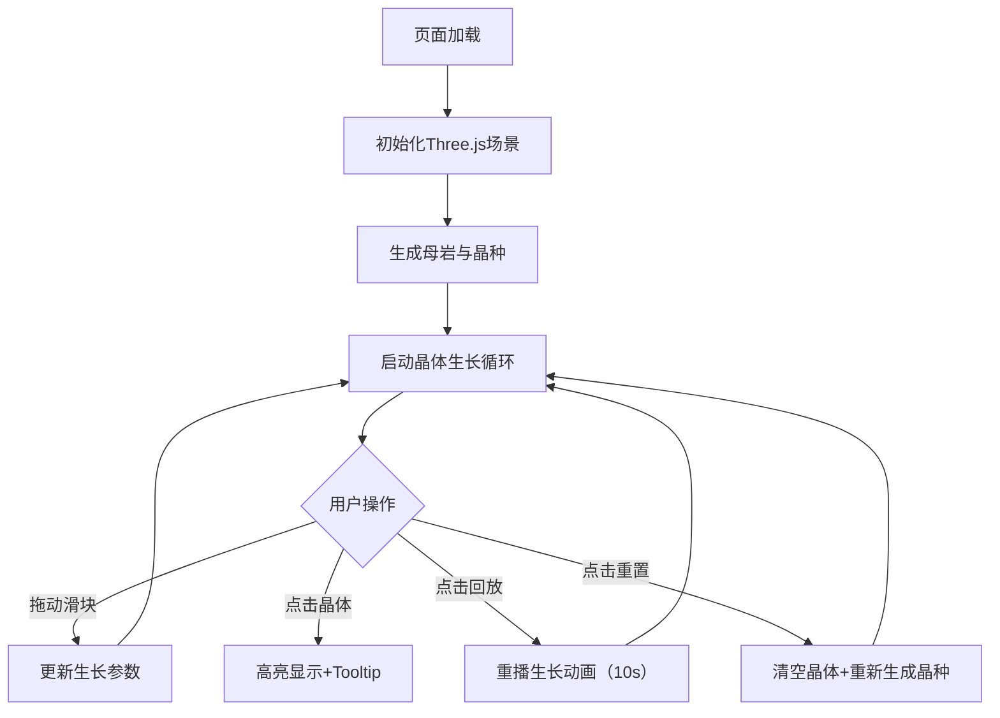

## 1. 产品概述

基于浏览器的动态矿物晶体生长模拟应用，为矿物学家提供沉浸式的热液结晶可视化工具。通过实时3D渲染展示晶体从晶种到成熟形态的演化过程，支持参数调节与交互观察。

- **核心目标**：直观展示冷却速率和溶液浓度对晶体形态的影响，辅助矿物学研究与教学
- **目标用户**：矿物学家、地质学研究者、教育工作者及学生

## 2. 核心功能

### 2.1 功能模块

1. **3D场景模块**：母岩基底、晶种生成、晶体生长渲染
2. **参数控制面板**：冷却速率滑块、溶液浓度滑块
3. **交互操控模块**：视角旋转缩放、晶体点击高亮、Tooltip信息展示
4. **回放控制模块**：生长历史回放、场景重置

### 2.2 页面详情

| 页面名称 | 模块名称 | 功能描述 |
|-----------|-------------|---------------------|
| 主页 | 3D渲染场景 | 居中展示母岩与晶体生长过程，深蓝紫色渐变背景 |
| 主页 | 右侧控制面板 | 冷却速率（0.1-1.0）、溶液浓度（0.02-0.1）滑块，实时响应 |
| 主页 | 底部控制栏 | 左下角回放按钮、重置按钮 |
| 主页 | 交互反馈 | 点击晶体高亮边缘发光，Tooltip显示体积与形状类型 |

## 3. 核心流程

用户打开页面后，场景自动初始化并开始晶体生长。用户可通过控制面板调节参数观察不同结晶效果，点击晶体查看详细信息，或使用回放/重置按钮控制生长过程。

## 4. 用户界面设计

### 4.1 设计风格

- **主色调**：深蓝紫色渐变背景 `#0a0a2a → #1a0033`
- **强调色**：亮青色 `#00ffff`（晶体中心、高亮边缘）、深蓝色 `#0044aa`（晶体外层）
- **控件样式**：半透明深色背景 `rgba(10,10,30,0.8)`，圆角 8px，控件间距 12px
- **交互反馈**：悬浮淡入动画 0.2s，滑块线性样式
- **字体**：现代无衬线字体，数字等宽显示

### 4.2 页面设计概述

| 页面名称 | 模块名称 | UI元素 |
|-----------|-------------|-------------|
| 主页 | 3D场景 | 全屏画布，中心母岩球体，渐变发光晶体 |
| 主页 | 控制面板 | 右侧浮动，深色半透明卡片，标签+滑块+数值显示 |
| 主页 | 控制按钮 | 左下角并排，圆角按钮，图标+文字 |
| 主页 | Tooltip | 跟随鼠标，半黑圆角矩形，体积+形状信息 |

### 4.3 响应式设计

- **桌面端（≥768px）**：控制面板固定右侧
- **移动端（<768px）**：控制面板移至底部，横向排列滑块

### 4.4 3D场景指导

- **环境**：深蓝紫色渐变背景，环境光+点光源模拟热液氛围
- **光照**：两盏点光源（青色从上方、暖橙色从侧面），环境光提供基础照明
- **相机**：PerspectiveCamera，初始距离10单位，缩放范围3-20
- **构图**：母岩居中，晶种分布于球面，晶体向外辐射生长
- **后处理**：晶体材质使用透明度渐变模拟冷却，边缘发光使用LineSegments

## 5. 性能约束

- 帧率 ≥ 30fps
- 晶面顶点总数 ≤ 1200
- 单次生长循环计算 ≤ 5ms
