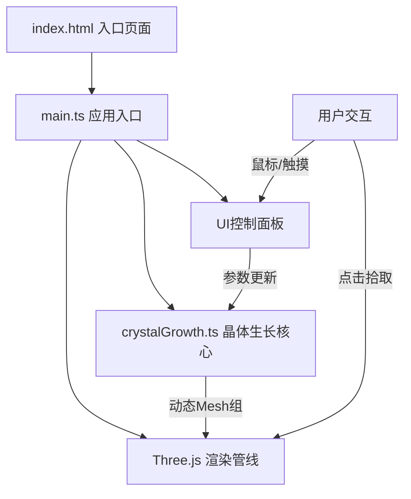

## 1. 架构设计



## 2. 技术栈描述

- **前端框架**：原生 TypeScript（无UI框架）+ Three.js 0.160.0
- **构建工具**：Vite 5.4.0
- **算法库**：simplex-noise 3.0.0（噪声驱动不规则生长）
- **语言版本**：TypeScript 5.5.0，目标 ES2020

## 3. 文件结构

```
auto15/
├── index.html              # 入口HTML，渐变背景+画布容器
├── package.json            # 依赖与启动脚本
├── vite.config.js          # Vite构建配置
├── tsconfig.json           # TypeScript严格模式配置
└── src/
    ├── main.ts             # 应用入口：场景初始化、UI、生长循环、交互
    └── crystalGrowth.ts    # 核心逻辑：晶种生成、生长算法、Mesh构建
```

### 文件职责与调用关系

| 文件 | 职责 | 输入 | 输出 | 被调用方 |
|------|------|------|------|----------|
| `index.html` | 提供DOM容器、样式布局 | — | canvas容器div | `main.ts` |
| `main.ts` | 应用编排中心 | 用户交互参数 | 渲染指令、UI更新 | `crystalGrowth.ts`、Three.js |
| `crystalGrowth.ts` | 晶体生长物理模拟 | 冷却速率、溶液浓度、时间增量 | 动态更新的Mesh组 | `main.ts` |

### 数据流向

```
UI滑块参数变化
    ↓
main.ts 接收参数
    ↓
crystalGrowth.updateParams(coolingRate, concentration)
    ↓
crystalGrowth.grow(deltaTime) 更新顶点位置/透明度
    ↓
Three.js 渲染循环 renderer.render(scene, camera)
    ↓
屏幕输出
```

## 4. 核心数据模型

### 4.1 Crystal（晶体）

```typescript
interface Crystal {
  id: number;
  seedPosition: THREE.Vector3;   // 晶种在母岩上的位置
  growthDirection: THREE.Vector3; // 初始生长方向（法向量+噪声偏转）
  currentSize: number;            // 当前尺寸
  shapePhase: number;             // 形状演化阶段 0(立方体) → 1(八面体) → 2(针状)
  opacity: number;                // 透明度 0.8→0.2
  mesh: THREE.Group;              // 晶体Mesh组
  edges: THREE.LineSegments;      // 高亮边缘线
}
```

### 4.2 GrowthParams（生长参数）

```typescript
interface GrowthParams {
  coolingRate: number;     // 0.1-1.0，影响形状演化速度和透明度变化
  concentration: number;   // 0.02-0.1，影响生长速度
}
```

## 5. 关键算法

### 5.1 晶种分布算法
- 在半径2的球面上随机采样3-5个点，使用极坐标转换确保均匀分布
- 每个晶种生长方向为该点球面法向量叠加simplex噪声偏移

### 5.2 形状演化算法
- `shapePhase = growthProgress × (1 + coolingRate × 0.5)`
- phase < 0.3：立方体（BoxGeometry各向同性缩放）
- 0.3 ≤ phase < 0.7：八面体过渡（8个顶点沿对角线方向拉伸，BoxGeometry顶点位移）
- phase ≥ 0.7：针状（沿主生长方向线性拉伸CylinderGeometry + 端部锥体）

### 5.3 顶点噪声扰动
- 使用 simplex-noise 在每个晶面顶点叠加高频小幅度位移（±0.02）
- 噪声频率随时间缓慢变化，模拟不规则生长

### 5.4 透明度衰减
- `opacity = 0.8 - 0.6 × growthProgress × coolingRate`
- 冷却速率越高，透明度下降越快（模拟快速凝固）

## 6. 性能优化策略

- **顶点复用**：共享Geometry，仅更新position属性避免重建
- **增量计算**：每帧仅更新活跃晶体的顶点，不重新生成Mesh
- **LOD简化**：远处晶体使用低面数几何体
- **计算节流**：生长计算限制在requestAnimationFrame内，单次≤5ms
