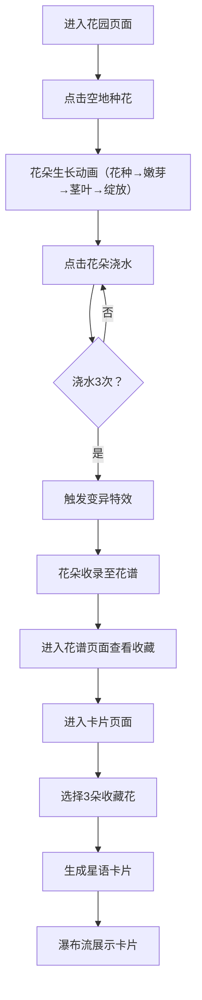

## 1. 产品概述

虚拟星语花园是一款沉浸式花语培育社交应用，让用户扮演花语编织者，在深空星海中种植、培育和收集独特的星光之花，并将其制作成闪耀的星语卡片分享给他人。

- 核心目标：通过精美的粒子动画和丰富的交互体验，为用户提供治愈系的种花收集乐趣
- 目标用户：喜爱休闲养成、收集类游戏及美学体验的年轻用户群体
- 市场价值：结合艺术美学与社交分享，打造独特的数字花卉收藏体验

## 2. 核心功能

### 2.1 用户角色

| 角色 | 注册方式 | 核心权限 |
|------|---------|---------|
| 花语编织者 | 无需注册，本地存储 | 种植花朵、浇水培育、收集花谱、制作分享卡片 |

### 2.2 功能模块

1. **花园页面**：深空背景、闪烁星点、点击空地种花、花朵生长动画、浇水交互、变异特效
2. **花谱页面**：网格布局展示收集品种、花色分组、搜索过滤、品种详情（名称、浇水次数）
3. **卡片页面**：选择3朵收藏花、生成星语卡片（含花朵、花语、编号）、瀑布流展示已生成卡片

### 2.3 页面详情

| 页面名称 | 模块名称 | 功能描述 |
|---------|---------|---------|
| 花园页面 | 星空背景 | 径向渐变深空背景（#0a0c1a到#161b33），150颗随机闪烁星点 |
| 花园页面 | 种植交互 | 点击空地生成花种（5种随机色系发光球），1.5秒沉土→0.8秒破土→2秒长茎叶+3-5片贝塞尔叶子→1.2秒绽放8瓣花朵 |
| 花园页面 | 浇水变异 | 点击花朵触发水波纹特效（10个同心扩散圆环，0.6秒）；每浇水3次触发变异：花瓣+/-1-2片、色相偏移+/-30°、花蕊脉动加速、30颗粒子爆发 |
| 花谱页面 | 品种展示 | 每行4列网格，60x60px静态花朵图标，显示品种名称和浇水次数 |
| 花谱页面 | 搜索过滤 | 全色渐变搜索条（#ff88aa→#88aaff→#aaff88），关键词过滤 |
| 卡片页面 | 卡片生成 | 300x400px卡片，深蓝紫黑径向渐变，3朵花等边三角形布局，彩色星光粒子环绕，左下角花名+随机花语，右上角STAR-XXXX编号 |
| 卡片页面 | 瀑布流展示 | 已生成卡片瀑布流布局展示 |

## 3. 核心流程

用户打开应用→进入花园页面→点击空地种花→观赏花朵生长动画→点击花朵浇水→多次浇水触发变异→花朵自动收录至花谱→进入花谱查看收藏→进入卡片页面选择3朵花→生成星语卡片→查看瀑布流展示

## 4. 用户界面设计

### 4.1 设计风格

- **主色调**：深蓝到紫色径向渐变（#0a0c1a→#161b33→#2a1f4d）
- **点缀色**：荧光色系（#ff88aa粉、#88aaff蓝、#aaff88绿、#ffaa88橙、#cc88ff紫）
- **背景效果**：径向渐变 + 浮动粒子（每页约100个半透明白色小点，缓慢上下漂移）
- **按钮样式**：圆角12px，半透明白色到对应色系渐变，悬停时亮度+15%并放大1.05倍（transition: 0.3s ease）
- **输入框**：深色半透明背景rgba(255,255,255,0.1)，聚焦时box-shadow发光边框
- **字体**：展示字体采用优雅衬线体，正文采用简洁无衬线体

### 4.2 页面设计概述

| 页面名称 | 模块名称 | UI元素 |
|---------|---------|--------|
| 花园页面 | 星空背景 | 径向渐变、150颗闪烁星点（1-3px，随机闪烁周期1-3秒） |
| 花园页面 | 花朵画布 | SVG绘制花朵，贝塞尔曲线叶子，花瓣8片+补色花蕊脉动 |
| 花园页面 | 交互特效 | 水波纹扩散、彩色粒子爆发（30颗，飞散0.5秒） |
| 花谱页面 | 搜索栏 | 全色线性渐变背景，关键词输入过滤 |
| 花谱页面 | 品种网格 | 4列网格，60x60扇形图标，名称+浇水次数 |
| 卡片页面 | 选择区 | 收藏花朵缩略图勾选，最多3朵 |
| 卡片页面 | 卡片预览 | 300x400px，等边三角形布局，星光粒子，花语文字 |
| 卡片页面 | 瀑布流 | 自适应列数，卡片错落排列 |

### 4.3 响应式设计

- **桌面端**（≥768px）：花谱4列网格、花园完整画布、瀑布流多列
- **移动端**（<768px）：花谱单列、瀑布流2列、粒子数量减半、触控优化
- 所有页面采用弹性布局，保证在各种屏幕尺寸下的良好体验

### 4.4 性能优化

- 花园画布同时渲染≤30朵花时保持60fps
- 花朵生长动画≥30fps
- 卡片生成响应时间≤200ms
- 使用CSS动画与requestAnimationFrame结合优化渲染性能
