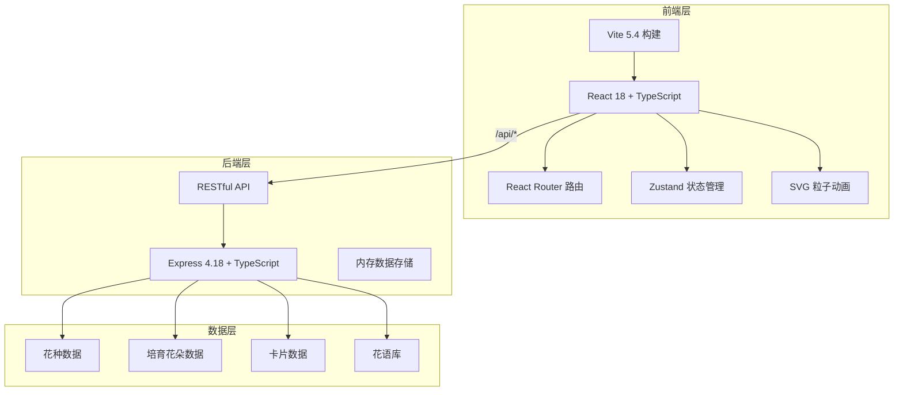
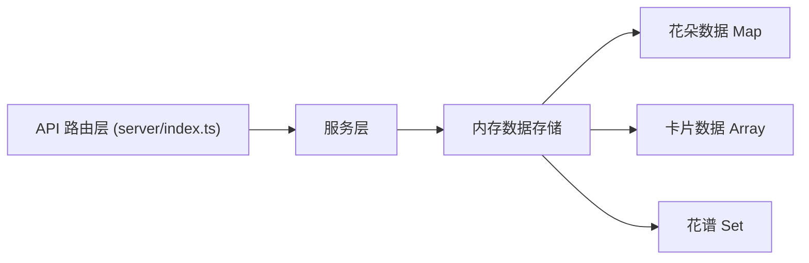
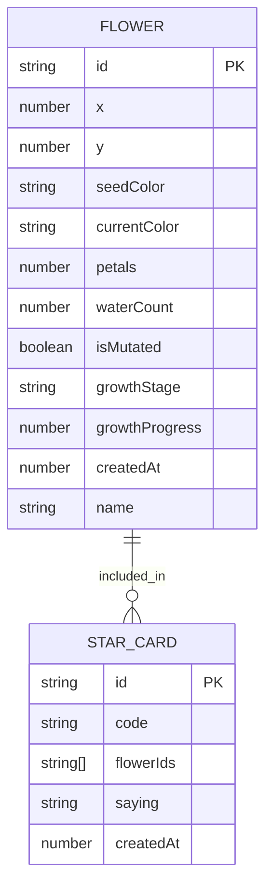

## 1. 架构设计



## 2. 技术描述

- **前端**：React@18.2.0 + TypeScript@5.5.0 + Vite@5.4.0
- **前端路由**：react-router-dom@6
- **状态管理**：zustand（轻量级状态管理）
- **后端**：Express@4.18.0 + TypeScript@5.5.0 + ts-node
- **后端中间件**：cors@2.8.5、body-parser@1.20.0
- **工具库**：uuid@9.0.0、concurrently（并行启动）
- **数据存储**：内存存储（用于演示，可扩展至持久化）
- **动画渲染**：原生 SVG + CSS Animation + requestAnimationFrame
- **UI 样式**：原生 CSS + CSS Variables（无需 Tailwind，用户要求自定义设计语言）

## 3. 路由定义

| 路由 | 用途 |
|------|------|
| / | 花园页面（默认首页） |
| /catalog | 花谱页面 |
| /cards | 卡片页面 |

## 4. API 定义

### 4.1 TypeScript 类型定义

```typescript
// 花朵生长阶段
type GrowthStage = 'seed' | 'sprout' | 'growing' | 'blooming' | 'bloomed';

// 花种基础色系
type SeedColor = '#ff88aa' | '#88aaff' | '#aaff88' | '#ffaa88' | '#cc88ff';

// 花朵数据
interface Flower {
  id: string;
  x: number;
  y: number;
  seedColor: SeedColor;
  currentColor: string;
  petals: number;
  waterCount: number;
  isMutated: boolean;
  growthStage: GrowthStage;
  growthProgress: number;
  createdAt: number;
  name: string;
}

// 卡片数据
interface StarCard {
  id: string;
  code: string;
  flowerIds: string[];
  flowers: Flower[];
  saying: string;
  createdAt: number;
}

// 花语库
const FLOWER_SAYINGS: string[] = [
  // 30条预设花语
];
```

### 4.2 API 接口

| 方法 | 路径 | 描述 | 请求体 | 响应 |
|------|------|------|--------|------|
| GET | /api/seeds | 获取花种色系列表 | - | `{ colors: SeedColor[] }` |
| GET | /api/flowers | 获取所有花朵 | - | `Flower[]` |
| POST | /api/flowers | 种植新花 | `{ x, y, seedColor }` | `Flower` |
| PUT | /api/flowers/:id/water | 浇水 | - | `Flower` |
| PUT | /api/flowers/:id/grow | 更新生长进度 | `{ growthStage, growthProgress }` | `Flower` |
| GET | /api/catalog | 获取花谱（已收集品种） | - | `Flower[]` |
| GET | /api/sayings | 获取随机花语 | - | `{ saying: string }` |
| POST | /api/cards | 生成星语卡片 | `{ flowerIds: string[] }` | `StarCard` |
| GET | /api/cards | 获取所有卡片 | - | `StarCard[]` |

## 5. 后端服务架构



后端采用单文件架构（server/index.ts），包含：
- Express 应用初始化与中间件配置
- 内存数据存储（使用 Map 和 Array）
- 所有 API 路由处理函数
- CORS 配置（允许前端 3000 端口访问）

## 6. 数据模型

### 6.1 实体关系图



### 6.2 项目文件结构

```
.
├── package.json              # 项目根配置
├── vite.config.js            # Vite 构建配置（代理 /api → 4000）
├── tsconfig.json             # TypeScript 配置
├── index.html                # 入口 HTML
├── server/
│   └── index.ts              # Express 后端服务
└── src/
    ├── main.tsx              # React 入口
    ├── App.tsx               # 主组件 + 路由
    ├── styles/
    │   └── globals.css       # 全局样式 + CSS Variables
    ├── store/
    │   └── useGardenStore.ts # Zustand 状态管理
    ├── types/
    │   └── index.ts          # 共享类型定义
    ├── utils/
    │   ├── colors.ts         # 颜色工具（色相偏移、补色等）
    │   └── particles.ts      # 粒子动画工具
    ├── pages/
    │   ├── GardenPage.tsx    # 花园页面
    │   ├── CatalogPage.tsx   # 花谱页面
    │   └── CardsPage.tsx     # 卡片页面
    └── components/
        ├── Garden.tsx        # 花园画布
        ├── Flower.tsx        # 单朵花组件（含粒子特效）
        ├── StarField.tsx     # 星星背景
        ├── FloatingParticles.tsx # 浮动粒子
        ├── NavBar.tsx        # 导航栏
        ├── FlowerIcon.tsx    # 花谱静态花朵图标
        ├── StarCard.tsx      # 星语卡片组件
        └── WaterRipple.tsx   # 浇水波纹特效
```

## 7. 性能优化策略

- **花朵渲染**：使用 SVG 而非 Canvas，利用浏览器硬件加速
- **粒子优化**：限制同时存在的粒子数量，使用 CSS transform 动画
- **状态更新**：Zustand 浅比较避免不必要的重渲染
- **动画调度**：使用 requestAnimationFrame 统一调度生长动画
- **响应式**：移动端粒子数量减半，降低渲染压力
- **代码分割**：按页面级懒加载非关键组件
