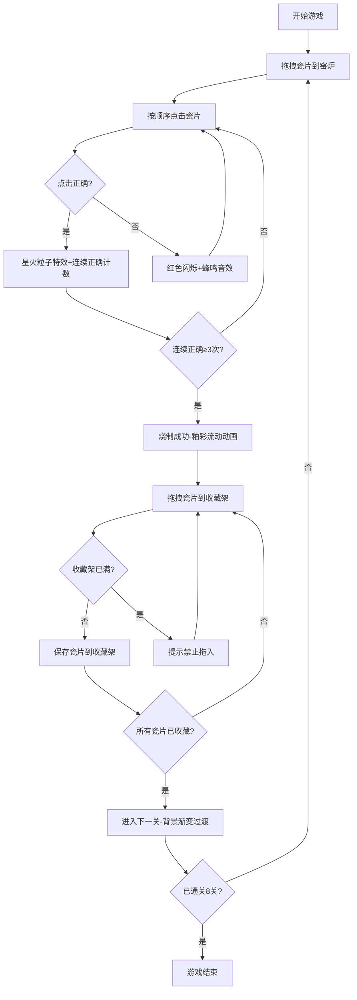

## 1. 产品概述

星火窑变烧制小游戏是一款基于浏览器的创意交互游戏，玩家扮演一位星火窑工，通过拖拽摆放瓷片、按特定节奏点击引燃星火，最终烧制出带有流光釉彩的精美瓷器。游戏融合了节奏点击、拖拽交互与视觉艺术创作，提供沉浸式的陶艺烧制体验。

- 主要用途：休闲娱乐、艺术创作体验
- 目标用户：喜欢创意小游戏、视觉艺术的玩家
- 产品价值：通过精美的粒子效果和釉彩流动动画，提供独特的视觉享受和成就感

## 2. 核心功能

### 2.1 功能模块

1. **瓷片拖拽模块**：从左侧瓷片堆拖拽瓷片到窑炉3x3网格
2. **节奏点击模块**：按随机生成的正确顺序点击瓷片引燃星火
3. **釉彩烧制模块**：连续正确3次后触发烧制，生成流光釉彩和粒子效果
4. **收藏架模块**：将烧制完成的瓷片拖入右侧收藏架保存
5. **关卡进度模块**：8关递进式难度，每关顺序和釉色不同

### 2.2 页面详情

| 页面名称 | 模块名称 | 功能描述 |
|-----------|-------------|---------------------|
| 游戏主界面 | 瓷片堆区 | 左侧展示可拖拽的素胚瓷片，带暗纹半透明圆片 |
| 游戏主界面 | 窑炉区域 | 中央3x3网格窑位，接收瓷片放置和点击交互 |
| 游戏主界面 | 收藏架区 | 右侧展示已烧制完成的瓷片，最多6片 |
| 游戏主界面 | 关卡进度 | 顶部显示当前关卡进度（如第3/8关） |
| 游戏主界面 | 状态提示 | 点击正确/错误反馈、烧制成功提示 |

## 3. 核心流程

玩家从左侧瓷片堆拖拽瓷片到窑炉中央的3x3网格，松开鼠标放置瓷片并产生弹性动画。然后按随机生成的正确顺序依次点击已放置的瓷片：点击正确时爆出星火粒子和高音铃声；点击错误时瓷片闪烁红色并发出低沉蜂鸣。连续正确点击3次后触发烧制成功，所有瓷片迸发彩色流光釉彩。烧制完成后可将瓷片拖拽到右侧收藏架保存。通关后背景色调渐变过渡到下一关。

## 4. 用户界面设计

### 4.1 设计风格

- **主色调**：深棕#1a0d05到暗红#2a0a05的径向渐变背景
- **强调色**：暗金色#885533（网格线）、橙黄#ffaa33到#ff6633（星火粒子）
- **点缀色**：10种预设釉彩配色（如#88aaff/#ff88aa等）
- **瓷片风格**：半透明圆片带暗纹，像素风带光泽质感，0.5px亮边高光
- **交互反馈**：所有操作均有0.3秒ease-out平滑过渡动画
- **字体**：使用衬线体营造古典陶艺氛围

### 4.2 页面设计概述

| 页面名称 | 模块名称 | UI元素 |
|-----------|-------------|-------------|
| 游戏主界面 | 瓷片堆区 | 左侧半透明略亮面板，展示圆形素胚瓷片，暗纹装饰 |
| 游戏主界面 | 窑炉区域 | 中央炭黑#0a0505底色，3x3暗金色网格线（透明度0.3），边沿橙黄火光脉动（幅度10px，周期2秒） |
| 游戏主界面 | 收藏架区 | 右侧半透明深蓝面板，展示带釉彩的瓷片 |
| 游戏主界面 | 顶部进度条 | 关卡进度文字显示，暗金色装饰 |

### 4.3 响应式

- 桌面端优先设计，canvas全屏自适应
- 瓷片尺寸按窗口大小等比缩放

### 4.4 视觉动效

- 瓷片放置：弹性动画（弹簧系数0.2，阻尼0.8）
- 点击正确：旋转星火粒子（15-25个，颜色渐变，扩散半径60px，持续0.8秒）
- 点击错误：红色闪烁0.3秒，抖动幅度3px，频率20Hz
- 釉彩流动：由内向外扩散，流速0.5单位/秒，持续3秒，瓷片边缘柔和光晕
- 收藏架悬停：釉彩围绕瓷片中心缓慢旋转
- 关卡过渡：背景色调渐变过渡，时长1.5秒
