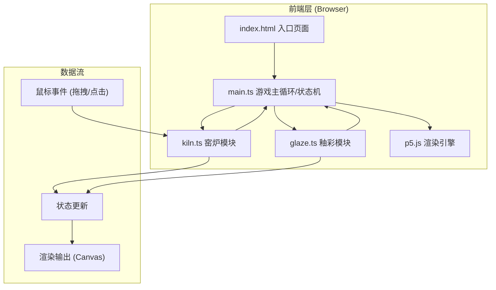

## 1. 架构设计



## 2. 技术描述

- **前端框架**：p5.js@1.9.0（Canvas渲染与交互）
- **语言**：TypeScript@5.5.0（严格模式）
- **构建工具**：Vite@5.4.0（开发服务器端口3000）
- **后端**：无（纯前端游戏）
- **数据库**：无

## 3. 模块职责与调用关系

### 3.1 文件结构

```
项目根目录
├── package.json          # 依赖配置与启动脚本
├── vite.config.js        # Vite构建配置
├── tsconfig.json         # TypeScript配置（严格模式）
├── index.html            # 入口页面
└── src/
    ├── main.ts           # 游戏主循环、状态机、初始化
    ├── kiln.ts           # 窑炉模块（网格、瓷片、交互）
    └── glaze.ts          # 釉彩模块（釉彩纹理、粒子效果）
```

### 3.2 模块数据流向

| 模块 | 输入 | 处理 | 输出 | 调用方 |
|------|------|------|------|--------|
| main.ts | 生命周期事件、模块回调 | 状态机管理、全局协调 | 初始化场景、状态更新通知 | Vite入口 |
| kiln.ts | 鼠标事件（拖拽/点击）、状态机指令 | 窑位网格管理、瓷片摆放、点击校验、动画计算 | 窑位状态变更、烧制事件、错误反馈 | main.ts |
| glaze.ts | 烧制成功事件、瓷片位置 | 釉彩纹理生成、粒子系统、流动动画 | 釉彩数据、粒子更新、渲染指令 | main.ts |

### 3.3 详细调用链

1. **初始化流程**：
   - main.ts.setup() → 创建p5实例 → 初始化kiln模块和glaze模块
   
2. **瓷片拖拽流程**：
   - 鼠标按下 → kiln.ts.onMousePressed() → 检测瓷片堆/收藏架瓷片
   - 鼠标移动 → kiln.ts.onMouseDragged() → 更新拖拽瓷片位置
   - 鼠标释放 → kiln.ts.onMouseReleased() → 检测窑位/收藏架目标 → 放置瓷片（弹簧动画）→ 通知main.ts

3. **点击交互流程**：
   - 鼠标点击窑位瓷片 → kiln.ts.onClick() → 校验点击顺序
     - 正确：调用glaze.ts.spawnSparkParticles() → 播放高音铃声 → 更新连击计数
     - 错误：触发错误闪烁动画 → 播放低沉蜂鸣 → 连击重置
   - 连击≥3 → kiln.ts触发firingComplete事件 → glaze.ts.generateGlazeTexture() → 釉彩流动动画

4. **渲染流程**：
   - main.ts.draw()（每帧60fps）→ kiln.render() → glaze.render() → p5.js绘制到Canvas

## 4. 核心数据模型

### 4.1 瓷片数据 (Shard)

```typescript
interface Shard {
  id: string;
  x: number;           // 当前位置X
  y: number;           // 当前位置Y
  targetX: number;     // 目标位置X（弹簧动画用）
  targetY: number;     // 目标位置Y
  vx: number;          // 速度X
  vy: number;          // 速度Y
  radius: number;      // 半径（默认30px）
  placed: boolean;     // 是否已放置到窑位
  fired: boolean;      // 是否已烧制
  glazeData?: GlazeData; // 釉彩数据（烧制后生成）
  errorFlash: number;  // 错误闪烁剩余时间
  shakeOffset: number; // 抖动偏移量
}
```

### 4.2 粒子数据 (Particle)

```typescript
interface Particle {
  x: number;
  y: number;
  vx: number;
  vy: number;
  life: number;        // 剩余生命周期（0-1）
  maxLife: number;     // 最大生命周期（秒）
  size: number;
  colorStart: string;  // #ffaa33
  colorEnd: string;    // #ff6633
  rotation: number;
  rotationSpeed: number;
}
```

### 4.3 釉彩数据 (GlazeData)

```typescript
interface GlazeData {
  primaryColor: string;   // 主色
  secondaryColor: string; // 辅色
  flowProgress: number;   // 流动进度（0-1）
  seed: number;           // 噪声种子（用于纹理随机）
  rotation: number;       // 收藏架悬停旋转角度
}
```

### 4.4 游戏状态机

```typescript
type GameState = 'placing' | 'clicking' | 'firing' | 'transition' | 'complete';
```

## 5. 性能优化策略

1. **粒子池管理**：粒子总数上限200，超过时回收最早生成的粒子（FIFO队列）
2. **釉彩更新节流**：釉彩流动动画帧更新间隔≤16ms（使用requestAnimationFrame同步）
3. **渲染分层**：静态元素（背景、网格）预渲染，动态元素（瓷片、粒子）每帧更新
4. **弹簧动画优化**：使用简谐运动公式（弹簧系数0.2，阻尼0.8），避免逐帧DOM操作
5. **Canvas全屏适配**：使用devicePixelRatio处理高清屏渲染，避免模糊

## 6. 音效方案

使用Web Audio API生成合成音效：
- **放置音效**：短促高频正弦波（800Hz，0.1秒，指数衰减）
- **正确点击**：高音铃声（两个正弦波叠加，1200Hz+1800Hz，0.15秒）
- **错误点击**：低沉蜂鸣（锯齿波，150Hz，0.3秒）
- **烧制成功**：琶音和弦（多频率叠加，0.5秒渐变）
