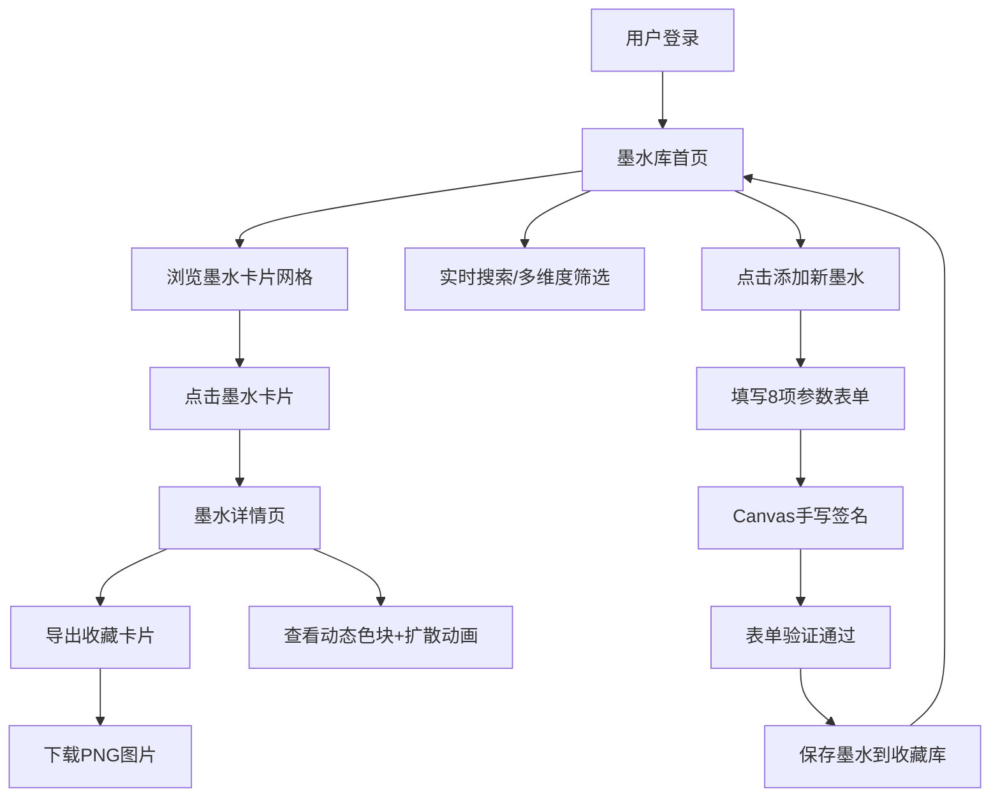

## 1. 产品概述

墨库（Ink Library）是一款面向手绘爱好者的个人数字墨水收藏管理全栈应用，帮助用户系统整理、搜索和展示各类数字墨水样本（含颜色值、纹理参数、光泽度和亲笔签名）。

- **核心价值**：解决手绘爱好者墨水收藏分散、难以检索和展示的痛点
- **目标用户**：手绘艺术家、插画师、钢笔/毛笔爱好者、数字绘画创作者

## 2. 核心功能

### 2.1 用户角色
| 角色 | 注册方式 | 核心权限 |
|------|----------|----------|
| 普通用户 | 账号注册登录 | 墨水增删改查、筛选搜索、导出分享 |

### 2.2 功能模块
1. **墨水库首页**：墨水网格卡片展示、实时搜索、多维度筛选、添加新墨水入口
2. **墨水详情页**：大色块展示、渐变色环绕动画、墨水扩散粒子动画、完整参数与签名展示
3. **添加/编辑墨水表单**：8项参数输入、颜色拾取器、纹理选择、光泽度/粘稠度滑块、Canvas手写签名、表单验证
4. **导出分享**：生成600x420px收藏卡片、Canvas渲染、PNG下载

### 2.3 页面详情
| 页面名称 | 模块名称 | 功能描述 |
|----------|----------|----------|
| 墨水库首页 | 导航栏 | 用户信息、搜索栏（300ms防抖实时搜索） |
| 墨水库首页 | 筛选面板 | 纹理类型筛选、光泽度区间筛选（低/中/高）、颜色色系筛选 |
| 墨水库首页 | 墨水卡片网格 | 圆形色块（80px）、纹理标签、墨水名称、悬停旋转+波纹动画、淡入淡出过渡 |
| 墨水库首页 | 添加墨水按钮 | 弹出模态表单 |
| 添加墨水表单 | 参数输入区 | 名称、颜色拾取器（24色预设）、纹理下拉、光泽度滑块、粘稠度滑块、备注、日期自动填充 |
| 添加墨水表单 | 手写签名区 | Canvas绘制、撤销功能、必填验证 |
| 墨水详情页 | 大色块展示 | 200px直径圆形色块 + 渐变色环绕（色相±15°、饱和度±10%、亮度±20%，10秒周期旋转） |
| 墨水详情页 | 参数展示区 | 全部8项参数数据展示 |
| 墨水详情页 | 墨水扩散动画 | 40个粒子从中心向外扩散，透明度渐变，1.5秒循环 |
| 墨水详情页 | 签名展示 | 手写签名图片渲染 |
| 导出卡片 | Canvas渲染 | 600x420px卡片、同色系渐变背景、色块+名称+纹理+光泽度+签名 |
| 导出卡片 | 下载功能 | PNG图片下载 |

## 3. 核心流程

用户注册登录后进入墨水库首页，浏览网格形式展示的墨水卡片。通过顶部搜索栏或筛选面板快速定位目标墨水。点击「添加新墨水」弹出表单，填写8项参数并通过Canvas手写签名后提交。点击墨水卡片进入详情页，欣赏动态色块与扩散动画，可导出精美的收藏卡片分享。

## 4. 用户界面设计

### 4.1 设计风格
- **主色调**：灰蓝调深色系 `#1e293b` `#334155` `#475569`
- **背景色**：暖白 `#f8fafc`
- **卡片风格**：圆角12px，微弱阴影 `0 2px 8px rgba(30,41,59,0.08)`
- **交互反馈**：悬停时 scale 1.03 + 阴影加深，transition 200ms ease
- **字体**：衬线展示字体 + 无衬线正文字体，营造艺术感
- **响应式断点**：480px / 768px / 1024px，移动端表单单列全宽

### 4.2 页面设计概述
| 页面名称 | 模块名称 | UI元素 |
|----------|----------|--------|
| 墨水库首页 | 卡片网格 | 80px圆形色块悬停旋转+波纹、纹理标签、淡入淡出筛选过渡 |
| 添加墨水表单 | 颜色拾取器 | 24种高级灰/莫兰迪色系预设色块 |
| 添加墨水表单 | 滑块控件 | 光泽度/粘稠度0-100范围滑动条 |
| 添加墨水表单 | 签名画板 | Canvas手写区、撤销按钮 |
| 墨水详情页 | 动态色块 | 200px圆形 + 渐变色环绕旋转（10s周期） |
| 墨水详情页 | 粒子动画 | 40粒子向外扩散，1.5s循环 |
| 导出卡片 | Canvas卡片 | 600x420px、同色系45°线性渐变背景 |

### 4.3 响应式
采用桌面优先（Desktop-first）设计思路：
- 1024px+：多列网格布局，侧边筛选面板
- 768px-1024px：两列网格，筛选按钮横向排列
- 480px-768px：单列网格，表单单列全宽
- 480px以下：紧凑单列，触控优化

### 4.4 性能指标
- 首次加载墨水列表渲染时间 ≤ 800ms（20条初始数据）
- 筛选操作响应时间 ≤ 150ms
