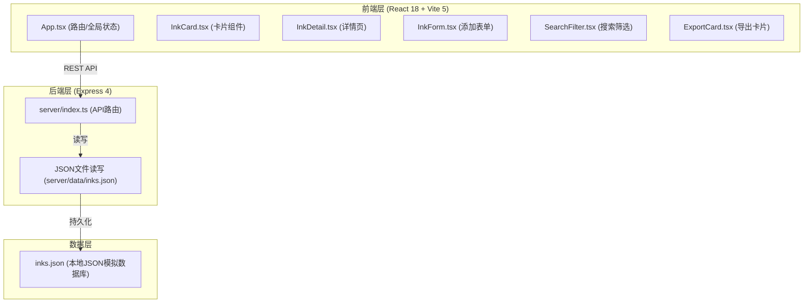
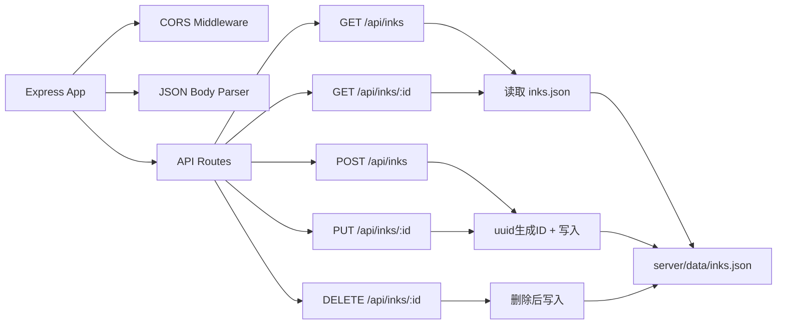
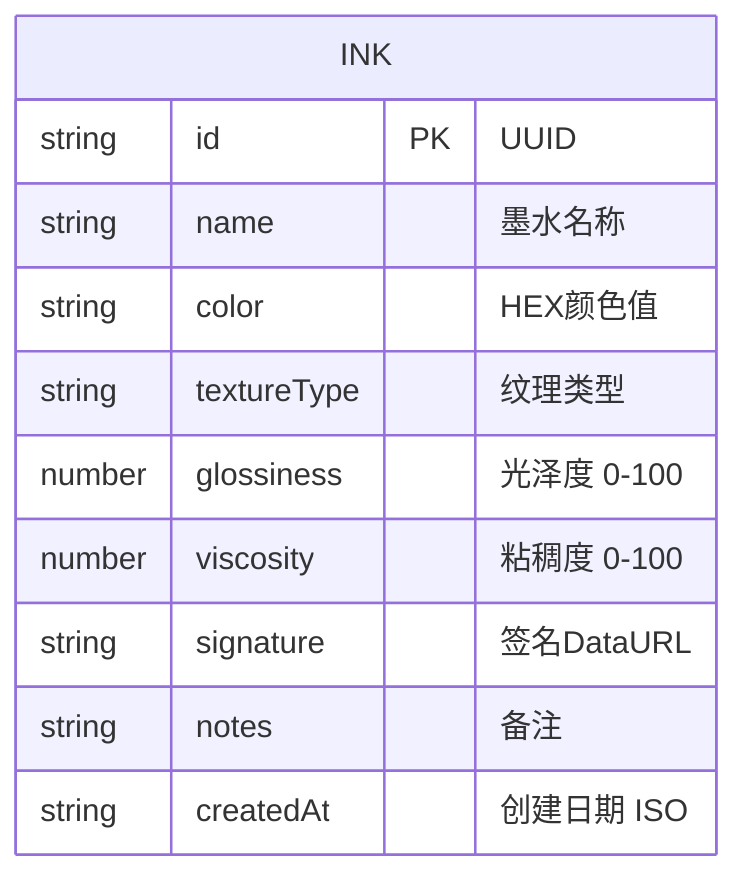

## 1. 架构设计



## 2. 技术描述

- **前端框架**：React@18.2.0 + TypeScript@5.5.0
- **构建工具**：Vite@5.4.0 + @vitejs/plugin-react@4.0.0
- **后端框架**：Express@4.18.0 + TypeScript@5.5.0
- **数据库**：本地JSON文件模拟（server/data/inks.json）
- **跨域处理**：cors@2.8.5
- **ID生成**：uuid@9.0.0
- **前端端口**：3000（Vite dev server）
- **后端端口**：3001（Express server）
- **启动脚本**：
  - `npm run dev` - 启动前端开发服务器
  - `npm run server` - 启动后端服务器
  - `npm run start` - 同时启动前后端

## 3. 路由定义

| 路由 | 用途 |
|------|------|
| `/` | 墨水库首页（墨水列表+搜索筛选+添加按钮） |
| `/ink/:id` | 墨水详情页（动态色块+参数+签名+导出） |

## 4. API 定义

### 4.1 类型定义

```typescript
interface Ink {
  id: string;
  name: string;
  color: string;
  textureType: 'matte' | 'velvet' | 'pearl' | 'metallic';
  glossiness: number;
  viscosity: number;
  signature: string;
  notes: string;
  createdAt: string;
}
```

### 4.2 RESTful API

| Method | Endpoint | 描述 | 请求体 | 响应 |
|--------|----------|------|--------|------|
| GET | `/api/inks` | 获取所有墨水列表 | - | `Ink[]` |
| GET | `/api/inks/:id` | 获取单条墨水详情 | - | `Ink` |
| POST | `/api/inks` | 新增墨水 | `Omit<Ink, 'id' \| 'createdAt'>` | `Ink` |
| PUT | `/api/inks/:id` | 更新墨水 | `Partial<Ink>` | `Ink` |
| DELETE | `/api/inks/:id` | 删除墨水 | - | `{ success: true }` |

## 5. 服务器架构



## 6. 数据模型

### 6.1 ER 图



### 6.2 初始数据（inks.json 示例）

```json
{
  "inks": [
    {
      "id": "uuid-1",
      "name": "深秋雾霾蓝",
      "color": "#4A6FA5",
      "textureType": "matte",
      "glossiness": 25,
      "viscosity": 60,
      "signature": "data:image/png;base64,...",
      "notes": "适合古典插画",
      "createdAt": "2024-01-15T10:30:00Z"
    }
  ]
}
```

## 7. 文件组织结构

```
auto157/
├── package.json
├── index.html
├── vite.config.ts
├── tsconfig.json
├── tsconfig.node.json
├── server/
│   ├── index.ts
│   └── data/
│       └── inks.json
└── src/
    ├── main.tsx
    ├── App.tsx
    ├── types.ts
    ├── styles/
    │   └── global.css
    ├── components/
    │   ├── InkCard.tsx
    │   ├── InkDetail.tsx
    │   ├── InkForm.tsx
    │   ├── SearchFilter.tsx
    │   ├── ExportCard.tsx
    │   └── SignaturePad.tsx
    └── utils/
        ├── colorUtils.ts
        └── api.ts
```

## 8. 性能优化策略

- **搜索防抖**：300ms debounce，避免频繁重渲染
- **列表虚拟化**：若数据量大可考虑虚拟滚动（20条无需）
- **CSS动画**：色块旋转、波纹、粒子动画均使用GPU加速属性（transform、opacity）
- **筛选过渡**：300ms淡入淡出，使用CSS transition
- **首次渲染**：≤800ms，组件轻量化，避免不必要的重渲染
- **筛选响应**：≤150ms，前端本地筛选，无需API请求
