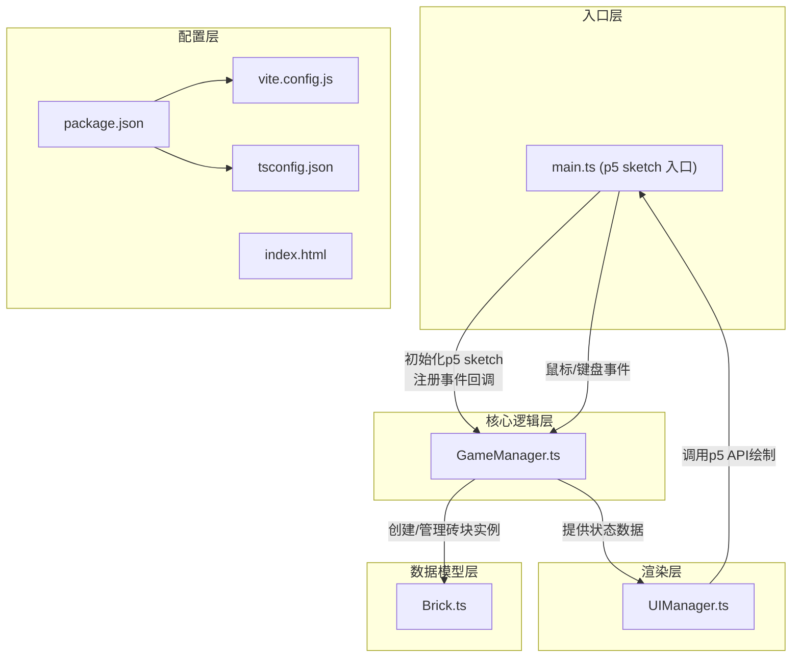
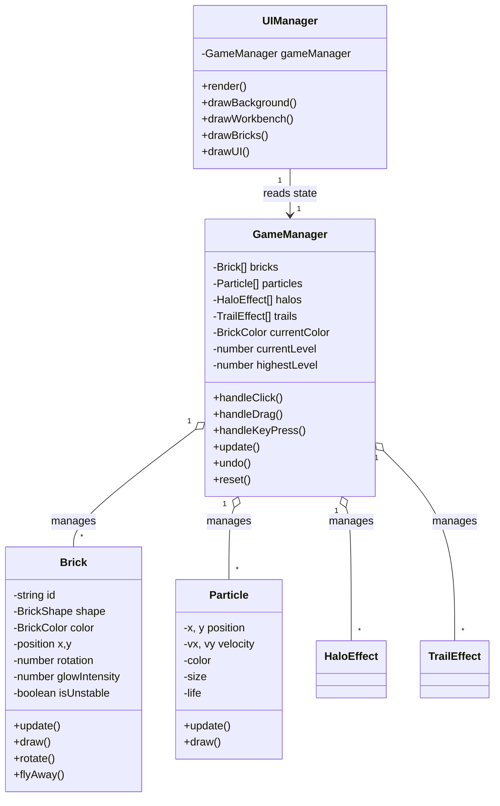

## 1. 架构设计



**数据流向说明**：
1. 用户启动应用 → `main.ts` 初始化 p5 sketch 并创建 `GameManager` 实例
2. 用户鼠标/键盘交互 → p5 事件触发 → `main.ts` 将事件转发给 `GameManager`
3. `GameManager` 更新砖块状态（位置、旋转、稳定性），管理堆叠逻辑
4. `GameManager` 通知 `UIManager` 数据更新
5. p5 `draw()` 循环调用 `UIManager.render()` 渲染所有视觉元素

## 2. 技术栈说明

- **前端框架**：p5.js@1.9.0（创意编程库，提供Canvas绘图、事件处理）
- **语言**：TypeScript@5.5.0（严格模式，静态类型检查）
- **构建工具**：Vite@5.4.0（快速开发服务器和构建）
- **后端**：无（纯前端应用）
- **数据库**：无（本地状态管理，最高纪录存localStorage）

## 3. 项目文件结构

```
auto159/
├── package.json              # 项目依赖和脚本配置
├── vite.config.js            # Vite构建配置（开发服务器端口3000）
├── tsconfig.json             # TypeScript严格模式配置
├── index.html                # 入口HTML页面
├── src/
│   ├── main.ts               # 入口文件：p5 sketch初始化，加载GameManager
│   ├── GameManager.ts        # 核心逻辑：砖块堆叠、碰撞、稳定性评估
│   ├── Brick.ts              # 砖块类：形状、颜色、发光、位置、旋转
│   └── UIManager.ts          # 界面渲染：工作台、提示、指示器
└── .trae/
    └── documents/
        ├── PRD.md            # 产品需求文档
        └── ARCHITECTURE.md   # 技术架构文档
```

## 4. 核心模块API定义

### 4.1 Brick.ts

```typescript
// 砖块形状类型
export type BrickShape = 'cube' | 'prism';

// 颜色定义
export const BRICK_COLORS = {
  RED: '#ff4466',    // 赤焰
  ORANGE: '#ff8844', // 曦光
  YELLOW: '#ffcc44', // 金辉
  GREEN: '#44ff88',  // 翠晶
  BLUE: '#4488ff',   // 冰魄
} as const;

export type BrickColor = typeof BRICK_COLORS[keyof typeof BRICK_COLORS];

export interface BrickState {
  id: string;
  shape: BrickShape;
  color: BrickColor;
  position: { x: number; y: number };
  targetPosition: { x: number; y: number };
  rotation: number;        // 度数：0, 45, 90, 135...
  glowIntensity: number;   // 发光强度：默认8，稳定连接16
  isPlaced: boolean;       // 是否已放置完成
  isFalling: boolean;      // 是否正在下落
  isFlying: boolean;       // 是否正在飞离（撤销/重置）
  isShaking: boolean;      // 是否抖动（不稳定性警告）
  isUnstable: boolean;     // 是否不稳定
  fallTimer: number;       // 不稳定计时（秒）
}

export class Brick {
  constructor(color: BrickColor, x: number, y: number);
  update(deltaTime: number): void;
  draw(p: p5): void;
  rotate(direction: 1 | -1): void;
  flyAway(): void;
  startShaking(): void;
  enhanceGlow(): void;
  resetGlow(): void;
  getTopSurfaceY(): number;
  getTopSurfaceCenterX(): number;
}
```

### 4.2 GameManager.ts

```typescript
export interface GameState {
  bricks: Brick[];
  currentColor: BrickColor;
  currentLevel: number;      // 连续稳定层数
  highestLevel: number;      // 最高纪录
  selectedBrickId: string | null;
  particles: Particle[];
  halos: HaloEffect[];
  trails: TrailEffect[];
}

export class GameManager {
  constructor(canvasWidth: number, canvasHeight: number);
  update(deltaTime: number): void;
  handleClick(x: number, y: number): void;
  handleDragStart(x: number, y: number): void;
  handleDragMove(x: number, y: number): void;
  handleDragEnd(x: number, y: number): void;
  handleKeyPress(key: string): void;
  undo(): void;
  reset(): void;
  getState(): GameState;
  getWorkbenchCenter(): { x: number; y: number };
  setCanvasSize(w: number, h: number): void;
}
```

### 4.3 UIManager.ts

```typescript
export class UIManager {
  constructor(gameManager: GameManager);
  render(p: p5): void;
  drawBackground(p: p5): void;
  drawWorkbench(p: p5): void;
  drawBricks(p: p5): void;
  drawColorIndicator(p: p5): void;
  drawLevelDisplay(p: p5): void;
  drawScrollingHint(p: p5): void;
  drawParticles(p: p5): void;
  drawHalos(p: p5): void;
  drawTrails(p: p5): void;
  updateCanvasSize(w: number, h: number): void;
}
```

## 5. 数据模型

### 5.1 实体关系



### 5.2 关键算法

1. **色相互补检测**：将十六进制颜色转为HSV，计算两颜色色相差值，判断是否在150°-210°范围内
2. **角度偏差计算**：计算两块砖旋转角度差值的最小模（考虑360°循环）
3. **稳定性评估**：同时满足色彩互补和角度偏差≤10°判定为稳定连接
4. **吸附对齐**：新砖块X坐标对齐到下方砖块上表面中心X坐标，Y坐标动画过渡到上表面
5. **粒子系统**：简单物理模拟，位置 += 速度*dt，生命值递减透明度
