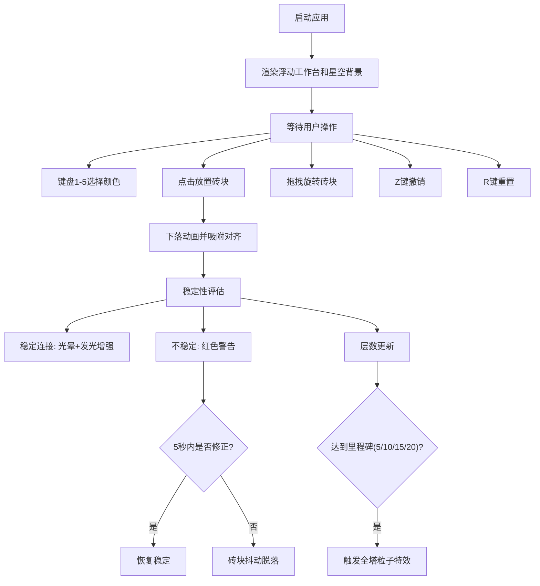

## 1. 产品概述

光之建筑师（Light Architect）是一款基于浏览器的创意互动应用，用户通过堆叠发光砖块建造虚拟光之塔，体验色彩与角度的艺术组合。

- 核心价值：提供沉浸式、艺术化的堆叠建造体验，融合物理规则与视觉美学
- 目标用户：创意爱好者、艺术创作者、休闲玩家

## 2. 核心功能

### 2.1 功能模块

1. **主画布交互区**：浮动工作台、砖块放置与旋转、粒子特效
2. **状态显示系统**：当前层数、最高纪录、颜色指示器、稳定性反馈
3. **操作控制系统**：键盘快捷键、鼠标拖拽与点击

### 2.2 功能详情

| 功能模块 | 子功能 | 功能描述 |
|----------|--------|----------|
| 浮动工作台 | 平台渲染 | 半透明圆形浮空平台，直径600px，深色径向渐变，边缘旋转光点，中心十字准星 |
| 光砖系统 | 砖块放置 | 点击基准标记或已有砖块上表面放置新砖块，0.3秒下落动画，自动吸附对齐 |
| 光砖系统 | 砖块旋转 | 拖拽砖块左右边缘每次旋转45度，带拖尾光迹效果 |
| 光砖系统 | 颜色切换 | 键盘1-5键切换五种颜色：赤焰、曦光、金辉、翠晶、冰魄 |
| 稳定性评估 | 稳定连接 | 色彩互补（色相差150-210度）+ 角度偏差≤10度，触发光晕效果和边缘发光增强 |
| 稳定性评估 | 不稳定警告 | 角度偏差>20度或色彩不互补，红色警告边框闪烁，5秒未修正则脱落 |
| 评分特效 | 层数统计 | 统计连续稳定连接的有效层数，屏幕显示当前层数和最高纪录 |
| 评分特效 | 里程碑粒子 | 达到5、10、15、20层时，塔顶喷射200颗彩色粒子特效 |
| 撤销重置 | 撤销 | Z键撤销上一步，砖块向上飞离消失（0.3秒动画） |
| 撤销重置 | 重置 | R键重置整个塔，所有砖块向上飞散消失（0.5秒动画） |

## 3. 核心流程

用户打开应用 → 查看浮动工作台 → 选择砖块颜色 → 点击放置砖块 → 观察稳定性反馈 → 旋转调整砖块角度 → 继续堆叠 → 达成里程碑触发特效 → 可随时撤销或重置

## 4. 用户界面设计

### 4.1 设计风格

- **主色调**：深蓝紫背景（#060b12 到 #0f0a18 径向渐变）
- **辅助色**：冰蓝光效（#88aaff）、浅紫（#8888aa）
- **砖块色**：赤焰#ff4466、曦光#ff8844、金辉#ffcc44、翠晶#44ff88、冰魄#4488ff
- **视觉风格**：高科技梦幻风格，发光特效、半透明效果、粒子动画
- **字体**：现代无衬线字体，支持中文显示

### 4.2 页面设计

| 区域 | 元素 | 设计细节 |
|------|------|----------|
| 背景 | 星域渐变 | 径向渐变#060b12→#0f0a18，300颗随机闪烁星点（1-3px，白色半透明，1-3秒闪烁周期） |
| 中央 | 浮动工作台 | 画面中央靠下（y偏移+50px），直径600px，深色径向渐变，边缘#88aaff光点旋转（10秒周期） |
| 工作台中心 | 基准标记 | 十字准星，线宽2px，颜色#8888aa，透明度0.5 |
| 右上角 | 颜色指示器 | 直径30px圆形色块，边框2px白色，显示当前选中颜色 |
| 上方 | 层数显示 | 当前层数和最高纪录，清晰易读 |
| 底部中央 | 操作提示 | 滚动文字（#aaaacc，16px，60px/s从右向左滚动） |

### 4.3 响应式适配

- 画布尺寸随窗口自适应，保持16:9宽高比
- 所有UI元素按百分比定位，确保在不同分辨率下布局协调
- 桌面端优先，鼠标交互优化

### 4.4 性能要求

- 1920x1080分辨率下稳定60 FPS
- 堆叠超过50块砖时帧率不低于30 FPS
- 粒子特效、发光效果需做性能优化
