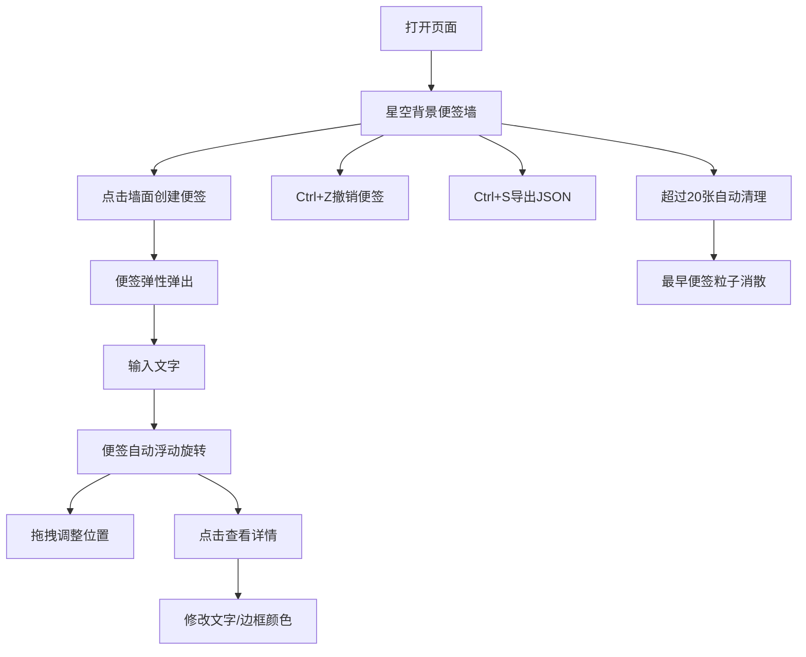

## 1. 产品概述

流光星语便签墙是一款沉浸式的虚拟便签应用，用户可以在深邃的星空背景墙面上创建、排列彩色发光便签，记录灵感与心情。

- 主要用途：个人灵感记录、心情便签、创意收集
- 目标用户：需要视觉化记录想法的创意工作者和普通用户
- 产品价值：将普通的便签记录转化为富有美学体验的创意工具

## 2. 核心功能

### 2.1 功能模块

1. **便签墙主页**：星空背景、便签创建、便签管理、便签详情、快捷键操作

### 2.2 页面详情

| 页面名称 | 模块名称 | 功能描述 |
|-----------|-------------|---------------------|
| 便签墙主页 | 星空背景 | 深紫到墨蓝的射线渐变背景，150颗半透明白色星点随机闪烁并向中心漂移 |
| 便签墙主页 | 便签创建 | 点击任意位置创建便签，弹性弹出动画 |
| 便签墙主页 | 便签展示 | 渐变发光边框、随机倾斜旋转、缓慢浮动、呼吸光效文字 |
| 便签墙主页 | 便签拖拽 | 鼠标拖拽重新排列，拖拽时放大增强发光 |
| 便签墙主页 | 便签详情 | 点击弹出模态框，显示详情、修改颜色 |
| 便签墙主页 | 便签管理 | 超过20张时最早的渐隐粒子消散，Ctrl+Z撤销，Ctrl+S导出JSON |

## 3. 核心流程

用户打开页面 → 看到星空背景便签墙 → 点击墙面任意位置创建便签 → 输入文字 → 拖拽便签调整位置 → 点击便签查看详情/修改颜色 → 使用快捷键撤销或导出

## 4. 用户界面设计

### 4.1 设计风格
- 主色调：深紫 #120a2a → 墨蓝 #0a1630 射线渐变
- 便签边框配色（5组渐变配色）：
  - 暖橙 #ff8844 → 淡黄 #ffdd88
  - 冰蓝 #44aaff → 淡蓝 #88ddff
  - 粉紫 #cc66ff → 淡粉 #ff88dd
  - 翠绿 #44dd88 → 淡绿 #88ffbb
  - 赤红 #ff4466 → 淡粉 #ffaacc
- 便签背景：半透明黑色 #00000055
- 文字颜色：白色 #eee
- 字体：14px，行高1.6
- 便签尺寸：140px × 160px，圆角16px，边框3px

### 4.2 页面设计概览

| 页面名称 | 模块名称 | UI元素 |
|-----------|-------------|-------------|
| 便签墙主页 | 星空背景 | 射线渐变、150颗闪烁星点、全屏自适应 |
| 便签墙主页 | 便签卡片 | 渐变发光边框、半透明黑底、弧形文字、呼吸光效 |
| 便签墙主页 | 便签详情模态框 | 详细内容、创建时间、颜色选择器 |

### 4.3 响应式
- 全屏自适应布局，桌面端优先

### 4.4 动效设计
- 便签创建：弹性弹出（0.5倍→1倍，0.6秒，easeOutBounce）
- 便签浮动：缓慢上下漂移（幅度3px，周期2-4秒）
- 便签旋转：0.3度随机倾斜缓慢旋转
- 鼠标悬停：放大1.05倍，光晕2px→6px
- 拖拽时：放大增强发光
- 粒子消散：便签删除时的渐隐粒子动画
- 星点闪烁：0.5-2秒随机周期
- 文字呼吸光效：微弱亮度变化
