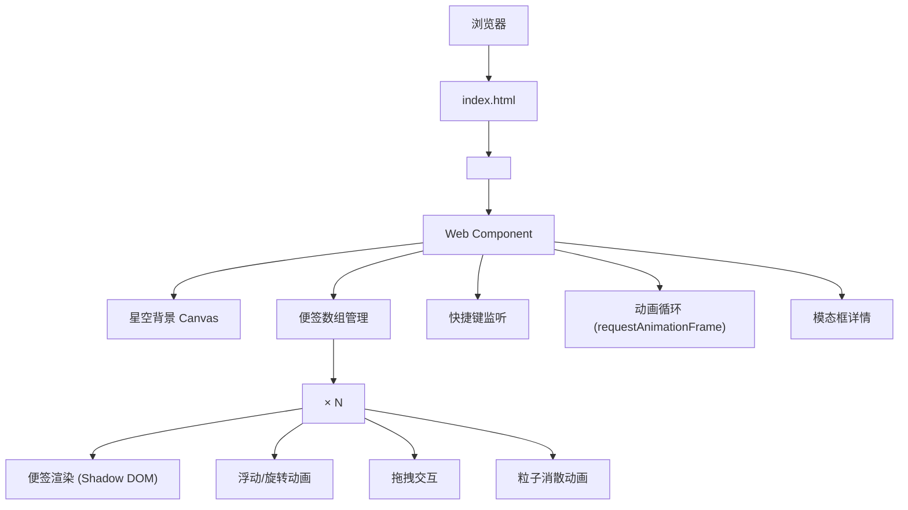

## 1. 架构设计



## 2. 技术说明

- 前端框架：原生 Web Components（Custom Elements + Shadow DOM）
- 编程语言：TypeScript 5.5.0（严格模式，ES2020）
- 构建工具：Vite 5.4.0（开发服务器端口 3000）
- 无第三方 UI 框架，全部使用原生 API 实现
- 动画驱动：requestAnimationFrame（性能优化，保持 60fps）

## 3. 项目结构

| 路径 | 说明 |
|-------|------|
| /package.json | 项目依赖和启动脚本 |
| /vite.config.js | Vite 构建配置 |
| /tsconfig.json | TypeScript 配置 |
| /index.html | 入口页面 |
| /src/note-wall.ts | 便签墙容器组件 `<x-note-wall>` |
| /src/note-item.ts | 单张便签组件 `<x-note-item>` |

## 4. 数据模型

### 4.1 便签数据结构

```typescript
interface NoteData {
  id: string;
  text: string;
  colorPair: ColorPair;
  textColor: string;
  position: { x: number; y: number };
  rotation: number;
  floatingOffset: number;
  createdAt: number;
}

interface ColorPair {
  from: string;
  to: string;
}
```

### 4.2 预设便签配色

```typescript
const COLOR_PAIRS: ColorPair[] = [
  { from: '#ff8844', to: '#ffdd88' }, // 暖橙
  { from: '#44aaff', to: '#88ddff' }, // 冰蓝
  { from: '#cc66ff', to: '#ff88dd' }, // 粉紫
  { from: '#44dd88', to: '#88ffbb' }, // 翠绿
  { from: '#ff4466', to: '#ffaacc' }, // 赤红
];
```

## 5. 自定义元素接口

### 5.1 `<x-note-wall>` 属性与事件

- 内部状态：便签数组、当前拖拽的便签、动画帧 ID
- 内部方法：`createNote(x, y)`、`deleteNote(id, animate)`、`handleUndo()`、`handleExport()`
- 监听事件：子组件的 `note-click`、`note-drag-start`、`note-drag-move`、`note-drag-end`、`note-delete`

### 5.2 `<x-note-item>` 属性

| 属性名 | 类型 | 说明 |
|--------|------|------|
| id | string | 便签唯一 ID |
| colorPair | ColorPair | 渐变边框配色 |
| text | string | 便签内容文字 |
| rotation | number | 初始旋转角度（度） |
| floatingOffset | number | 浮动偏移相位 |

### 5.3 `<x-note-item>` 派发事件

- `note-click`：点击便签（非拖拽）
- `note-drag-start`：开始拖拽
- `note-drag-move`：拖拽中（位置更新）
- `note-drag-end`：结束拖拽
- `note-delete`：请求删除（粒子消散完成后）

## 6. 性能优化策略

- 使用 `requestAnimationFrame` 统一驱动所有动画循环
- 星空背景使用单个 Canvas 批量渲染 150 颗星点
- 便签浮动/旋转动画通过 CSS transform（GPU 加速）实现
- 粒子消散使用离屏计算，避免频繁 DOM 操作
- Shadow DOM 样式隔离，减少重排范围
- 最大同时显示便签数：30 张（超过后最早的自动清理）
