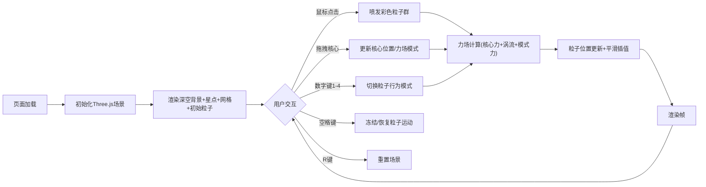

## 1. 产品概述

三维星云流体动力学实时交互可视化应用，让用户在浏览器中以星云雕塑师的身份，通过鼠标交互注入彩色粒子流，观察粒子在动态力场作用下融合、分裂并形成不断演化的星云结构。

- 核心价值：为用户提供沉浸式的三维粒子流体交互体验，支持实时创作和观察星云演化过程
- 目标用户：数字艺术家、科学可视化爱好者、创意交互体验开发者

## 2. 核心功能

### 2.1 功能模块

1. **主场景页面**：深空背景三维画布、粒子系统、力场核心、参考网格、状态栏

### 2.2 页面详情

| 页面名称 | 模块名称 | 功能描述 |
|-----------|-------------|---------------------|
| 主场景 | 深空背景 | 径向渐变(#050510→#0f0518)，500颗闪烁星点 |
| 主场景 | 粒子喷发 | 鼠标点击喷发300-500个彩色粒子，8色调色板随机 |
| 主场景 | 力场核心 | 可拖拽吸引/排斥核心，Shift切换排斥模式 |
| 主场景 | 涡流场 | 绕Y轴旋转(0.005 rad/s)，产生螺旋轨迹 |
| 主场景 | 模式切换 | 数字键1-4切换：自由扩散/聚合/分裂/湍流 |
| 主场景 | 冻结/重置 | 空格冻结，R键重置场景 |
| 主场景 | 参考网格 | 半透明三维网格(-8~8，#3355aa，alpha 0.1) |
| 主场景 | 状态栏 | 粒子数、模式名、核心坐标实时显示 |

## 3. 核心流程

用户打开页面 → 深空场景加载完成（含初始100个随机粒子）→ 鼠标点击注入粒子群 → 粒子在力场中演化 → 可拖拽核心/切换模式/冻结/重置 → 状态栏实时反馈状态

## 4. 用户界面设计

### 4.1 设计风格
- **主色调**：深空深黑紫径向渐变背景(#050510→#0f0518)
- **粒子色板**：#ff3366, #ff9933, #ffcc33, #33cc66, #3399ff, #9933ff, #ff33cc, #88aaff
- **辅助色**：半透明蓝紫(#3355aa网格，#aaccff文字，#111122cc状态栏背景)
- **视觉风格**：半透明发光风格，粒子发光模糊效果，深空沉浸式体验
- **布局**：全屏Canvas(100vw×100vh)，底部固定状态栏(80px高)
- **最低分辨率**：1280×720，低于此分辨率时画布居中，灰色背景(#222)

### 4.2 页面设计概述

| 页面名称 | 模块名称 | UI元素 |
|-----------|-------------|-------------|
| 主场景 | 深空背景 | 径向渐变，500闪烁星点，暗色调深空风格 |
| 主场景 | 粒子系统 | 彩色发光粒子，模糊半径6px(>3000粒子时减半为3px)，半径2-5px随机 |
| 主场景 | 力场核心 | 可拖拽球体，半透明发光，默认位置(0,0,0)，半径3单位 |
| 主场景 | 参考网格 | -8~8范围三维网格，#3355aa，透明度0.1，固定朝向 |
| 主场景 | 状态栏 | 底部固定80px高，#111122cc背景，#aaccff文字16px，左右20px padding，弹性动画 |

### 4.3 响应式
- 桌面优先，全屏自适应布局(flex居中)
- 最低支持1280×720，低于此分辨率显示灰色背景并居中画布

### 4.4 3D场景指引
- **环境**：深空径向渐变背景，500颗随机星点
- **光照**：粒子自发光，无需额外光源
- **相机**：透视相机，可通过OrbitControls旋转缩放观察
- **交互**：鼠标点击喷发粒子，拖拽力场核心，键盘快捷键切换模式
- **后处理**：粒子发光模糊效果(通过shader或sprite实现)
- **性能预算**：≤3000粒子时≥50FPS，>3000粒子自动降低模糊半径
