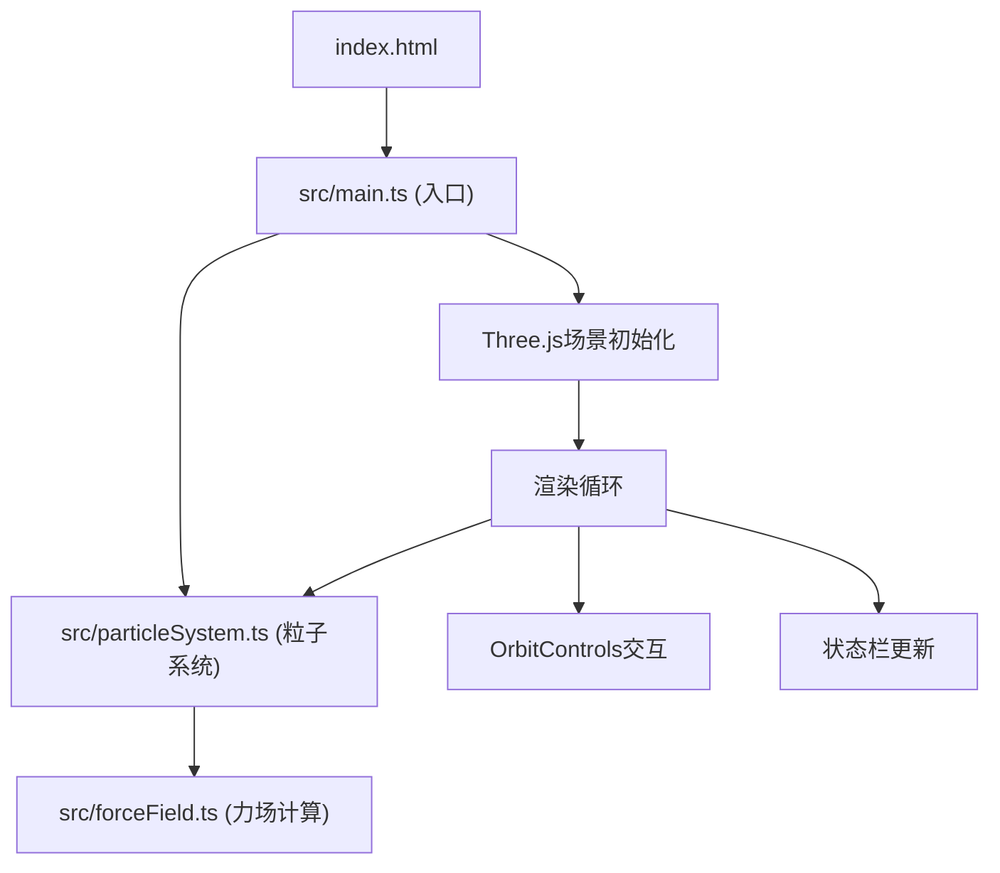

## 1. 架构设计



## 2. 技术描述

- **前端框架**：原生 TypeScript + Three.js (无 React/Vue，按用户要求)
- **构建工具**：Vite@5.4.0
- **语言标准**：TypeScript@5.5.0 (严格模式，target ES2020)
- **3D引擎**：Three.js@0.160.0
- **开发服务器端口**：3000

## 3. 项目文件结构

| 文件路径 | 用途 |
|----------|------|
| package.json | 项目依赖与启动脚本 |
| vite.config.js | Vite配置(端口3000) |
| tsconfig.json | TypeScript严格模式配置 |
| index.html | 入口页面，加载src/main.ts |
| src/main.ts | 主入口：初始化场景、相机、渲染器、控制器、交互事件、渲染循环 |
| src/particleSystem.ts | 粒子系统核心：创建/更新/渲染粒子、模式切换、状态管理 |
| src/forceField.ts | 力场计算模块：核心吸引力/排斥力、涡流、聚合/分裂/湍流力 |

## 4. 核心数据结构

### 4.1 粒子数据结构
```typescript
interface Particle {
  position: THREE.Vector3;    // 当前位置
  velocity: THREE.Vector3;    // 当前速度
  color: THREE.Color;         // 粒子颜色
  baseColor: THREE.Color;     // 原始颜色(用于模式切换闪烁)
  size: number;               // 粒子半径 2-5px
  flashProgress: number;      // 模式切换闪烁动画进度 0~1
}
```

### 4.2 粒子行为模式
```typescript
type ParticleMode = 'free' | 'aggregate' | 'split' | 'turbulence';
// 1=free 自由扩散, 2=aggregate 聚合, 3=split 分裂, 4=turbulence 湍流
```

### 4.3 力场核心状态
```typescript
interface ForceCore {
  position: THREE.Vector3;  // 核心位置
  radius: number;           // 影响半径 3单位
  isRepulsive: boolean;     // true=排斥, false=吸引(Shift键切换)
}
```

## 5. 力场计算公式

### 5.1 核心径向力
```
F_core = direction * strength / max(distance, 0.5)
strength: 吸引为正，排斥为负(Shift键时取反)
```

### 5.2 涡流力(绕Y轴)
```
角速度: ω = 0.005 rad/s
切向方向: tangent = normalize(cross(up, position - core))
F_vortex = tangent * ω * distance_from_Y_axis
```

### 5.3 模式力
- **聚合模式**: 对邻近粒子施加弱吸引力(距离阈值内)
- **分裂模式**: 对邻近粒子施加弱排斥力
- **湍流模式**: 叠加Perlin噪声或伪随机扰动向量

## 6. 性能优化策略

1. **粒子数量限制**: 动态管理，超过上限可考虑衰减移除
2. **发光模糊降级**: 粒子>3000时模糊半径从6px降至3px
3. **空间分区**: 聚合/分裂模式下使用网格空间分区加速邻近查询
4. **批量渲染**: 使用THREE.Points + BufferGeometry批量渲染所有粒子
5. **Shader优化**: 自定义shader实现粒子发光效果，避免后处理开销

## 7. 交互事件映射

| 事件 | 行为 |
|------|------|
| 鼠标左键点击场景 | 喷发300-500个随机颜色粒子 |
| 鼠标拖拽核心 | 移动力场核心位置 |
| Shift + 拖拽核心 | 排斥模式(默认吸引) |
| 数字键 1 | 自由扩散模式 |
| 数字键 2 | 聚合模式 |
| 数字键 3 | 分裂模式 |
| 数字键 4 | 湍流模式 |
| 空格键 | 冻结/恢复粒子运动 |
| R键 | 重置场景(清除粒子，生成100个初始粒子) |
