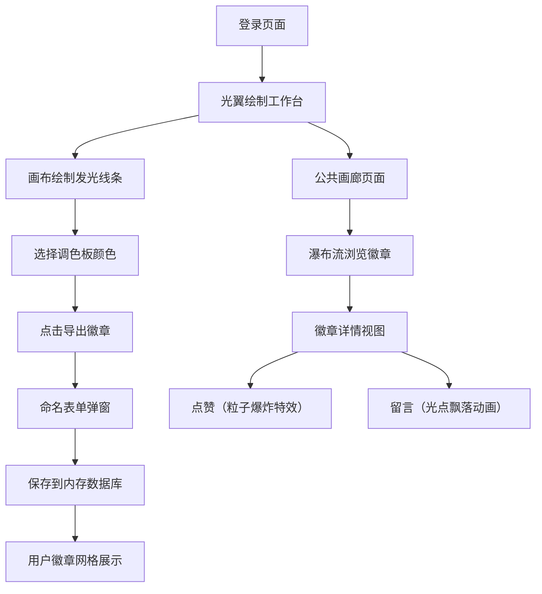

## 1. 产品概述

光翼画廊是一个数字艺术社区平台，让用户化身光翼设计师，在个人工作台上绘制动态发光线条并导出为可穿戴的虚拟光翼徽章。徽章可在社区公共画廊中展示，支持点赞和留言互动。

- **目标用户**：数字艺术爱好者、创意设计师、社区互动用户
- **核心价值**：将创意光绘作品转化为可分享、可互动的虚拟徽章，构建沉浸式艺术社区

## 2. 核心功能

### 2.1 用户角色

| 角色 | 注册方式 | 核心权限 |
|------|----------|----------|
| 普通用户 | 昵称注册（模拟登录） | 绘制光翼、导出徽章、浏览画廊、点赞、留言 |

### 2.2 功能模块

1. **登录/注册页面**：呼吸光翼图标、登录表单、渐变背景
2. **光翼绘制工作台**：绘图画布、12色调色板、导出徽章、用户徽章网格
3. **公共画廊页面**：瀑布流布局、徽章卡片、懒加载、详情视图
4. **徽章详情页**：放大徽章、留言光点、点赞粒子特效、贝塞尔曲线飘落动画

### 2.3 页面详情

| 页面名称 | 模块名称 | 功能描述 |
|----------|----------|----------|
| 登录页 | 光翼图标动画 | 半透明发光翼形，呼吸脉动3秒周期 |
| 登录页 | 登录表单 | 半透明圆角输入框，聚焦变色，跳转工作台 |
| 工作台 | 绘图画布 | 800x600画布，鼠标拖拽绘制发光线条 |
| 工作台 | 调色板 | 12色预设，线条8px+6px高斯模糊发光 |
| 工作台 | 导出徽章 | 缩放为64px圆形徽章，20个旋转粒子光晕 |
| 工作台 | 命名保存 | 弹出命名表单，闪光提示"光翼已展开" |
| 工作台 | 用户徽章网格 | 卡片悬停翼形扇动（上下10度，1.5秒周期） |
| 画廊页 | 瀑布流布局 | 半透明卡片，显示预览和作者昵称 |
| 详情页 | 徽章放大 | 全屏暗化遮罩，中央放大徽章 |
| 详情页 | 留言光点 | 彩色小球点击弹出气泡留言 |
| 详情页 | 点赞功能 | 心形图标+15粒子爆炸特效（0.6秒生命周期） |
| 详情页 | 留言功能 | Enter发送，贝塞尔曲线飘落1秒 |

## 3. 核心流程

用户从登录页进入，在工作台画布上绘制光翼线条，选择颜色后导出为徽章，命名保存后可在个人网格中查看。公共画廊展示所有用户徽章，点击进入详情可点赞（触发粒子爆炸）和留言（光点飘落动画）。

## 4. 用户界面设计

### 4.1 设计风格

- **主色调**：深紫#120a2a、墨蓝#0a1630
- **强调色**：亮蓝#88aaff、粉色#ff5588
- **背景**：动态径向渐变（角度60度，10秒周期循环）
- **按钮/输入框**：半透明毛玻璃（backdrop-filter: blur(6px)），圆角12px
- **交互反馈**：悬停发光边框（box-shadow: 0 0 12px #88aaff），点击缩放scale(0.95)
- **字体**：展示字体选用优雅衬线体，正文选用现代无衬线字体
- **动画**：页面过渡渐隐渐现0.3秒

### 4.2 页面设计概览

| 页面名称 | 模块名称 | UI元素 |
|----------|----------|--------|
| 登录页 | 中央布局 | 径向渐变背景、200px发光翼形图标、半透明表单 |
| 工作台 | 画布区域 | 深色画布背景、调色板横排、导出按钮、徽章网格 |
| 画廊页 | 瀑布流 | 半透明卡片(#1a1a2e)、缩略预览、作者昵称 |
| 详情页 | 模态层 | 0.6透明度黑色遮罩、中央徽章、留言光点、底部输入框 |

### 4.3 响应式

桌面优先设计，宽度<768px时切换单列布局，画布缩放至屏幕95%宽度，所有交互元素触控优化。

### 4.4 性能要求

- 画布绘制帧率稳定60FPS
- 画廊首次加载≤15张卡片，滚动懒加载
- API响应时间<300ms
- 页面切换过渡流畅无卡顿
