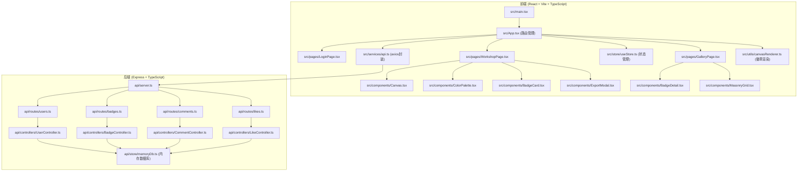
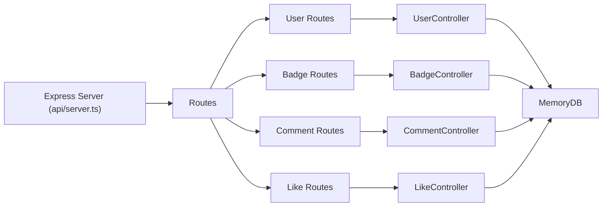
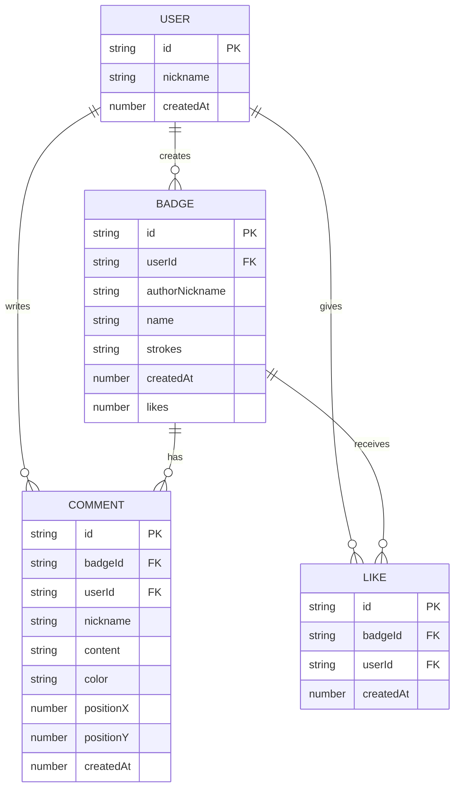

## 1. 架构设计



## 2. 技术描述

- **前端**：React@18.2.0 + TypeScript@5.5.0 + Vite@5.4.0 + @vitejs/plugin-react@4.2.0 + Axios@1.6.0 + Zustand
- **后端**：Express@4.18.0 + TypeScript（内存数据库存储）
- **构建工具**：Vite（开发端口3000）
- **数据存储**：内存Map模拟数据库，启动时加载示例数据
- **样式方案**：纯CSS + CSS变量，毛玻璃backdrop-filter

## 3. 路由定义

| 前端路由 | 页面用途 |
|----------|----------|
| /login | 登录/注册页面 |
| /workshop | 光翼绘制工作台 |
| /gallery | 公共画廊（含详情弹窗） |

## 4. API 定义

### 4.1 用户接口

```typescript
// POST /api/users/login
// Request: { nickname: string }
// Response: { id: string, nickname: string, token: string }

// POST /api/users/register
// Request: { nickname: string }
// Response: { id: string, nickname: string, token: string }
```

### 4.2 徽章接口

```typescript
interface PathPoint { x: number; y: number; }
interface Stroke { color: string; points: PathPoint[]; }
interface Badge {
  id: string;
  userId: string;
  authorNickname: string;
  name: string;
  strokes: Stroke[];
  createdAt: number;
  likes: number;
}

// POST /api/badges
// Request: { name: string, strokes: Stroke[] } (Header: Authorization)
// Response: Badge

// GET /api/badges?userId=xxx&page=1&limit=15
// Response: { badges: Badge[], total: number }

// GET /api/badges/:id
// Response: Badge
```

### 4.3 点赞接口

```typescript
// POST /api/badges/:id/like
// Request: { userId: string }
// Response: { likes: number, liked: boolean }

// GET /api/badges/:id/like?userId=xxx
// Response: { liked: boolean, likes: number }
```

### 4.4 留言接口

```typescript
interface Comment {
  id: string;
  badgeId: string;
  userId: string;
  nickname: string;
  content: string;
  color: string;
  positionX: number;
  positionY: number;
  createdAt: number;
}

// POST /api/badges/:id/comments
// Request: { userId: string, content: string }
// Response: Comment

// GET /api/badges/:id/comments
// Response: Comment[]
```

## 5. 服务端架构图



## 6. 数据模型

### 6.1 ER 图



### 6.2 内存数据库结构

```typescript
interface MemoryDB {
  users: Map<string, { id: string; nickname: string; createdAt: number }>;
  badges: Map<string, Badge>;
  comments: Map<string, Comment>;
  likes: Map<string, { id: string; badgeId: string; userId: string; createdAt: number }>;
  userBadges: Map<string, string[]>;
  badgeLikes: Map<string, Set<string>>;
}
```

## 7. 文件结构与调用关系

```
项目根目录/
├── package.json              # 项目依赖与脚本
├── vite.config.js            # Vite构建配置（端口3000）
├── tsconfig.json             # TypeScript严格模式配置
├── index.html                # HTML入口，含根挂载点
├── src/
│   ├── main.tsx              # React入口 → 渲染App
│   ├── App.tsx               # 主组件，路由管理，axios调用API
│   ├── index.css             # 全局样式、CSS变量、动画
│   ├── pages/
│   │   ├── LoginPage.tsx     # 登录页 → 调用api.login()
│   │   ├── WorkshopPage.tsx  # 工作台 → 调用api.saveBadge/getUserBadges()
│   │   └── GalleryPage.tsx   # 画廊页 → 调用api.getAllBadges()
│   ├── components/
│   │   ├── Canvas.tsx        # 绘图画布 → onStrokeChange传父组件
│   │   ├── ColorPalette.tsx  # 调色板 → onColorSelect传父组件
│   │   ├── BadgeCard.tsx     # 徽章卡片 → 渲染预览，悬停动画
│   │   ├── BadgePreview.tsx  # 徽章预览渲染器
│   │   ├── ExportModal.tsx   # 导出命名弹窗
│   │   ├── BadgeDetail.tsx   # 详情弹窗 → 点赞/留言API
│   │   └── ParticleEffect.tsx# 粒子特效组件
│   ├── services/
│   │   └── api.ts            # Axios封装 → 调用后端REST API
│   ├── store/
│   │   └── useStore.ts       # Zustand全局状态
│   └── utils/
│       └── badgeRenderer.ts  # Canvas徽章绘制工具函数
└── api/
    ├── server.ts             # Express入口，挂载路由，CORS
    ├── routes/
    │   ├── users.ts          # 用户路由 → UserController
    │   ├── badges.ts         # 徽章路由 → BadgeController
    │   ├── comments.ts       # 留言路由 → CommentController
    │   └── likes.ts          # 点赞路由 → LikeController
    ├── controllers/
    │   ├── UserController.ts
    │   ├── BadgeController.ts
    │   ├── CommentController.ts
    │   └── LikeController.ts
    └── store/
        └── memoryDb.ts       # 内存数据库，含初始Mock数据
```
