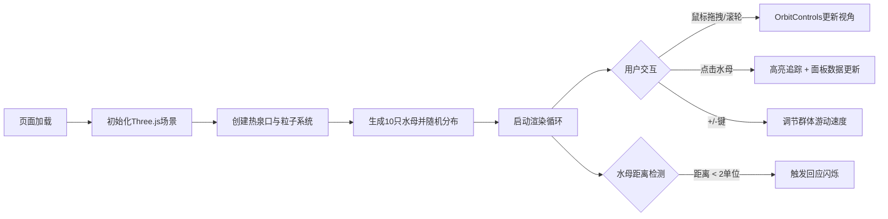

## 1. 产品概述

深海荧光水母交互模拟器——一款沉浸式3D生物可视化网页应用，让用户以深海生物学家的视角观察热泉口附近荧光水母的游弋与生物发光通讯行为。
- 目标：通过Three.js实现高精度的3D深海水母模拟，包含真实的物理运动、生物发光信号交互和用户交互体验
- 目标用户：生物爱好者、科普教育工作者、3D交互艺术爱好者

## 2. 核心功能

### 2.1 用户角色
| 角色 | 注册方式 | 核心权限 |
|------|----------|----------|
| 访客用户 | 无需注册 | 观察场景、点击追踪水母、调节游动速度、旋转缩放视角 |

### 2.2 功能模块
1. **3D深海场景**：纯黑背景、热泉口几何体、喷涌粒子系统、海底碎屑颗粒
2. **水母实体系统**：伞状体、口腕、触手的程序化生成，发光节点
3. **发光状态机**：空闲闪烁、警告闪烁、回应闪烁三种模式及距离触发交互
4. **用户交互系统**：OrbitControls视角控制、点击追踪高亮、键盘速度调节
5. **信息面板UI**：追踪水母实时数据显示、操作说明

### 2.3 页面详情
| 页面名称 | 模块名称 | 功能描述 |
|----------|----------|----------|
| 主页面 | 3D渲染画布 | 全屏WebGL渲染，无边框，纯黑背景 |
| 主页面 | 热泉口系统 | 半圆柱体堆叠几何体 + 粒子喷涌效果 |
| 主页面 | 水母群体 | 10只水母在热泉口周围5-8单位半径内游弋 |
| 主页面 | 信息面板 | 右下角半透明面板显示追踪水母数据 |
| 主页面 | 操作说明 | 左上角简洁说明文字 |

## 3. 核心流程

用户打开页面后自动加载3D场景，水母开始随机游弋并发光。用户可通过鼠标拖拽旋转视角、滚轮缩放观察。点击任意水母可高亮追踪，面板显示该水母的发光状态、速度和坐标。使用键盘+/-键调节整个群体的游动速度（0.5-2倍范围）。当两只水母距离小于2单位时，相互触发回应闪烁信号。

## 4. 用户界面设计

### 4.1 设计风格
- 主色调：纯黑背景 (#000005)、青色 (#00ffff)、紫色 (#ff00ff)、橙红 (#ff4500)
- 按钮/交互：无传统按钮，直接点击3D实体，键盘快捷键
- 字体：系统等宽字体，发光阴影效果
- 布局风格：全屏沉浸式画布，角落浮动UI元素
- 视觉特效：毛玻璃面板、脉冲光环、粒子发光、半透明渐变材质

### 4.2 页面设计概览
| 页面名称 | 模块名称 | UI元素 |
|----------|----------|--------|
| 主页面 | 3D场景 | 纯黑背景、深海氛围、热泉口橙红粒子、水母青紫光晕 |
| 主页面 | 信息面板 | 右下角、圆角12px、毛玻璃backdrop-filter、宽220px、内边距16px、背景rgba(0,10,20,0.7)、淡入动画0.3s |
| 主页面 | 操作说明 | 左上角、白色14px、text-shadow: 0 0 8px #00ffff |
| 主页面 | 追踪光环 | 黄色半透明圆环、半径1.2单位、脉冲周期0.5s |

### 4.3 响应式
- 桌面端优先，自适应窗口大小
- 画布始终全屏，UI元素相对窗口定位
- 鼠标交互（拖拽、滚轮、点击）为主要输入方式

### 4.4 3D场景指南
- **环境**：纯黑 (#000005) 背景，无环境光，仅水母和粒子自发光营造氛围
- **光照**：点光源模拟水母发光，环境光强度极低
- **相机**：PerspectiveCamera，初始位置(0, 5, 15)，OrbitControls启用阻尼
- **构图**：热泉口位于场景中心底部，水母在其周围半径5-8单位、高度-2到2空间漂浮
- **交互**：鼠标左键旋转、右键平移、滚轮缩放；点击水母Raycaster检测；键盘+/-监听
- **后处理**：无额外后处理，通过材质emissive和透明混合实现发光感
- **性能预算**：每只水母顶点<2000，总粒子<300，帧率≥30fps
