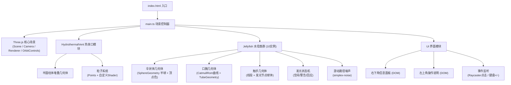

## 1. 架构设计

纯前端单页3D可视化应用，采用模块化TypeScript架构，通过Vite构建，Three.js负责3D渲染。



## 2. 技术描述

- **前端**：TypeScript 5.5.0 + Three.js 0.160.0 + Vite 5.4.0
- **初始化工具**：手动配置（用户指定精确文件结构）
- **后端**：无（纯前端应用）
- **数据库**：无
- **第三方库**：
  - `three@0.160.0`：3D渲染引擎
  - `three/examples/jsm/controls/OrbitControls.js`：相机交互控制
  - `simplex-noise@3.0.0`：水母游动路径的柏林噪声生成

## 3. 路由定义

| 路由 | 用途 |
|------|------|
| / | 主页面 - 3D深海水母场景 |

## 4. 项目文件结构

```
.
├── package.json              # 依赖与脚本配置
├── index.html                # 入口HTML（全屏画布）
├── tsconfig.json             # TypeScript配置（严格模式，ES2022）
├── vite.config.js            # Vite构建配置
└── src/
    ├── main.ts               # 主入口：场景初始化、动画循环、事件协调
    ├── Jellyfish.ts          # 水母类：几何体构建、状态机、噪声游走
    ├── HydrothermalVent.ts   # 热泉口：几何体+粒子系统
    └── UI.ts                 # UI面板：DOM创建、数据更新、事件绑定
```

## 5. 核心类与接口定义

### Jellyfish（水母类）
```typescript
enum GlowState { IDLE, WARNING, RESPONSE }

interface JellyfishConfig {
  position: THREE.Vector3;
  contractionFrequency: number; // 2-4秒随机
  opacity: number;              // 0.3-0.6随机
}

class Jellyfish {
  public group: THREE.Group;
  public glowState: GlowState;
  public isTracked: boolean;
  public trackRing: THREE.Mesh | null;
  
  constructor(config: JellyfishConfig);
  public update(delta: number, time: number, speedMultiplier: number): void;
  public triggerResponse(): void;
  public setTracked(tracked: boolean): void;
  public getPosition(): THREE.Vector3;
}
```

### HydrothermalVent（热泉口类）
```typescript
class HydrothermalVent {
  public group: THREE.Group;
  private particles: THREE.Points;
  private particleData: Array<{ velocity: THREE.Vector3; life: number }>;
  private lastEmitTime: number;
  
  constructor();
  public update(delta: number, time: number): void;
}
```

### UI（界面管理类）
```typescript
interface UIData {
  glowState: string;
  glowColor: string;
  speedMultiplier: number;
  position: { x: number; y: number; z: number };
}

class UI {
  private panel: HTMLElement;
  private instruction: HTMLElement;
  
  constructor();
  public updateTrackedData(data: UIData): void;
  public setPanelVisible(visible: boolean): void;
  public onSpeedChange(callback: (delta: number) => void): void;
  public onJellyfishClick(callback: (jellyfish: Jellyfish) => void): void;
}
```

## 6. 性能优化策略

- **几何体复用**：水母的触手节点小球体使用同一SphereGeometry
- **粒子池化**：热泉口粒子使用固定点数（300上限），循环复用
- **材料共享**：同类水母部件共享材质实例，仅修改uniforms
- **距离检测优化**：每帧仅检测相邻水母对（基于空间网格或简单两两检测，10只水母O(n²)=100可接受）
- **顶点数控制**：伞状体32分段、触手20分段、口腕8分段，单只水母<2000顶点
