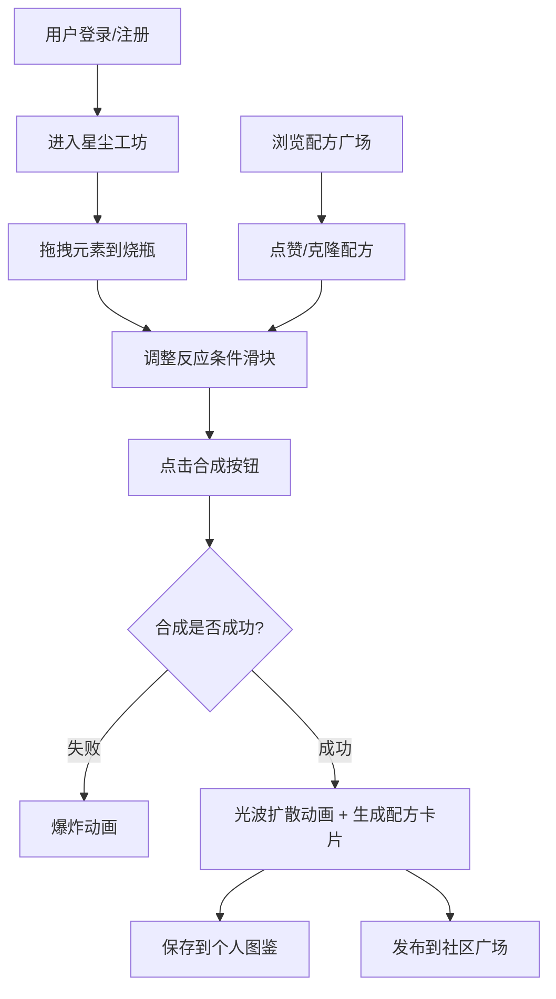

## 1. 产品概述
星尘炼金术是一款面向虚拟星尘炼金术师的全栈Web应用，用户可通过混合虚拟元素（星屑、光尘、暗物质）并控制反应条件来合成具有独特视觉特效的星尘配方，并支持保存、分享和交易。

- 解决的核心问题：星尘炼金术师无法在数字平台上进行虚拟元素混合实验
- 目标用户：虚拟炼金爱好者、视觉艺术创作者、收藏玩家

## 2. 核心特性

### 2.1 用户角色
| 角色 | 注册方式 | 核心权限 |
|------|----------|----------|
| 普通用户 | 用户名+密码注册 | 创建、保存配方；浏览、点赞、克隆社区配方 |

### 2.2 功能模块
1. **登录/注册页**：用户身份认证入口
2. **星尘工坊**：核心实验页面，包含元素库、烧瓶容器、滑块控制、合成按钮
3. **个人图鉴**：用户已保存配方的网格展示与详情查看
4. **配方广场**：社区公开配方的瀑布流展示与交互

### 2.3 页面详情
| 页面名称 | 模块名称 | 功能描述 |
|----------|----------|----------|
| 登录/注册页 | 表单模块 | 用户输入用户名密码进行登录或注册 |
| 星尘工坊 | 元素库 | 拖拽星屑/光尘/暗物质三种元素到烧瓶 |
| 星尘工坊 | 烧瓶容器 | Canvas粒子渲染、液面颜色变化、温度霜/蒸汽效果、合成爆炸/光波动画 |
| 星尘工坊 | 滑块控制区 | 温度(-100~200°C)、压力(0.5~5.0atm)、搅拌速率(0~100rpm) |
| 星尘工坊 | 合成按钮 | 根据配比与条件计算合成结果，触发对应动画 |
| 个人图鉴 | 星图网格 | 半透明星图背景，卡片悬浮，悬停放大发光，点击查看详情 |
| 个人图鉴 | 详情模态框 | 配方详情展示，一键复制参数到工坊 |
| 配方广场 | 瀑布流 | 公开配方卡片展示，底部点赞/克隆按钮 |

## 3. 核心流程

用户登录后进入星尘工坊，从左侧元素库拖拽元素加入烧瓶，调整温度/压力/搅拌滑块观察实时变化，点击合成按钮生成配方（成功/失败触发对应动画），成功后可保存到个人图鉴，也可在广场浏览其他用户的公开配方并点赞或克隆参数。

## 4. 用户界面设计

### 4.1 设计风格
- **主色调**：深空紫 `#0a0518`（基底）、暖金 `#ffcc66`、冰蓝 `#66aaff`
- **辅助色**：星屑 `#ffcc66`、光尘 `#66aaff`、暗物质 `#6633cc`
- **按钮样式**：圆角 8px，背景半透明 `#ffffff10`，悬停加深至 `#ffffff20` 并外发光 4px
- **字体**：主标题使用 Cinzel（炼金术复古风格），正文使用 Noto Sans SC
- **布局**：工坊采用左右布局，图鉴星图网格，广场瀑布流
- **动效**：所有模态框 0.3s ease-out 缩放+透明度动画；粒子系统基于 Canvas 渲染

### 4.2 页面设计概览
| 页面名称 | 模块名称 | UI 元素 |
|----------|----------|---------|
| 登录/注册页 | 表单 | 深空背景+星光粒子，毛玻璃表单卡片，暖金按钮 |
| 星尘工坊 | 烧瓶 | 渐变背景 `#0a0a1a`→`#1a1a2a`，3px 半透明白色边框，烧瓶形状 SVG 遮罩 |
| 星尘工坊 | 滑块 | 自定义轨道渐变发光，滑块圆形发光 |
| 个人图鉴 | 卡片网格 | 半透明星图连线背景，卡片 1.2 倍悬停放大 |
| 配方广场 | 瀑布流卡片 | 心形粒子点赞动效，克隆 5 秒提示 Toast |

### 4.3 响应式
- Desktop-first 设计
- 宽度 <768px 时：工坊面板垂直布局，元素库折叠为抽屉，滑块垂直排列
- 触摸优化：拖拽支持 touch events，点击区域 ≥44px

### 4.4 性能要求
- 粒子渲染与合成动画期间 FPS ≥30
- Canvas 使用 requestAnimationFrame，粒子数量动态优化
