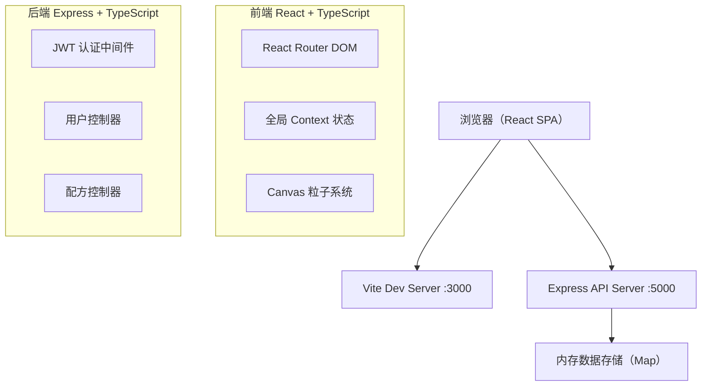
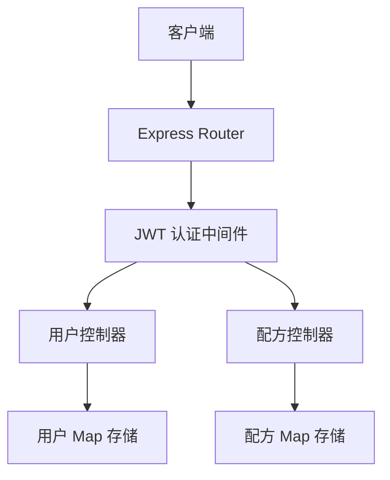
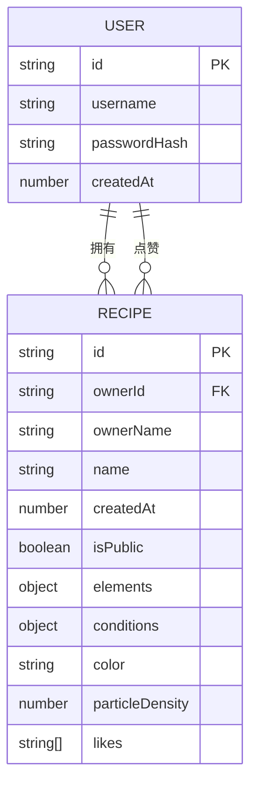

## 1. 架构设计



## 2. 技术说明
- **前端**：React@18.2.0 + TypeScript@5.5.0 + Vite@5.4.0 + @vitejs/plugin-react@4.2.0 + react-router-dom@6.20.0
- **后端**：Express@4.18.0 + TypeScript@5.5.0 + bcrypt@5.1.0 + jsonwebtoken@9.0.0
- **构建工具**：Vite 5.4（开发端口 3000），后端使用 ts-node
- **数据存储**：内存 Map 结构（用户 Map、配方 Map）
- **样式方案**：原生 CSS + CSS Variables，毛玻璃 backdrop-filter
- **粒子渲染**：HTML5 Canvas + requestAnimationFrame

## 3. 路由定义

| 路由 | 页面 | 说明 |
|------|------|------|
| `/login` | 登录/注册页 | 用户身份认证 |
| `/workshop` | 星尘工坊 | 核心合成实验页面 |
| `/gallery` | 配方广场 | 社区公开配方 |
| `/collection` | 个人图鉴 | 已保存配方 |

## 4. API 定义

```typescript
// 用户类型
interface User {
  id: string;
  username: string;
  passwordHash: string;
  createdAt: number;
}

// 配方类型
interface Recipe {
  id: string;
  ownerId: string;
  ownerName: string;
  name: string;
  createdAt: number;
  isPublic: boolean;
  elements: { stardust: number; lightdust: number; darkmatter: number };
  conditions: { temperature: number; pressure: number; stirRate: number };
  color: string;
  particleDensity: number;
  likes: string[];
}

// 认证
POST /api/auth/register    { username, password } → { token, user }
POST /api/auth/login       { username, password } → { token, user }

// 配方
GET    /api/recipes                          → Recipe[]          (公开配方)
GET    /api/recipes/mine                     → Recipe[]          (当前用户配方)
POST   /api/recipes                          → Recipe            (创建配方，需JWT)
GET    /api/recipes/:id                      → Recipe            (配方详情)
PATCH  /api/recipes/:id/like                 → { likes: number } (点赞/取消)
```

## 5. 服务端架构图



## 6. 数据模型

### 6.1 ER 图


### 6.2 内存数据结构
```typescript
// server/src/store.ts
export const users = new Map<string, User>();
export const recipes = new Map<string, Recipe>();

// 索引：用户名 -> 用户ID
export const usernameIndex = new Map<string, string>();
```

## 7. 项目目录结构

```
auto172/
├── package.json
├── vite.config.js
├── tsconfig.json
├── index.html
├── server/
│   ├── package.json
│   └── src/
│       ├── index.ts
│       ├── auth.ts
│       └── store.ts
└── client/
    ├── package.json
    └── src/
        ├── main.tsx
        ├── App.tsx
        ├── context/
        │   └── AppContext.tsx
        ├── components/
        │   ├── Flask.tsx
        │   ├── Card.tsx
        │   ├── ElementLibrary.tsx
        │   ├── Slider.tsx
        │   └── Modal.tsx
        ├── pages/
        │   ├── Login.tsx
        │   ├── Workshop.tsx
        │   ├── Gallery.tsx
        │   └── Collection.tsx
        ├── styles/
        │   └── global.css
        └── utils/
            ├── api.ts
            └── synthesis.ts
```
