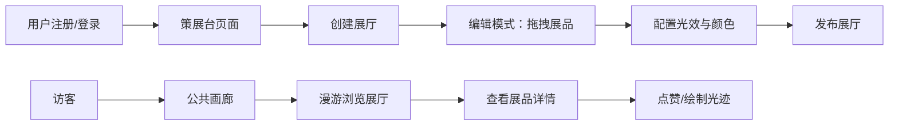

## 1. 产品概述

虚拟数字藏品展览会管理系统，解决数字藏家作为策展人无法在线上空间创建个性化展厅、布置带光效展品，以及访客无法沉浸式漫游浏览、互动点赞和留下光迹评论的问题。

- 目标用户：数字藏家（策展人）、艺术爱好者（访客）
- 产品价值：打造沉浸式虚拟展览体验，让数字藏品展示超越传统画廊的物理限制

## 2. 核心功能

### 2.1 用户角色

| 角色 | 注册方式 | 核心权限 |
|------|----------|----------|
| 策展人 | 用户名密码注册 | 创建/编辑展厅、布置展品、配置光效 |
| 访客 | 无需注册 | 漫游展厅、点赞、绘制光迹评论 |

### 2.2 功能模块

1. **登录页面**：用户注册/登录，JWT认证
2. **策展台页面**：展厅缩略图网格展示、创建新展厅、进入编辑模式
3. **展厅编辑页面**：展品拖拽放置、光效类型切换、光晕颜色配置
4. **公共画廊页面**：第一人称漫游、展品详情、光迹绘制、点赞互动

### 2.3 页面详情

| 页面名称 | 模块名称 | 功能描述 |
|----------|----------|----------|
| 登录页 | 认证表单 | 用户名密码注册/登录，表单校验，错误提示 |
| 策展台 | 展厅网格 | 俯视缩略图展示、实时合成渲染、呼吸光效悬停动画 |
| 展厅编辑 | 虚拟空间编辑器 | 深色径向渐变背景、展品拖拽放置、光效下拉菜单、拾色器 |
| 公共画廊 | 漫游场景 | WASD/方向键控制、平滑缓动镜头、流动光幕入口、展品光效激活 |
| 公共画廊 | 光迹绘制 | 12色调色板、3px发光轨迹、5秒衰减、颜色混合与粒子碰撞 |
| 公共画廊 | 互动系统 | 点赞波纹动画、金色持续发光、访客列表展示 |

## 3. 核心流程

用户注册登录 → 进入策展台 → 创建新展厅 → 拖拽放置展品并配置光效 → 发布展厅 → 访客进入公共画廊 → 第一人称漫游浏览 → 查看展品详情 → 点赞或绘制光迹评论

## 4. 用户界面设计

### 4.1 设计风格

- **主色调**：深色主题，背景#0f0f1a，卡片#1a1a2e，文字#e0e0ff
- **强调色**：光晕渐变#ffaa66 → #66aaff，金色点赞#ffcc44，边框#4455aa(0.3透明度)
- **按钮风格**：圆角8px，微光晕边框，悬停发光增强
- **布局风格**：Flex响应式网格（大屏4列/中屏3列/小屏2列）
- **动画效果**：页面淡入0.4秒，呼吸光效2秒周期，镜头移动平滑缓动

### 4.2 页面设计概述

| 页面名称 | 模块名称 | UI元素 |
|----------|----------|--------|
| 登录页 | 认证卡片 | 深色玻璃态卡片、渐变光晕边框、输入框聚焦光效 |
| 策展台 | 展厅缩略图 | 俯视渲染缩略图、呼吸光晕悬停、点击进入编辑 |
| 展厅编辑 | 编辑画布 | 径向渐变深色背景、圆形发光展台(140px)、拖拽手柄 |
| 展厅编辑 | 控制面板 | 光效类型下拉、颜色拾色器、保存按钮 |
| 公共画廊 | 漫游视图 | 第一人称视角、方向键控制、平滑移动缓动 |
| 公共画廊 | 展品卡 | 半透明详情框(#000000aa)、2px光晕边框、名称/描述/时间 |
| 公共画廊 | 光迹工具 | 12色调色板、绘制按钮、清除按钮 |
| 公共画廊 | 点赞按钮 | 波纹扩散动画(半径40px)、金色持续发光状态 |

### 4.3 响应式设计

- 桌面优先设计
- 策展台网格：>1200px 4列 / 768-1200px 3列 / <768px 2列
- 移动端触控优化，确保拖拽和绘制操作流畅
