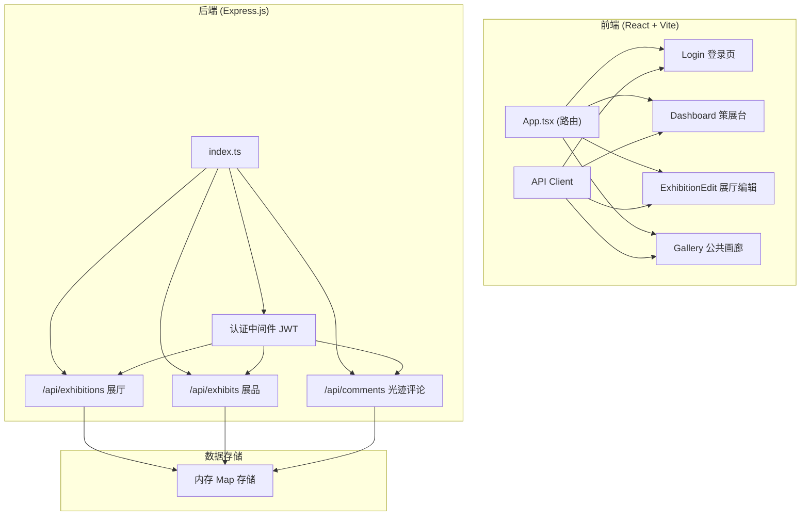
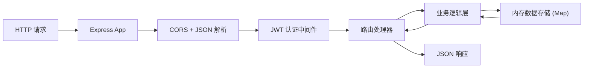
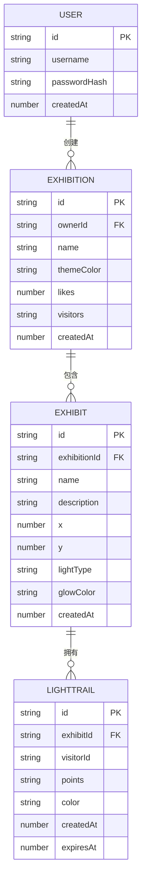

## 1. 架构设计



## 2. 技术描述

- **前端**：React@18.2.0 + TypeScript@5.5.0 + Vite@5.4.0 + react-router-dom@6.20.0
- **构建工具**：Vite@5.4.0 + @vitejs/plugin-react@4.2.0
- **后端**：Express@4.18.0 + TypeScript@5.5.0
- **认证**：JWT，Session过期30分钟
- **数据存储**：内存Map（开发阶段）
- **样式方案**：纯CSS + CSS变量，暗色主题系统

## 3. 路由定义

| 路由 | 用途 |
|------|------|
| /login | 用户登录/注册页面 |
| /dashboard | 策展台，展厅缩略图网格 |
| /exhibition/:id/edit | 展厅编辑模式 |
| /gallery | 公共画廊漫游页面 |

## 4. API 定义

### 4.1 类型定义

```typescript
interface User {
  id: string;
  username: string;
  passwordHash: string;
  createdAt: number;
}

interface Exhibition {
  id: string;
  ownerId: string;
  name: string;
  themeColor: string;
  likes: number;
  visitors: string[];
  createdAt: number;
  updatedAt: number;
}

interface Exhibit {
  id: string;
  exhibitionId: string;
  name: string;
  description: string;
  x: number;
  y: number;
  lightType: 'pulse' | 'rotate' | 'ripple';
  glowColor: string;
  createdAt: number;
}

interface LightTrail {
  id: string;
  exhibitId: string;
  visitorId: string;
  points: { x: number; y: number }[];
  color: string;
  createdAt: number;
  expiresAt: number;
}
```

### 4.2 API端点

| 方法 | 路径 | 描述 | 请求体 | 响应 |
|------|------|------|--------|------|
| POST | /api/auth/register | 用户注册 | { username, password } | { token, user } |
| POST | /api/auth/login | 用户登录 | { username, password } | { token, user } |
| GET | /api/exhibitions | 获取展厅列表 | - | Exhibition[] |
| POST | /api/exhibitions | 创建展厅 | { name, themeColor } | Exhibition |
| GET | /api/exhibitions/:id | 获取展厅详情 | - | Exhibition |
| PUT | /api/exhibitions/:id | 更新展厅 | Partial<Exhibition> | Exhibition |
| POST | /api/exhibitions/:id/like | 点赞展厅 | - | { likes: number } |
| GET | /api/exhibitions/:id/exhibits | 获取展品列表 | - | Exhibit[] |
| POST | /api/exhibits | 创建展品 | { exhibitionId, name, description, x, y, lightType, glowColor } | Exhibit |
| PUT | /api/exhibits/:id | 更新展品 | Partial<Exhibit> | Exhibit |
| DELETE | /api/exhibits/:id | 删除展品 | - | { success: true } |
| GET | /api/exhibits/:id/trails | 获取光迹列表 | - | LightTrail[] |
| POST | /api/exhibits/:id/trails | 添加光迹 | { points, color } | LightTrail |

## 5. 服务端架构



## 6. 数据模型

### 6.1 ER 图



### 6.2 内存存储结构

```typescript
// users: Map<string, User>
// exhibitions: Map<string, Exhibition>
// exhibits: Map<string, Exhibit>
// lightTrails: Map<string, LightTrail>
// tokens: Map<string, { userId: string; expiresAt: number }>
```
