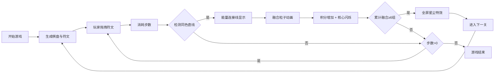

## 1. 产品概述

星轨符文解谜是一款基于浏览器的休闲益智游戏，玩家扮演星轨符文师，在悬浮的星轨棋盘上通过拖拽符文石，将同色符文排列成直线以触发链式能量融合，最终点亮星轨核心。

- 主要目标：通过策略性拖拽符文石，形成同色符文直线融合，获取高分并通关
- 目标用户：休闲游戏爱好者，喜欢策略解谜类游戏的玩家
- 市场价值：提供沉浸式的视觉体验与策略性的游戏玩法，适合碎片时间娱乐

## 2. 核心功能

### 2.1 功能模块
1. **星轨棋盘系统**：三层同心六边形环布局，格子闪烁星点效果，中心星轨核心
2. **符文石系统**：四种基础符文属性（火焰、冰霜、雷电、暗影），拖拽移动与吸附，拖尾粒子效果
3. **能量融合系统**：直线检测（0°、60°、120°），能量连接线脉动，融合爆裂粒子动画
4. **关卡进度系统**：核心点亮机制，关卡递进（步数限制、符文种类增加），全屏星尘通关特效
5. **计分与步数系统**：基础得分与连击加成，步数限制与缩放动画，飘字得分提示
6. **视觉反馈系统**：悬停光晕、屏幕振动、融合闪白、深空背景星点

### 2.2 页面详情

| 页面名称 | 模块名称 | 功能描述 |
|---------|---------|---------|
| 游戏主页面 | 背景渲染 | 深紫到墨蓝径向渐变背景，300颗闪烁星点 |
| 游戏主页面 | 信息栏 | 顶部半透明面板，显示当前得分与剩余步数 |
| 游戏主页面 | 星轨棋盘 | 三层六边形环棋盘，36个格子，中心星轨核心 |
| 游戏主页面 | 符文石 | 12颗可拖拽符文石，四种属性区分 |
| 游戏主页面 | 提示文字 | 底部操作提示 |

## 3. 核心流程

玩家进入游戏 → 查看棋盘布局与符文位置 → 拖拽符文石至空位（消耗步数） → 系统检测同色符文直线 → 触发能量连接线与融合动画 → 获得积分并闪烁核心 → 累计融合6组符文 → 核心完全点亮 → 全屏星尘特效 → 进入下一关（步数减少、符文增加）

## 4. 用户界面设计

### 4.1 设计风格
- **主色调**：深空背景（深紫#0a0515 → 墨蓝#071018），符文属性色（火焰#ff4433、冰霜#33aaff、雷电#ffcc33、暗影#8844cc、光耀#ffcc88）
- **辅助色**：格子边框#5566aa、文字#ddeeff、提示#8899bb、核心光晕#88aaff
- **视觉风格**：神秘宇宙星空风格，粒子光效，半透明玻璃质感面板
- **字体**：现代无衬线字体，信息栏18px，提示14px，飘字3px

### 4.2 页面设计概述

| 页面名称 | 模块名称 | UI元素 |
|---------|---------|---------|
| 游戏主页面 | 背景 | 径向渐变、300颗随机闪烁星点 |
| 游戏主页面 | 信息栏 | 半透明黑色面板(#000000, 0.4)、圆角8px、#ddeeff文字 |
| 游戏主页面 | 棋盘 | 三层六边形环、格子#0f0f1a填充、#5566aa边框(0.3)、格子内暗淡星点 |
| 游戏主页面 | 符文石 | 圆形石体、流动光粒、中心符文符号、悬停光晕+50%亮度 |
| 游戏主页面 | 核心 | 直径40px半透明球体、#88aaff光晕、闪烁扩大到60px |
| 游戏主页面 | 提示区 | 底部#8899bb文字14px |

### 4.3 响应性
- 桌面端优先设计，画布居中显示
- 自适应窗口大小，棋盘基于canvas中心点定位

### 4.4 动画特效
- **拖拽拖尾**：粒子2-4px，半透明渐变消散
- **能量连接线**：4px线宽，2Hz脉动频率
- **融合粒子**：每颗50-80粒子，向外扩散，6px→0px，1.5秒
- **核心闪烁**：40px→60px→40px，0.3秒
- **全屏星尘**：500粒子，200px/s扩散，5px→0px，2秒
- **步数缩放**：1.2倍→1倍，0.2秒
- **飘字得分**：向上飘起，1秒消失
- **屏幕振动**：1px位移，0.1秒
- **融合闪白**：透明度0.3→0，0.15秒
