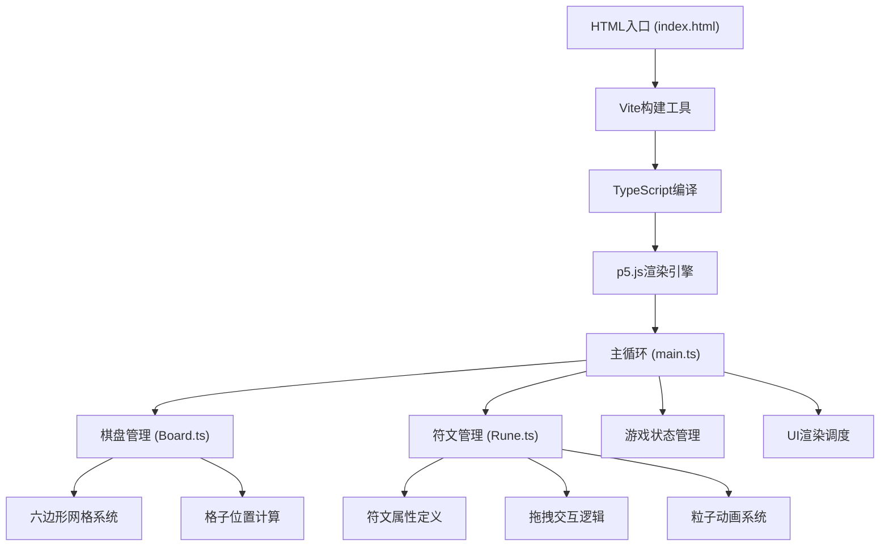

## 1. 架构设计



## 2. 技术描述

- **前端框架**：p5.js@1.9.0（创意编程渲染引擎）
- **开发语言**：TypeScript@5.5.0（严格模式）
- **构建工具**：Vite@5.4.0（开发服务器与打包）
- **无后端依赖**：纯前端单页应用，游戏状态内存管理

## 3. 文件结构

| 文件路径 | 用途 |
|---------|-----|
| package.json | 项目依赖与脚本配置 |
| vite.config.js | Vite构建配置 |
| tsconfig.json | TypeScript严格模式配置 |
| index.html | 入口HTML页面 |
| src/main.ts | 游戏主循环入口、初始化画布、帧更新与渲染调度 |
| src/Board.ts | 星轨棋盘类、六边形网格布局、符文位置与状态、拖拽检测 |
| src/Rune.ts | 符文石类、属性定义、视觉渲染、拖拽逻辑、能量融合动画 |

## 4. 核心数据模型

### 4.1 符文属性枚举
```typescript
enum RuneType {
  FIRE = 'fire',      // 火焰 #ff4433
  ICE = 'ice',        // 冰霜 #33aaff
  THUNDER = 'thunder', // 雷电 #ffcc33
  SHADOW = 'shadow',  // 暗影 #8844cc
  LIGHT = 'light'     // 光耀 #ffcc88 (第2关起)
}
```

### 4.2 六边形格子
```typescript
interface HexCell {
  x: number;          // 中心X坐标
  y: number;          // 中心Y坐标
  ring: number;       // 所在环(0内层, 1中层, 2外层)
  index: number;      // 环内索引(0-11)
  size: number;       // 格子边长
  rune: Rune | null;  // 放置的符文
  stars: StarDot[];   // 格子内星点
}
```

### 4.3 游戏状态
```typescript
interface GameState {
  score: number;          // 当前得分
  steps: number;          // 剩余步数
  level: number;          // 当前关卡
  fusionCount: number;    // 累计融合组数
  comboCount: number;     // 连击计数
  lastFusionTime: number; // 上次融合时间戳
  isDragging: boolean;    // 是否拖拽中
  draggedRune: Rune | null; // 当前拖拽的符文
  particles: Particle[];  // 全局粒子列表
  fusionLines: FusionLine[]; // 融合连接线
  coreFlashTime: number;  // 核心闪烁计时
  screenShake: number;    // 屏幕振动强度
  whiteFlash: number;     // 屏幕闪白透明度
  scorePopups: ScorePopup[]; // 得分飘字
}
```

## 5. 核心算法

### 5.1 六边形坐标系统
- 采用偏移坐标系，三层同心环，每层12个格子
- 内层半径对应25px边长，中层35px，外层45px
- 格子中心位置通过极坐标计算：angle = index * 30°，radius为环半径

### 5.2 直线检测算法
- 三个六边形格子中心点形成直线判断
- 计算两两斜率，允许0°、60°、120°三种方向（容差范围内）
- 同属性符文三点共线则触发融合

### 5.3 粒子系统
- 对象池管理，避免频繁GC
- 每帧更新位置、速度、透明度、大小
- 支持多种粒子：拖尾粒子、融合粒子、星尘粒子、背景星点

## 6. 性能优化
- 60FPS目标帧率，使用p5.js的requestAnimationFrame
- 粒子数量限制，对象池复用
- 几何计算缓存，避免每帧重复计算格子位置
- 减少draw调用，批量渲染同类型元素
