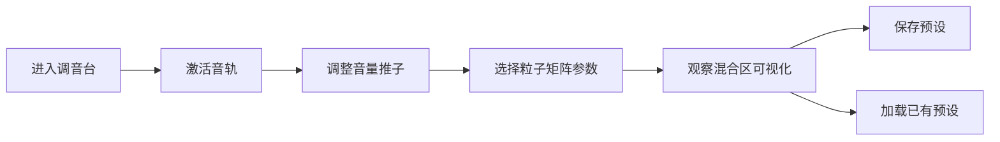

## 1. 产品概述

虚拟音乐星尘调音台是一个面向星尘DJ的全栈Web应用，让用户能够在线上实时混合多种星尘音轨、调整粒子特效与音频波形的联动，并保存和分享自己的混音预设。

- 主要目的：提供沉浸式的太空主题音乐混音体验，融合音频可视化与粒子特效
- 解决问题：星尘DJ无法在线上实时进行多轨混音、粒子特效联动和预设管理
- 目标用户：音乐爱好者、视觉艺术家、星尘DJ
- 产品价值：将音频创作与视觉艺术结合，打造独特的交互式太空音乐体验

## 2. 核心功能

### 2.1 用户角色
| 角色 | 注册方式 | 核心权限 |
|------|---------|---------|
| 星尘DJ | 无需注册，直接使用 | 混音操作、粒子控制、预设管理（本地+云端） |

### 2.2 功能模块
1. **调音台主页面**：左侧预设面板、中间音轨区+混合区、右侧预留区
2. **音轨控制模块**：激活按钮、音量推子、4x4粒子矩阵
3. **混合可视化模块**：粒子系统、音频波形、星尘漩涡
4. **预设管理模块**：预设保存、预设列表、预设加载/删除

### 2.3 页面详情
| 页面名称 | 模块名称 | 功能描述 |
|---------|---------|---------|
| 调音台主页 | 预设面板 | 展示预设卡片列表，支持保存、加载、删除预设，可折叠 |
| 调音台主页 | 音轨区 | 6条音轨，每条包含激活按钮、发光推子、数值显示、粒子矩阵 |
| 调音台主页 | 混合区 | Canvas渲染粒子流、音频波形、中心漩涡动画、背景星点 |
| 调音台主页 | 顶部控制栏 | 预设保存按钮（六边形发光图标） |

## 3. 核心流程

用户进入调音台 → 点击轨道激活按钮启用音轨 → 拖拽推子调整音量 → 点击粒子矩阵格子选择粒子发射参数 → 观察混合区粒子与波形联动 → 点击保存按钮存储预设 → 点击预设卡片加载已有配置

## 4. 用户界面设计

### 4.1 设计风格
- **主色调**：深黑太空 #0a0a1a，深紫面板 #1a1a2e，边框蓝紫 #334466，高亮蓝 #6688aa
- **音轨色**：#ff3366（玫红）、#ff9933（橙）、#ffcc33（金）、#33cc66（翠绿）、#3399ff（天蓝）、#9933ff（紫）
- **按钮风格**：发光圆形激活按钮，六边形保存图标
- **字体**：发光数字字体 #aabbcc，太空科技感
- **布局风格**：三栏布局（左200px+中间自适应+右预留），卡片式预设面板
- **动效风格**：平滑过渡0.3s ease-out，呼吸光效1.5s周期，推子光晕跟随，漩涡持续旋转

### 4.2 页面设计概述
| 页面名称 | 模块名称 | UI元素 |
|---------|---------|--------|
| 调音台主页 | 预设面板 | 可折叠侧栏、预设卡片（背景#1a1a2e、边框#334466、悬停上浮3px） |
| 调音台主页 | 音轨条 | 渐变背景#222244→#334455、发光激活按钮、垂直推子（发光小球滑块）、数值显示、4x4矩阵格子 |
| 调音台主页 | 混合区 | 径向渐变#050510→#0f0518、100颗闪烁星点、粒子流、发光波形线条、旋转星尘漩涡 |
| 调音台主页 | 保存按钮 | 六边形发光图标，悬停旋转10度+增大光晕 |

### 4.3 响应式
- Desktop-first设计，宽度≥768px保持三栏布局
- 宽度<768px时：左侧面板变为顶部可折叠栏，音轨改为垂直排列并支持横向滚动
- 触控优化：推子和矩阵格子支持触摸操作

### 4.4 性能要求
- 粒子总数≤2000个
- 帧率维持55-60FPS
- Canvas分层渲染优化
