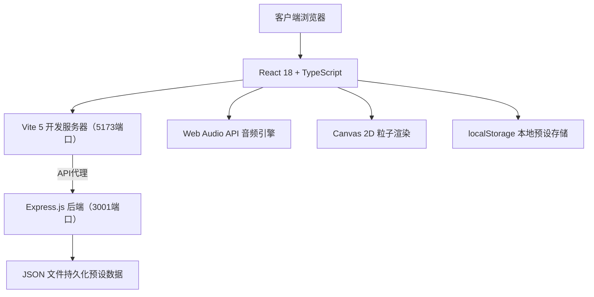
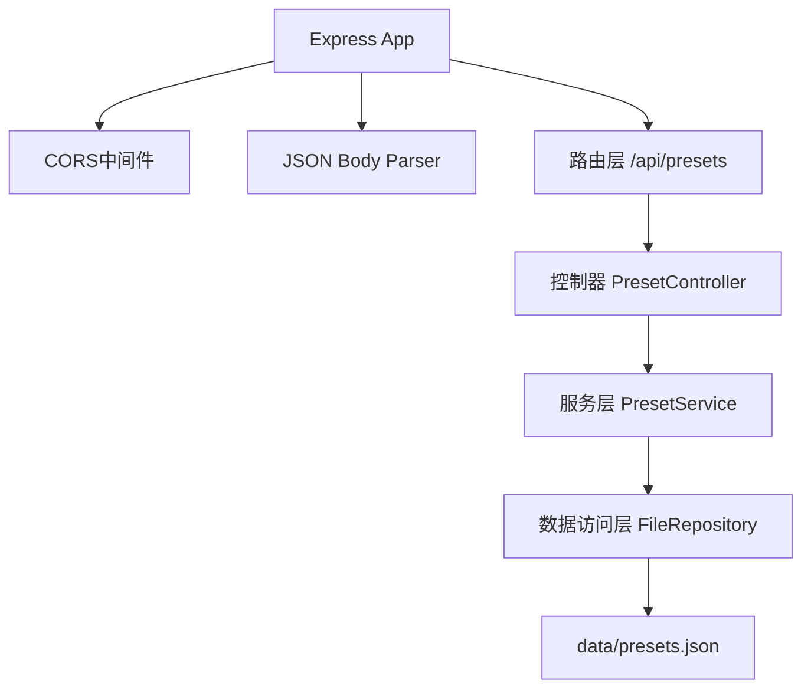
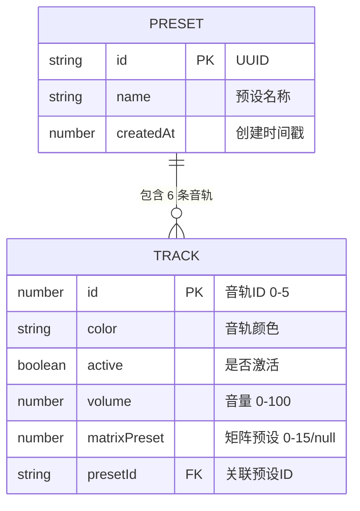

## 1. 架构设计



## 2. 技术描述

- **前端**：React@18.2.0 + TypeScript@5.5.0 + Vite@5.4.0
- **状态管理**：React useState/useReducer（组件内状态）+ localStorage（预设持久化）
- **音频**：Web Audio API（OscillatorNode合成音效 + AnalyserNode频谱分析）
- **可视化**：Canvas 2D API（粒子系统、波形渲染、漩涡动画）
- **后端**：Express@4.18.0 + TypeScript@5.5.0
- **数据存储**：JSON文件持久化 + localStorage双备份
- **初始化工具**：Vite手动配置（react-ts模板）

## 3. 路由定义

| 路由 | 用途 |
|------|------|
| / | 调音台主页面（唯一页面） |

## 4. API 定义

### TypeScript 类型

```typescript
// 单个音轨状态
interface TrackState {
  id: number;
  color: string;
  active: boolean;
  volume: number; // 0-100
  matrixPreset: number | null; // 0-15 对应4x4矩阵格子，null表示未选择
}

// 预设数据结构
interface Preset {
  id: string;
  name: string;
  createdAt: number;
  tracks: TrackState[];
}

// 预设保存请求
interface SavePresetRequest {
  name: string;
  tracks: TrackState[];
}

// 预设响应
interface PresetResponse {
  success: boolean;
  data?: Preset;
  presets?: Preset[];
  error?: string;
}
```

### RESTful API 端点

| 方法 | 路径 | 描述 | 请求体 | 响应 |
|------|------|------|--------|------|
| GET | /api/presets | 获取所有预设 | - | `PresetResponse { presets: Preset[] }` |
| POST | /api/presets | 创建新预设 | `SavePresetRequest` | `PresetResponse { data: Preset }` |
| GET | /api/presets/:id | 获取单个预设 | - | `PresetResponse { data: Preset }` |
| DELETE | /api/presets/:id | 删除预设 | - | `PresetResponse { success: boolean }` |

## 5. 服务器架构图



## 6. 数据模型

### 6.1 数据模型定义



### 6.2 JSON 数据格式

```json
{
  "presets": [
    {
      "id": "uuid-string",
      "name": "深空回响",
      "createdAt": 1717900000000,
      "tracks": [
        { "id": 0, "color": "#ff3366", "active": true, "volume": 75, "matrixPreset": 5 },
        { "id": 1, "color": "#ff9933", "active": false, "volume": 50, "matrixPreset": null },
        { "id": 2, "color": "#ffcc33", "active": true, "volume": 60, "matrixPreset": 10 },
        { "id": 3, "color": "#33cc66", "active": false, "volume": 40, "matrixPreset": null },
        { "id": 4, "color": "#3399ff", "active": true, "volume": 80, "matrixPreset": 3 },
        { "id": 5, "color": "#9933ff", "active": false, "volume": 50, "matrixPreset": null }
      ]
    }
  ]
}
```

## 7. 项目文件结构

```
auto179/
├── package.json              # 根目录脚本（concurrently前后端同时启动）
├── tsconfig.json             # TypeScript 根配置
├── index.html                # Vite 入口 HTML
├── vite.config.js            # Vite 构建配置（含API代理）
├── data/
│   └── presets.json          # 后端预设持久化文件
├── src/                      # 前端源码
│   ├── App.tsx               # 主应用组件
│   ├── Track.tsx             # 音轨组件
│   ├── Mixer.tsx             # 混合区组件
│   ├── AudioEngine.ts        # 音频/粒子引擎模块
│   ├── types.ts              # 共享类型定义
│   └── main.tsx              # React 入口
└── server/                   # 后端源码
    ├── package.json          # 后端依赖
    ├── tsconfig.json         # 后端 TS 配置
    └── index.ts              # Express 服务器入口
```

## 8. 粒子参数矩阵定义（4x4=16种预设）

| 格子索引 | 颜色变体 | 大小(px) | 速度(单位/帧) | 生命期(秒) |
|---------|---------|---------|-------------|-----------|
| 0 | 原色 | 2 | 0.5 | 1.0 |
| 1 | 原色 | 3 | 0.8 | 1.2 |
| 2 | 浅色 | 2 | 1.0 | 1.5 |
| 3 | 浅色 | 4 | 1.2 | 1.8 |
| 4 | 亮色 | 3 | 0.6 | 2.0 |
| 5 | 亮色 | 5 | 1.0 | 1.5 |
| 6 | 原色 | 4 | 1.5 | 2.2 |
| 7 | 浅色 | 6 | 0.8 | 2.5 |
| 8 | 亮色 | 2 | 2.0 | 1.0 |
| 9 | 原色 | 6 | 0.5 | 3.0 |
| 10 | 浅色 | 3 | 1.8 | 1.8 |
| 11 | 亮色 | 4 | 1.2 | 2.8 |
| 12 | 原色 | 5 | 0.7 | 2.0 |
| 13 | 浅色 | 2 | 1.5 | 1.2 |
| 14 | 亮色 | 6 | 1.0 | 2.5 |
| 15 | 混色 | 3 | 2.0 | 3.0 |
