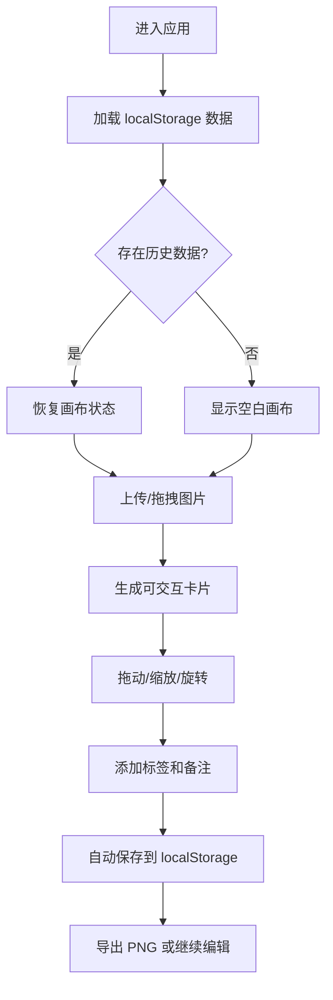

## 1. 产品概述

Moodboard 是一款面向设计师的在线灵感图片收集与管理工具，用户可将图片拖拽至 A3 画布上自由排列、缩放、旋转，形成视觉灵感拼图，并通过标签和备注进行分类检索。

- 目标用户：视觉设计师、创意工作者、品牌策划人员
- 核心价值：快速搭建视觉情绪板、整理灵感素材、导出高清水印拼图

## 2. 核心功能

### 2.1 功能模块

1. **画布区域**：A3 比例浅米色画布，支持图片上传与拖拽摆放
2. **图片卡片**：可拖动、缩放、旋转的图片卡片，带标签与删除按钮
3. **侧边菜单**：点击卡片弹出备注编辑面板
4. **素材池**：右侧深灰色面板，展示历史上传缩略图，支持复用
5. **数据持久化**：localStorage 自动保存与恢复画布状态
6. **PNG 导出**：一键将画布导出为 2x 清晰度的 PNG 图片

### 2.2 页面详情

| 页面名称 | 模块名称 | 功能描述 |
|---------|---------|---------|
| 主界面 | 顶部操作栏 | 上传按钮、导出 PNG 按钮、清空画布按钮 |
| 主界面 | 画布区域 | A3 比例浅米色画布，卡片摆放与交互区 |
| 主界面 | 图片卡片 | 图片展示、拖拽移动、缩放旋转手柄、标签胶囊、删除按钮 |
| 主界面 | 侧边备注面板 | 多行备注输入（200 字上限）、标签编辑 |
| 主界面 | 素材池面板 | 按时间倒序排列的缩略图列表，可拖拽复用 |

## 3. 核心流程

用户进入应用 → 从本地拖拽或点击上传图片 → 图片显示为画布卡片 → 拖动/缩放/旋转调整布局 → 添加标签与备注 → 从素材池复用历史图片 → 点击导出保存为 PNG → 刷新页面自动恢复状态

## 4. 用户界面设计

### 4.1 设计风格

- **主色调**：浅米色 `#F5F0E8`（画布背景）、深炭灰 `#2C2C2C`（文字/面板）
- **卡片样式**：微妙投影 `box-shadow: 2px 2px 6px rgba(0,0,0,0.15)`
- **按钮样式**：圆角方形 `border-radius: 8px`
- **过渡动画**：`transition: all 0.3s cubic-bezier(.25,.46,.45,.94)` 弹性过渡
- **字体**：选择简洁优雅的无衬线字体，标签使用小号清晰字体

### 4.2 页面设计概述

| 页面名称 | 模块名称 | UI 元素 |
|---------|---------|---------|
| 主界面 | 画布区域 | A3 比例（宽高比 1.414:1）、浅米色背景、居中显示 |
| 主界面 | 图片卡片 | 图片填充、右下角圆形缩放旋转手柄、顶部半透明胶囊标签、右上角红色圆形删除按钮 |
| 主界面 | 侧边备注面板 | 从右侧滑入、深灰磨砂背景、多行文本框、标签输入框 |
| 主界面 | 素材池 | 深灰磨砂窄条面板、80x80 缩略图、按时间倒序排列、滚动条隐藏 |
| 主界面 | 顶部操作栏 | 左对齐上传按钮、右对齐导出按钮 |

### 4.3 响应式

- **桌面端（1024px+）**：完整三栏布局，素材池常驻右侧
- **平板端（768px-1023px）**：素材池折叠为抽屉，点击图标滑出
- **移动端（<768px）**：画布自适应缩小，素材池底部抽屉

## 5. 性能要求

- 拖拽操作保持 60fps 流畅度
- 单次 PNG 导出时间不超过 2 秒
- localStorage 读写异步化，不阻塞 UI
