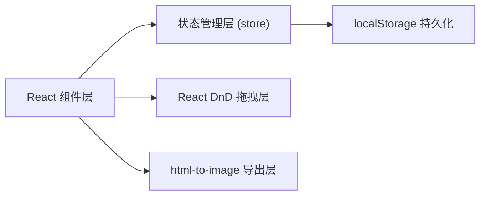

## 1. 架构设计

纯前端单页应用，数据存储在浏览器 localStorage，无后端依赖。



## 2. 技术描述

- **前端框架**：React 18 + TypeScript
- **构建工具**：Vite 5 + @vitejs/plugin-react
- **拖拽库**：react-dnd + react-dnd-html5-backend
- **图片导出**：html-to-image
- **状态管理**：自定义 store（发布订阅模式 + localStorage）

## 3. 项目文件结构

| 文件路径 | 职责 |
|---------|------|
| `package.json` | 依赖与启动脚本 |
| `index.html` | 入口 HTML，挂载 React 根节点 |
| `tsconfig.json` | TypeScript 严格模式配置 |
| `vite.config.js` | Vite 配置，使用 React 插件 |
| `src/App.tsx` | 主组件，整体布局，DnD Provider 包裹 |
| `src/Canvas.tsx` | 画布区域，卡片状态管理与交互 |
| `src/MaterialPool.tsx` | 素材池面板，缩略图展示与拖拽 |
| `src/store.ts` | 集中状态管理，localStorage 读写 |

## 4. 数据模型

```typescript
interface CardData {
  id: string;
  imageDataUrl: string;
  x: number;
  y: number;
  width: number;
  height: number;
  rotation: number;
  label: string;
  note: string;
  createdAt: number;
}

interface AppState {
  cards: CardData[];
  selectedCardId: string | null;
}
```

## 5. 核心交互实现

### 5.1 拖拽实现
- 使用 `react-dnd` 的 `useDrag` 和 `useDrop` Hook
- 卡片类型：`"IMAGE_CARD"`，素材池拖拽源类型相同
- 位置更新使用 CSS transform 保证 60fps

### 5.2 缩放与旋转
- 右下角手柄监听 mousedown 事件
- 计算鼠标与卡片中心的角度和距离
- 更新 width、height、rotation 状态

### 5.3 PNG 导出
- 使用 `html-to-image` 的 `toPng` 方法
- 设置 `pixelRatio: 2` 保证清晰度
- 背景色设为 `#F5F0E8` 与画布一致

### 5.4 持久化
- 每次状态变更后 debounce 100ms 写入 localStorage
- 应用启动时从 localStorage 读取并恢复
