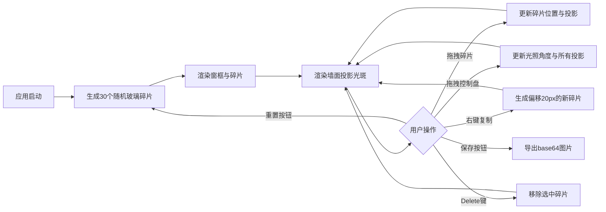

## 1. 产品概述
基于浏览器的动态彩色玻璃窗光影模拟交互应用，让用户模拟中世纪玻璃工匠，通过拖拽组合不同形状与颜色的玻璃碎片，拼接成完整的彩色玻璃窗，并实时模拟不同角度阳光照射产生的光影效果和色彩投影。

## 2. 核心功能

### 2.1 用户角色
| 角色 | 注册方式 | 核心权限 |
|------|----------|----------|
| 普通用户 | 无需注册，直接使用 | 拖拽编辑玻璃碎片、调整光照角度、重置布局、保存快照 |

### 2.2 功能模块
1. **主画布区**：拱形窗框、玻璃碎片渲染、墙面光斑投影
2. **光照控制面板**：圆形太阳方位控制盘
3. **顶部工具栏**：重置布局按钮、保存快照按钮

### 2.3 页面详情
| 页面名称 | 模块名称 | 功能描述 |
|----------|----------|----------|
| 主页面 | 拱形窗框 | 高600px×宽400px拱形窗框，上缘半圆弧，深灰色#4a4a4a边框8px |
| 主页面 | 玻璃碎片 | 30个随机多边形碎片（三角形/四边形/五边形，4-8顶点），支持拖拽移动、选中删除、右键复制 |
| 主页面 | 墙面光斑 | 右侧浅米色墙#f5f0e8，实时渲染彩色光斑投影，ADD混合模式，仿射变换拉伸 |
| 主页面 | 光照控制盘 | 右下角半透明圆盘，可拖拽控制点调整方位角0-360°和高度角15-75° |
| 主页面 | 工具栏按钮 | 重置布局（棕色）、保存快照（绿色），悬停放大1.05倍，0.3s过渡动画 |

## 3. 核心流程

用户打开应用 → 看到随机生成的彩色玻璃碎片 → 拖拽碎片调整位置 → 通过控制盘调整阳光角度 → 观察墙面彩色光影变化 → 右键复制碎片/Delete删除 → 点击重置重新生成 → 点击保存快照导出图片

## 4. 用户界面设计

### 4.1 设计风格
- **主色调**：深石板灰#2a2a2a（背景）、铁灰#4a4a4a（窗框）、浅米色#f5f0e8（墙面）
- **按钮颜色**：棕色#6a4a3a（重置）、绿色#3a6a4a（保存），悬停#8a6a5a/#5a8a6a
- **按钮样式**：圆角矩形4px，白色文字，0.3s过渡，悬停scale(1.05)
- **控制盘**：直径120px半透明深灰#333，边框#888，白色控制点直径12px
- **字体**：默认系统无衬线字体，中世纪教堂风格配色
- **布局**：桌面端居中布局，窗框固定3:2比例

### 4.2 页面设计概览
| 页面名称 | 模块名称 | UI元素 |
|----------|----------|--------|
| 主页面 | 顶部工具栏 | 左右布局，重置按钮左侧，保存按钮右侧，圆角4px，悬停过渡0.3s |
| 主页面 | 中央画布 | 居中拱形窗框400×600，30个随机彩色多边形碎片，1px黑色铅条边框 |
| 主页面 | 右侧墙面 | 从窗框右边缘延伸至屏幕右缘，浅米色背景，ADD混合彩色光斑 |
| 主页面 | 光照控制盘 | 右下角偏移20px，可拖拽控制点，方位角/高度角映射 |

### 4.3 响应式
- 桌面端优先设计，固定窗框宽高比3:2
- 窗口尺寸变化时，画布等比缩放保持比例
- 控制盘保持右下角20px相对偏移

### 4.4 视觉效果
- 玻璃碎片：HSL随机色，饱和度70-90%，亮度50-70%，透明度0.6-0.9
- 墙面光斑：碎片主色混合白色（比例=透明度），透明度30%，ADD混合模式，柔和发光
- 所有元素圆角4px，交互元素0.3s淡入淡出过渡
