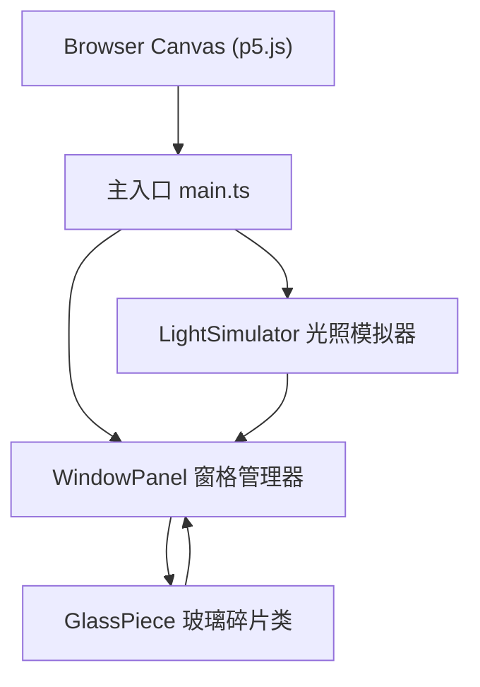
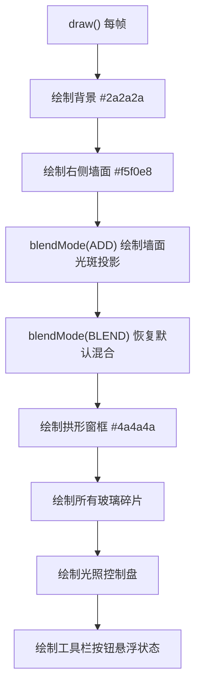

## 1. 架构设计



## 2. 技术描述
- **前端框架**: p5.js@1.9.0 (Canvas渲染)
- **开发语言**: TypeScript@5.5.0 (严格模式, ES2020)
- **构建工具**: Vite@5.4.0
- **渲染模式**: HTML5 Canvas 2D

## 3. 模块结构与文件定义

| 文件路径 | 模块名称 | 职责描述 |
|----------|----------|----------|
| package.json | 项目配置 | 依赖声明: p5@1.9.0, typescript@5.5.0, vite@5.4.0; 启动脚本: npm run dev |
| index.html | 入口页面 | Canvas容器，CSS样式(深色背景、按钮过渡动画) |
| tsconfig.json | TS配置 | 严格模式 strict:true, target:ES2020, module:ES2020 |
| vite.config.js | 构建配置 | Vite开发服务器与打包配置 |
| src/main.ts | 应用入口 | 初始化p5实例，setup/draw帧循环，窗口resize自适应，事件分发 |
| src/glassPiece.ts | 玻璃碎片类 | 多边形顶点数组、HSL颜色+透明度、位置、旋转、边框；绘制方法、碰撞检测(点在多边形内) |
| src/windowPanel.ts | 窗格管理器 | 碎片集合管理；增删改查；拖拽选择；基于法线角度和透明度计算亮度与投影颜色 |
| src/lightSimulator.ts | 光照模拟器 | 方位角(0-360°绕Y)、高度角(15°-75°仰角)；地面投影多边形拉伸计算；墙面光斑位置大小计算 |

## 4. 核心数据结构

### 4.1 GlassPiece
```typescript
interface Vertex {
  x: number;
  y: number;
}

interface HSLColor {
  h: number;      // 0-360
  s: number;      // 0-100 (%)
  l: number;      // 0-100 (%)
  a: number;      // 0.6-0.9
}

class GlassPiece {
  vertices: Vertex[];       // 本地坐标顶点数组
  position: Vertex;         // 世界坐标位置
  rotation: number;         // 弧度
  color: HSLColor;
  borderWidth: number;      // 1px
  borderColor: string;      // #000000
  selected: boolean;
  dragging: boolean;
  dragOffset: Vertex;

  draw(p: p5): void;
  containsPoint(px: number, py: number): boolean;  // 点-多边形碰撞检测
  getWorldVertices(): Vertex[];                     // 应用变换后的世界坐标
  getNormalAngle(): number;                         // 平均法线角度
  clone(offsetX: number, offsetY: number): GlassPiece;
}
```

### 4.2 WindowPanel
```typescript
class WindowPanel {
  pieces: GlassPiece[];
  selectedPiece: GlassPiece | null;
  windowRect: { x: number; y: number; width: number; height: number; archRadius: number };

  addPiece(piece: GlassPiece): void;
  removePiece(piece: GlassPiece): void;
  clearAll(): void;
  generateRandomPieces(count: number): void;
  getPieceAt(px: number, py: number): GlassPiece | null;
  startDrag(piece: GlassPiece, mx: number, my: number): void;
  updateDrag(mx: number, my: number): void;
  endDrag(): void;
  calculateBrightness(piece: GlassPiece, lightDir: { x: number; y: number; z: number }): number;
  calculateProjectionColor(piece: GlassPiece, brightness: number): HSLColor;
  drawWindowFrame(p: p5): void;
  drawAllPieces(p: p5): void;
}
```

### 4.3 LightSimulator
```typescript
interface ProjectionPolygon {
  vertices: Vertex[];
  color: HSLColor;
}

class LightSimulator {
  azimuthAngle: number;     // 0-360度，绕Y轴
  elevationAngle: number;   // 15-75度，仰角
  controlKnob: { x: number; y: number };  // 控制盘上的控制点坐标
  draggingKnob: boolean;

  setFromKnobPosition(knobX: number, knobY: number, controlCenterX: number, controlCenterY: number, controlRadius: number): void;
  getLightDirection(): { x: number; y: number; z: number };
  calculateWallProjection(piece: GlassPiece, wallX: number): ProjectionPolygon;
  calculateStretchFactor(): number;      // 基于高度角的拉伸因子 1.2-2.0
  drawControlPanel(p: p5, centerX: number, centerY: number): void;
  isKnobHit(px: number, py: number, centerX: number, centerY: number): boolean;
  getMixedColor(piece: GlassPiece): HSLColor;  // 主色混合白色，比例=透明度
}
```

## 5. 性能优化策略
- 使用Canvas 2D原生渲染，避免DOM重排
- 投影计算缓存：仅当碎片位置或光照角度变化时重新计算
- 拖拽时仅更新被拖拽碎片的投影，其余保持不变
- 批量绘制：同一绘制pass内完成所有碎片和投影渲染
- 目标帧率：60FPS，光照计算单次<8ms

## 6. 渲染流程

