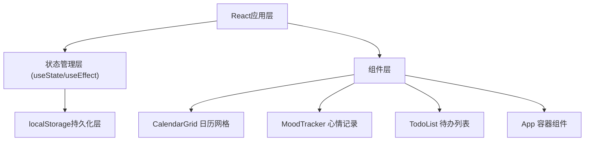

## 1. 架构设计



## 2. 技术描述

- **前端框架**：React@18 + TypeScript@5
- **构建工具**：Vite@5 + @vitejs/plugin-react@4
- **状态管理**：React Hooks（useState、useEffect）
- **数据持久化**：localStorage
- **样式方案**：原生CSS（CSS过渡动画）
- **初始化方式**：按用户指定文件结构手动搭建

## 3. 项目结构

```
.
├── package.json
├── index.html
├── tsconfig.json
├── vite.config.js
└── src/
    ├── main.tsx          # 主入口，渲染根组件
    ├── App.tsx           # 应用容器，状态管理与数据流
    ├── App.css           # 全局样式与布局
    └── components/
        ├── CalendarGrid.tsx    # 日历网格组件
        ├── CalendarGrid.css
        ├── MoodTracker.tsx     # 心情记录组件
        ├── MoodTracker.css
        ├── TodoList.tsx        # 待办事项组件
        └── TodoList.css
```

## 4. 数据模型

### 4.1 类型定义

```typescript
// 心情类型
type MoodType = '😄' | '😊' | '😐' | '😞' | '😢' | null;

// 待办事项
interface TodoItem {
  id: string;
  text: string;
  completed: boolean;
  date: string; // YYYY-MM-DD格式
}

// 日期数据存储格式
interface DailyData {
  mood: MoodType;
  todos: TodoItem[];
}

// 全局存储结构
type CalendarStore = Record<string, DailyData>;
```

### 4.2 localStorage键名
- `calendar_moods`：心情记录
- `calendar_todos`：待办事项

## 5. 性能要求

- 月份切换动画帧率 ≥ 40fps
- 点击响应时间 ≤ 200ms
- localStorage读写时间 ≤ 10ms
- CSS动画使用GPU加速属性（transform、opacity）
