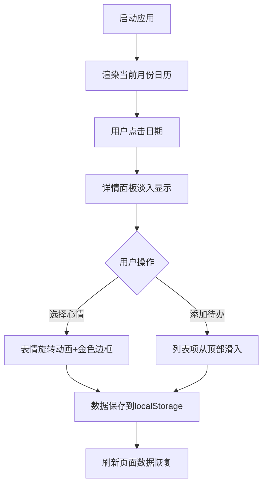

## 1. 产品概述

交互式电子年历应用，帮助用户查看日期信息、记录每日心情和管理待办事项。目标用户为需要记录日常心情和管理任务的个人用户，通过简洁直观的界面提升日常效率与生活品质。

## 2. 核心功能

### 2.1 功能模块

1. **日历网格视图**：月份切换、日期选择、今日高亮
2. **心情记录**：5种心情选择、动画反馈、持久化存储
3. **待办事项管理**：添加、勾选、删除、完成统计、持久化存储
4. **日期详情面板**：显示选中日期的心情与待办信息

### 2.2 页面详情

| 页面名称 | 模块名称 | 功能描述 |
|-----------|-------------|---------------------|
| 主页面 | 日历网格 | 展示月份日历，支持切换月份动画，点击日期高亮放大，显示心情标记 |
| 主页面 | 心情记录区 | 5个表情按钮，点击旋转放大，金色边框标记选中状态 |
| 主页面 | 待办列表面板 | 添加、勾选、删除待办，显示完成统计，列表项滑入动画 |
| 主页面 | 日期详情面板 | 显示选中日期格式、心情状态、当日待办列表，淡入动画 |

## 3. 核心流程

用户启动应用 → 默认显示当前月份日历 → 点击任意日期 → 详情面板淡入显示该日信息 → 用户可选择心情（表情旋转动画）或添加待办（从顶部滑入）→ 数据自动保存到localStorage → 刷新页面后数据恢复

## 4. 用户界面设计

### 4.1 设计风格
- **主色调**：渐变背景 #667eea → #764ba2（日历头部），#FF6B6B（今日高亮），#FFD700（心情选中金色边框）
- **辅助色**：#F5F5F5（浅灰待办面板背景），#EEEEEE（日期悬停），#E74C3C（删除按钮hover），#888（提示文字）
- **文字颜色**：周末淡蓝色，非周末深灰色，今日白色
- **按钮样式**：圆形月份切换按钮（直径40px，阴影，hover放大1.1倍）
- **字体**：系统默认无衬线字体
- **布局**：桌面端左右分栏（待办30% + 详情70%），移动端上下堆叠
- **圆角**：日期单元格8px
- **动画**：月份切换300ms淡入淡出，心情图标0.2s旋转，待办滑入200ms，详情面板淡入200ms

### 4.2 页面设计概述

| 页面名称 | 模块名称 | UI元素 |
|-----------|-------------|-------------|
| 主页面 | 日历头部 | 渐变背景、白色文字、左右圆形箭头按钮 |
| 主页面 | 日历网格 | 7列布局、周末淡蓝文字、今日红色圆角高亮、选中日期放大阴影、左下角心情小图标 |
| 主页面 | 待办面板 | 浅灰背景、输入框+添加按钮、复选框（删除线效果）、删除按钮hover变红、顶部完成统计 |
| 主页面 | 详情面板 | 日期标题（加大加粗）、5个心情emoji、当日待办列表、淡入动画 |

### 4.3 响应式设计
- **桌面端（≥768px）**：左右分栏布局，待办面板30%宽度，详情面板70%宽度
- **移动端（<768px）**：上下堆叠布局，待办在上、详情在下，各占100%宽度
- **触摸优化**：所有交互元素点击区域≥44x44px，日期单元格最小40x40px，字体最小12px
