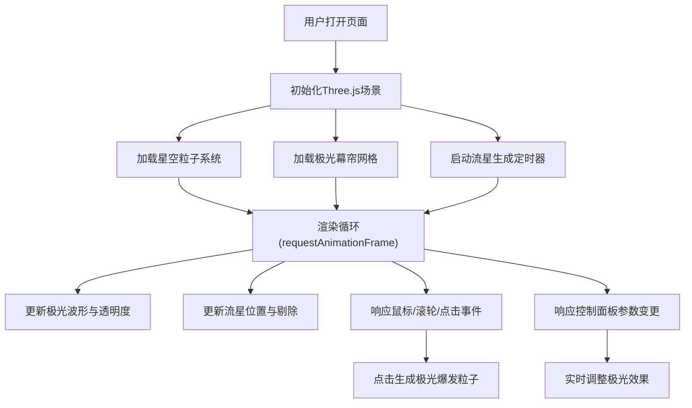

## 1. 产品概述
沉浸式极光星空3D可视化应用，在浏览器中模拟北极圈夜空的动态极光幕帘、闪烁繁星与流星划过的自然奇观。
- 解决用户无法亲临北极圈体验极光的痛点，提供可交互、可调节参数的沉浸式视觉体验
- 面向天文爱好者、自然景观体验者、艺术创作者等追求沉浸式视觉享受的用户群体

## 2. 核心功能

### 2.1 功能模块
1. **3D星空场景**：静态星星粒子系统、动态闪烁亮星、深空背景
2. **极光幕帘系统**：三层半透明波浪曲面、动态着色器材质、正弦波流动动画
3. **流星系统**：随机生成流星粒子、尾迹效果、特殊红色流星
4. **用户交互系统**：鼠标视角控制、滚轮缩放、点击极光爆发
5. **参数控制系统**：极光强度滑块、色相滑块、半透明控制面板

### 2.2 页面详情
| 页面名称 | 模块名称 | 功能描述 |
|-----------|-------------|---------------------|
| 主页 | 3D场景容器 | 全屏Three.js渲染画布，深空黑色背景，自动适配窗口大小 |
| 主页 | 星空层 | 3000颗静态星星（白到淡蓝渐变），50颗动态闪烁亮星（淡黄色） |
| 主页 | 极光层 | 三层波浪曲面，底部绿色到顶部紫色渐变，透明度周期变化，正弦波流动 |
| 主页 | 流星层 | 每5-10秒随机流星，带尾迹，5%概率红色特殊流星 |
| 主页 | 控制面板 | 右下角悬浮面板，强度滑块(1-10)和色相滑块(0-360) |

## 3. 核心流程
用户打开页面后，立即呈现全屏极光星空场景。极光持续流动、星星闪烁、流星偶现。用户可通过鼠标移动调整视角，滚轮缩放距离，点击天空触发极光粒子爆发。通过右下角滑块调节极光强度和颜色，实时反馈到场景中。

## 4. 用户界面设计

### 4.1 设计风格
- **主色调**：深空黑(#000005)，极光绿(#00ff88)，极光紫(#8800ff)
- **辅助色**：星白(#ffffff)，淡蓝(#aac8ff)，淡黄(#ffddaa)
- **风格定位**：深空科幻、沉浸式、极简UI、柔光阴影
- **字体**：无衬线系统字体，轻量化，避免喧宾夺主

### 4.2 页面设计概述
| 页面名称 | 模块名称 | UI元素 |
|-----------|-------------|-------------|
| 主页 | 全屏3D画布 | 黑色背景(#000005)，无边框无滚动条，占满整个视口 |
| 主页 | 控制面板 | 右下角悬浮，rgba(0,0,0,0.5)半透明背景，圆角12px，柔光阴影，内边距16px |
| 主页 | 强度滑块 | 轨道高4px，滑块直径12px，颜色跟随极光当前色相，范围1-10，默认值5 |
| 主页 | 色相滑块 | 轨道高4px，滑块直径12px，颜色跟随极光当前色相，范围0-360，默认值120 |

### 4.3 响应式
- Desktop-first设计，画布自动适配窗口resize事件
- 控制面板固定右下角，移动端适配触控滑动调节
- 相机近远裁剪面随窗口比例自动调整

### 4.4 3D场景指导
- **环境**：纯深空黑色背景，无HDRI，自发光材质为主
- **光照**：无需场景光源，粒子和曲面使用自发光着色器
- **相机**：PerspectiveCamera，初始距离15单位，fov 60度，范围5-30单位
- **构图**：极光幕帘位于场景中上部，星空填充整个视锥
- **动画**：requestAnimationFrame驱动60fps循环，极光波形周期8秒，亮星闪烁周期1.5秒
- **性能**：粒子总数控制≤4000，不可见粒子剔除，使用BufferGeometry和PointsMaterial
