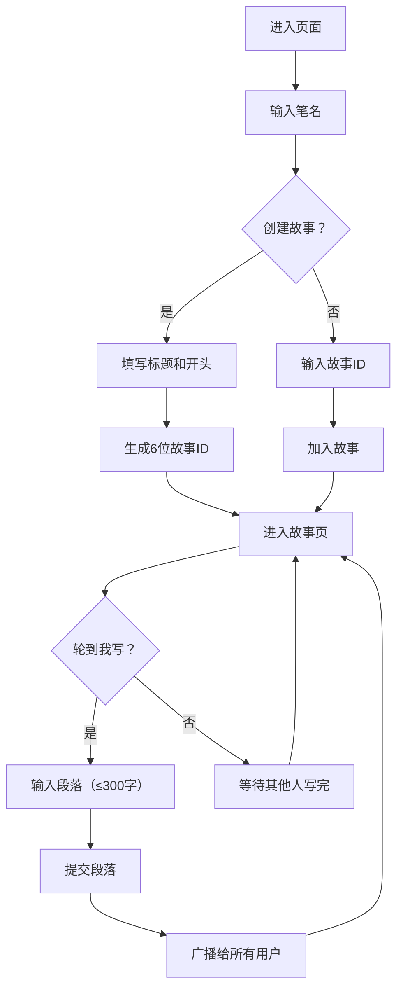

## 1. 产品概述
一个在线协作式故事接龙平台，让朋友或写作爱好者可以共同接力创作故事，每人每次写一段（最多300字），写完即锁定，下一人继续，最终形成多人共创的完整叙事作品。
- 解决单人写作缺乏创意碰撞的问题，降低多人协作写作的门槛
- 核心价值：社交化写作体验、实时协作、珍贵的共创记录

## 2. 核心功能

### 2.1 用户角色
| 角色 | 注册方式 | 核心权限 |
|------|----------|----------|
| 访客用户 | 输入笔名即可（无需注册） | 创建故事、加入故事、写作接龙、阅读故事 |

### 2.2 功能模块
1. **创建/加入页**：笔名输入、故事创建（标题+开头）、故事加入（通过ID）
2. **故事阅读页**：书信体故事展示、段落高亮、写作状态提示、底部写作输入框
3. **历史时间线侧边栏**：写作时间线、段落跳转、统计信息（字数/人数）

### 2.3 页面详情
| 页面名称 | 模块名称 | 功能描述 |
|----------|----------|----------|
| 创建/加入页 | 笔名输入 | 用户进入后先输入笔名，本地保存 |
| 创建/加入页 | 创建故事表单 | 输入故事标题和开头段落，生成6位ID |
| 创建/加入页 | 加入故事表单 | 输入6位故事ID加入已有故事 |
| 创建/加入页 | ID复制分享 | 创建成功后展示ID并支持一键复制 |
| 故事阅读页 | 书信体展示区 | 羊皮纸背景、Georgia字体、段落间装饰线、笔名+时间标注 |
| 故事阅读页 | 写作输入区 | 固定底部输入框，300字限制，轮到我时可编辑，否则只读提示 |
| 故事阅读页 | 锁定机制 | 先到先得锁定，同一时间仅一人可写 |
| 故事阅读页 | 实时同步 | 新段落提交后1秒内同步给所有在线用户 |
| 时间线侧边栏 | 写作历史列表 | 显示笔名、段落序号、写作用时，点击高亮跳转 |
| 时间线侧边栏 | 统计面板 | 底部显示总字数和总参与人数 |

## 3. 核心流程
用户输入笔名 → 选择创建或加入故事 → 创建时填写标题和开头段落 → 系统生成6位ID → 进入故事页面 → 等待轮到自己写作 → 提交段落 → 自动解锁给下一人 → 所有用户实时看到更新

## 4. 用户界面设计

### 4.1 设计风格
- **主色调**：泛黄羊皮纸渐变（#F5E6CA → #EDD9A8），深棕色文字（#3E2723）
- **辅助色**：装饰线浅灰（#D7CCC8），高亮段落暖黄色（#FFE082）
- **按钮样式**：深棕色圆角按钮，悬停时略深，带轻微阴影
- **字体**：Georgia, serif 衬线字体，模拟旧日记书写感
- **行间距**：宽松（1.8-2.0倍行高），阅读舒适
- **布局**：故事区占75%宽度，右侧时间线占25%宽度
- **图标风格**：简洁线条图标，与复古书信体风格协调

### 4.2 页面设计概览
| 页面名称 | 模块名称 | UI元素 |
|----------|----------|--------|
| 创建/加入页 | 顶部标题 | 大号Georgia字体，故事接龙标题，居中展示 |
| 创建/加入页 | 笔名输入框 | 带复古边框的输入框，羊皮纸背景 |
| 创建/加入页 | 创建/加入Tab切换 | 两个并排按钮，选中态为深棕色填充 |
| 创建/加入页 | 创建表单 | 标题输入、开头段落文本域（300字限制） |
| 创建/加入页 | ID展示卡片 | 创建成功后弹出ID卡片，大号字体，复制按钮 |
| 故事阅读页 | 故事标题区 | 顶部居中大号标题，下划线装饰 |
| 故事阅读页 | 段落卡片 | 每段显示笔名+时间，内容缩进，段落间装饰线 |
| 故事阅读页 | 底部输入区 | 固定底部，"当前轮到你了"醒目标注，300字计数，提交按钮 |
| 故事阅读页 | 锁定状态 | 只读灰化状态，"当前用户写作中，请稍候"提示 |
| 时间线侧边栏 | 时间线列表 | 竖线时间轴，每条记录带圆点标记，悬停高亮 |
| 时间线侧边栏 | 底部统计 | 两个数字卡片：总字数、总参与人数 |

### 4.3 响应式
桌面优先设计，移动端适配：时间线侧边栏在小屏转为底部可折叠面板，输入框自适应宽度。

### 4.4 动画效果
- 页面切换：淡入淡出 0.4s
- 输入框锁定状态变化：高度平滑变化 0.3s ease-out
- 新段落出现：轻微淡入上滑动画
- 按钮悬停：颜色渐变 0.2s
