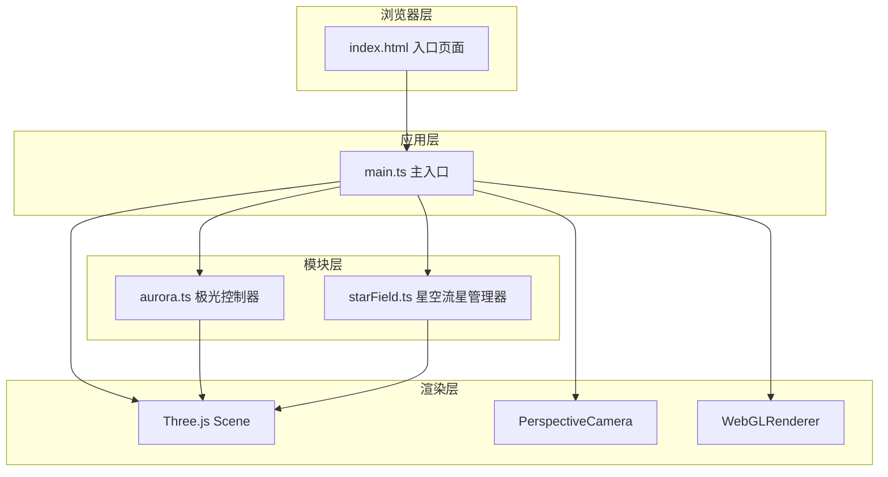

## 1. 架构设计



## 2. 技术描述
- **前端框架**：原生TypeScript + Three.js@0.160.0（无React/Vue，用户明确指定纯Three.js实现）
- **构建工具**：Vite@5.4.0
- **语言**：TypeScript@5.5.0（严格模式，ES2020目标）
- **后端**：无（纯前端可视化应用）
- **数据库**：无

## 3. 路由定义
| Route | Purpose |
|-------|---------|
| / | 主页，全屏3D极光星空场景 |

## 4. 数据模型

### 4.1 核心接口定义

```typescript
// 控制面板参数
interface AuroraControls {
  intensity: number;    // 1-10，控制透明度0.1-1.0和振幅0.5-3.0
  hue: number;          // 0-360，控制极光主色调
}

// 流星数据
interface Meteor {
  position: THREE.Vector3;
  velocity: THREE.Vector3;
  life: number;         // 剩余生命值 0-1
  duration: number;     // 总持续时间（秒）
  isRed: boolean;       // 是否为红色特殊流星
  tail: THREE.Vector3[]; // 尾迹点
}

// 极光爆发粒子
interface BurstParticle {
  position: THREE.Vector3;
  velocity: THREE.Vector3;
  life: number;
  color: THREE.Color;
}
```

## 5. 文件结构

```
e:\solo\VersionFast\tasks\auto21\
├── package.json
├── index.html
├── tsconfig.json
├── vite.config.js
└── src/
    ├── main.ts          # 主入口：场景初始化、渲染循环、交互、控制面板
    ├── aurora.ts        # AuroraController：三层极光波浪曲面管理
    └── starField.ts     # StarField：星空粒子+流星系统管理
```

## 6. 关键实现要点

### 6.1 极光控制器 (AuroraController)
- 使用`PlaneGeometry`创建曲面，宽度20、高度8单位，宽度分段64、高度分段16
- 三层Mesh沿Z轴间距1.5单位排列
- 自定义`ShaderMaterial`实现顶点动画（正弦波+高频抖动）和颜色渐变
- `update(time, intensity, hue)`方法每帧更新uniform变量

### 6.2 星空流星管理器 (StarField)
- 3000颗静态星星：`BufferGeometry` + `PointsMaterial`，随机位置分布在半径50球体内
- 50颗亮星：独立`Mesh`(SphereGeometry)，每1.5秒随机闪烁
- 流星系统：每5-10秒随机生成一颗，持续0.8秒，方向角30-60度，尾迹10个粒子
- 5%概率红色流星：颜色从#ff4444到#ffaa00
- 粒子总数≤4000，超出视锥的流星自动剔除

### 6.3 主入口 (main.ts)
- `PerspectiveCamera` fov=60, near=0.1, far=200, 初始距离15
- 鼠标移动：视角0.3倍速度旋转
- 滚轮缩放：camera.position.z范围5-30
- 点击屏幕：射线投射到场景平面，生成60个彩色爆发粒子（持续1.2秒）
- 控制面板DOM元素：绝对定位右下角，自定义滑块样式
- requestAnimationFrame主循环，目标60fps
