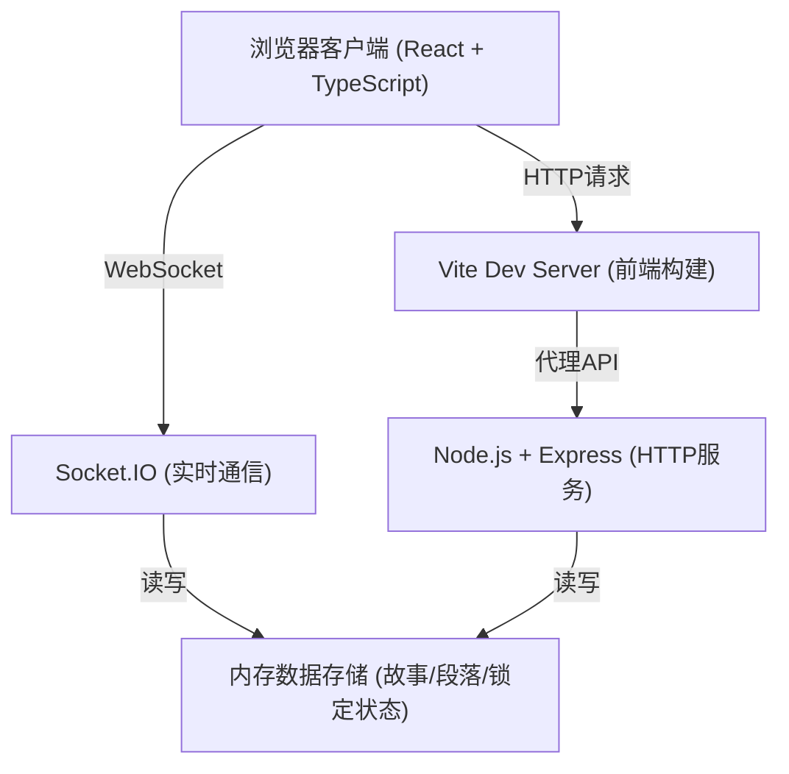
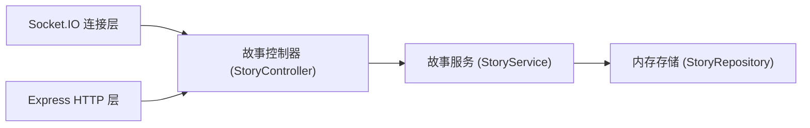
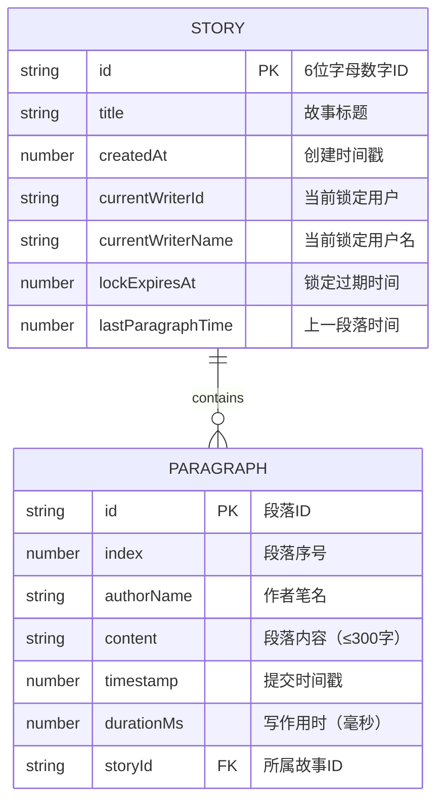

## 1. 架构设计



## 2. 技术描述
- **前端**：React 18 + TypeScript + Vite 5 + Socket.IO Client + React Router DOM 6
- **后端**：Node.js + Express 4 + Socket.IO 4 + TypeScript
- **数据存储**：内存缓存（Map对象存储故事数据），支持热数据持久化
- **实时通信**：Socket.IO 双向通信，用于段落同步和锁定状态广播

## 3. 路由定义
| 路由 | 用途 |
|------|------|
| /create | 创建/加入故事首页（笔名输入、创建/加入表单） |
| /story/:id | 故事阅读与写作页（书信体展示、写作输入、时间线侧边栏） |

## 4. API 与 Socket 事件定义

### 4.1 HTTP REST API
| 方法 | 路径 | 描述 | 请求体 | 响应体 |
|------|------|------|--------|--------|
| POST | /api/story | 创建新故事 | { title: string, opening: string, authorName: string } | { id: string, story: Story } |
| GET | /api/story/:id | 获取故事完整数据 | - | Story \| null |

### 4.2 Socket.IO 事件
| 事件名 | 方向 | 描述 | 数据 |
|--------|------|------|------|
| join-story | Client → Server | 用户加入故事房间 | { storyId: string, userName: string } |
| story-state | Server → Client | 推送完整故事状态（初始/刷新） | Story |
| request-lock | Client → Server | 请求写作锁定 | { storyId: string, userId: string, userName: string } |
| lock-granted | Server → Client | 锁定授权成功 | { storyId: string, userId: string, expiresAt: number } |
| lock-denied | Server → Client | 锁定被拒绝（有人在写） | { storyId: string, currentWriter: string } |
| lock-released | Server → Client | 锁定已释放（可申请写作） | { storyId: string } |
| submit-paragraph | Client → Server | 提交新段落 | { storyId: string, userId: string, content: string } |
| paragraph-added | Server → Client | 广播新段落 | { storyId: string, paragraph: Paragraph } |
| writer-status | Server → Client | 当前写作者状态 | { storyId: string, writerName: string \| null } |

### 4.3 TypeScript 类型定义
```typescript
interface Paragraph {
  id: string;
  index: number;
  authorName: string;
  content: string;
  timestamp: number;
  durationMs: number;
}

interface Story {
  id: string;
  title: string;
  paragraphs: Paragraph[];
  currentWriterId: string | null;
  currentWriterName: string | null;
  lockExpiresAt: number | null;
  lastParagraphTime: number | null;
  createdAt: number;
}
```

## 5. 服务端架构



- **连接层**：处理Socket连接、事件分发、房间管理
- **控制器**：处理业务逻辑、参数校验、事件广播
- **服务层**：核心业务逻辑（ID生成、锁定管理、段落追加）
- **存储层**：内存Map存储故事数据，按ID快速索引

## 6. 数据模型

### 6.1 实体关系


### 6.2 锁定机制说明
- 采用先到先得（FCFS）锁定策略
- 用户通过 request-lock 事件申请锁定
- 锁定有效期60秒，超时自动释放
- 提交段落成功后立即释放锁定
- 所有状态变更通过 writer-status 和 lock-* 事件实时广播
