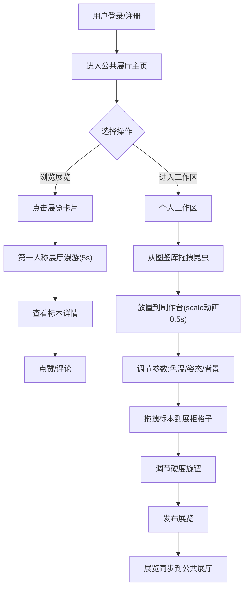

## 1. 产品概述

虚拟昆虫标本博物馆展览策划平台是一款让用户以自然历史博物馆策展人身份，在线采集、分类、制作虚拟昆虫标本并布置数字展厅的Web应用。用户可创建主题展览、调节灯光与背景，其他用户可浏览展厅、点赞评论，形成完整的策展-观展生态。

- 目标用户：对昆虫学、博物学感兴趣的爱好者，数字艺术创作者，教育工作者
- 产品价值：将传统博物馆策展体验数字化，降低策展门槛，提供沉浸式的标本创作与展览浏览体验

## 2. 核心功能

### 2.1 用户角色

| 角色 | 注册方式 | 核心权限 |
|------|----------|----------|
| 策展人 | 本地用户名登录 | 创建展览、制作标本、布置展柜、管理个人收藏馆 |
| 参观者 | 本地用户名登录 | 浏览展厅、点赞标本、发表评论、查看策展人收藏馆 |

### 2.2 功能模块

1. **公共展厅主页**：3D展厅模型预览、展览卡片列表、展厅漫游
2. **个人工作区**：昆虫图鉴库、标本制作台、参数调节面板、展柜格子管理
3. **个人收藏馆**：展览历史展示、勋章墙、个人策展数据统计
4. **展览浏览页**：第一人称漫游、标本详情、点赞评论系统

### 2.3 页面详情

| 页面名称 | 模块名称 | 功能描述 |
|----------|----------|----------|
| 公共展厅主页 | 3D展厅预览 | Three.js渲染6面墙矩形空间，木纹地面，轨道射灯，360°旋转展示 |
| 公共展厅主页 | 展览卡片列表 | 竖排卡片（200px宽），含缩略图/名称/日期，悬停上浮5px+阴影过渡0.3s |
| 公共展厅主页 | 展厅漫游 | 点击卡片后摄像机沿预设路径5秒ease-in-out缓动推进 |
| 个人工作区 | 昆虫图鉴库 | 预设30种昆虫JSON数据，含名称/学名/地点/描述/512x512图片 |
| 个人工作区 | 标本制作台 | 浅木色#d4a574背景（700x500px），放大镜图标，支持拖拽昆虫放置 |
| 个人工作区 | 参数调节面板 | 灯光色温滑块(2700K-6500K)、姿态切换(3种，0.3s旋转动画)、背景衬色(12种织物纹理，1s平滑过渡) |
| 个人工作区 | 展柜格子 | 4行3列共12格(120x150px)，深棕边框，悬停淡黄高亮，双击删除/替换，硬度旋钮(1-5级调节光晕) |
| 个人收藏馆 | 展览历史 | 展示所有已发布展览卡片 |
| 个人收藏馆 | 勋章墙 | 展示获得的策展勋章 |

## 3. 核心流程

策展人登录后进入公共展厅，可浏览现有展览；进入个人工作区后从图鉴库拖拽昆虫到制作台，调节灯光、姿态、背景参数后制作标本；将标本拖拽到展柜格子中调整位置和光束硬度，完成后发布展览；参观者浏览展厅、查看标本详情、点赞并留下评论。

## 4. 用户界面设计

### 4.1 设计风格
- 主色调：深灰色系渐变 #2a2a2a → #1a1a1a（公共展厅背景），浅木色 #d4a574（制作台），深棕色 #5a3a1a（展柜边框）
- 点缀色：淡黄色 #ffffe0（高亮），深红 #8b0000、墨绿 #006400（织物背景）
- 按钮风格：圆角矩形按钮，半透明玻璃质感，悬停有发光效果
- 字体：展示字体使用优雅的衬线体（如 Playfair Display），正文字体使用现代无衬线体
- 布局风格：卡片式布局、沉浸式3D场景、网格展柜系统
- 动效原则：所有交互动画使用 ease-in-out 缓动，时长0.3s-1s

### 4.2 页面设计概述

| 页面名称 | 模块名称 | UI元素 |
|----------|----------|--------|
| 公共展厅主页 | 3D展厅预览 | Three.js渲染场景、木纹地面纹理、轨道射灯、摄像机自动旋转 |
| 公共展厅主页 | 展览卡片列表 | 200px宽竖排卡片、阴影、悬停上浮5px、box-shadow过渡0.3s |
| 公共展厅主页 | 顶部导航栏 | 深色半透明背景、用户名欢迎语、导航按钮 |
| 个人工作区 | 昆虫图鉴库 | 网格缩略图、可拖拽卡片、hover放大预览 |
| 个人工作区 | 标本制作台 | 浅木色背景700x500px、放大镜图标中心、昆虫居中显示、色光滤镜叠加 |
| 个人工作区 | 参数滑块 | 自定义样式滑块、色温可视化色条、姿态图标切换按钮 |
| 个人工作区 | 展柜格子 | 4x3网格、120x150px每格、深棕边框、悬停淡黄高亮、硬度旋钮、半透明标签 |

### 4.3 响应式设计
- 设计原则：桌面优先，移动端自适应
- 断点：768px
- 桌面端：左侧展览竖排列表 + 中央3D展厅
- 移动端：顶部水平轮播卡片（150px宽，可滑动），制作台宽度100%，展柜改为2列6行，按钮和滑块放大10%适配触屏

### 4.4 3D场景指导
- 环境：深灰色背景氛围，模拟真实博物馆展厅的沉浸感
- 光照：天花板轨道射灯（聚光灯）、环境光补光、展柜内聚光灯
- 摄像机：默认自动缓慢环绕展厅旋转，点击展览后沿预设贝塞尔路径5秒ease-in-out推进到第一人称视角
- 构成：6面墙围成矩形空间、木纹纹理地面、天花板射灯几何体、展柜占位模型
- 后处理：轻微环境光遮蔽、色彩校正增强对比度
- 性能预算：Draw call < 50，单帧渲染时间 < 16ms，稳定30fps+
