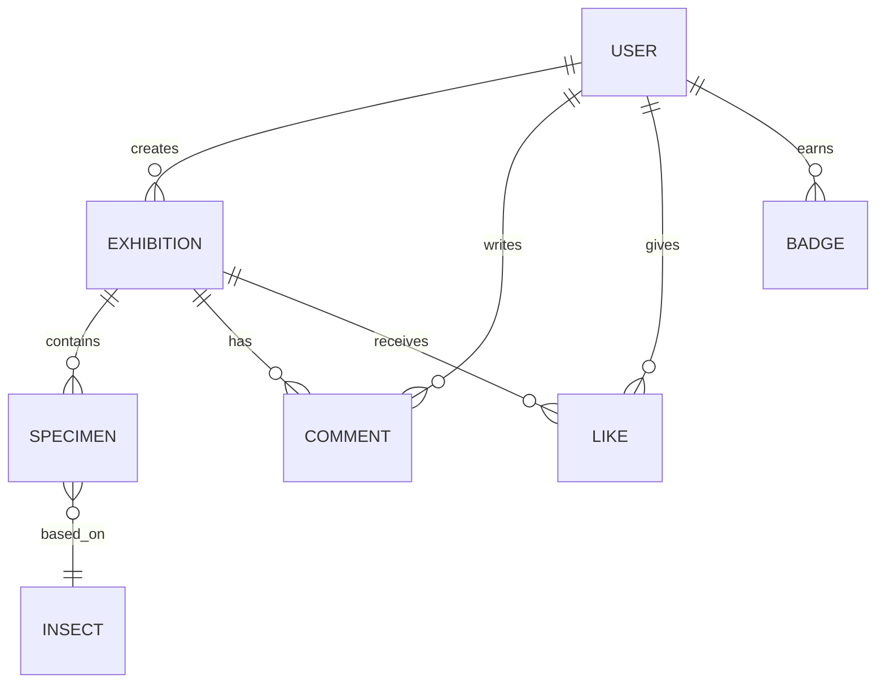

## 1. 架构设计

```mermaid
flowchart LR
    subgraph "客户端 (Browser)"
        A["React 18 + TypeScript"] --> B["Vite 5 (开发服务器]
        A --> C["Three.js 3D渲染引擎"]
        A --> D["Axios HTTP客户端"]
        E["localStorage 本地持久化"]
    end
    subgraph "服务端 (Node.js)"
        F["Express 4 API服务"]
        G["静态文件服务"]
        H["JSON文件数据库 (data.json)"]
    end
    A -->|REST API| F
    F -->|读写| H
    F -->|静态资源| G
```

## 2. 技术描述

- 前端框架：React@18.2.0 + TypeScript@5.5.0
- 构建工具：Vite@5.4.0 + @vitejs/plugin-react@4.2.0
- 3D渲染：three@0.160.0
- HTTP客户端：axios@1.6.0
- 后端框架：Express@4.18.2
- 数据存储：localStorage（前端） + JSON文件（后端data.json）
- 开发模式：前后端分离，Vite开发服务器通过代理转发API请求到Express后端（端口3001）

## 3. 路由定义（前端视图路由）

| 路由状态 | 对应组件 | 用途 |
|----------|----------|------|
| hall | ExhibitionHall | 公共展厅主页，3D展厅+展览列表 |
| workspace | Workspace | 个人工作区，标本制作与展柜布置 |
| view-exhibition | ExhibitionViewer | 查看单个展览详情与漫游 |
| collection | PersonalCollection | 个人收藏馆 |

## 4. API 定义

### 4.1 GET /api/insects

获取昆虫图鉴库数据

**响应格式：**
```typescript
interface Insect {
  id: string;
  name: string;           // 中文名称
  scientificName: string;     // 学名
  location: string;       // 发现地点
  description: string;      // 描述文字
  imageUrl: string;       // 512x512正方形虫体图片URL
}

// Response: Insect[]
```

### 4.2 POST /api/save

保存用户数据到服务器JSON文件

**请求格式：**
```typescript
interface UserData {
  username: string;
  exhibitions: Exhibition[];
  specimens: Specimen[];
  comments: Comment[];
  likes: Record<string, string[]>;
  badges: Badge[];
}

// Request Body: UserData
// Response: { success: boolean, message: string }
```

## 5. 数据模型

### 6.1 数据模型定义



### 6.2 核心数据类型

```typescript
interface User {
  username: string;
  createdAt: number;
}

interface Insect {
  id: string;
  name: string;
  scientificName: string;
  location: string;
  description: string;
  imageUrl: string;
}

interface Specimen {
  id: string;
  insectId: string;
  temperature: number;      // 灯光色温 2700-6500
  pose: 'symmetric' | 'flying' | 'resting';
  bgColor: string;
  hardness: number;     // 1-5
  position: number;   // 展柜格子索引 0-11
}

interface Exhibition {
  id: string;
  title: string;
  curator: string;
  createdAt: number;
  specimens: Specimen[];
  thumbnail: string;
  likes: number;
}

interface Comment {
  id: string;
  exhibitionId: string;
  author: string;
  content: string;
  createdAt: number;
}

interface Badge {
  id: string;
  name: string;
  description: string;
  icon: string;
  earnedAt: number;
}
```
