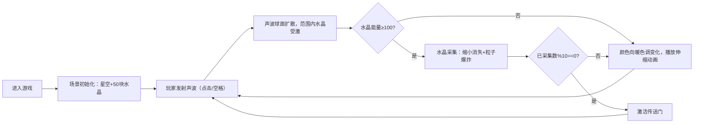

## 1. 产品概述

一款基于浏览器的3D声波水晶采集与生态交互游戏，玩家通过发射声波激活、采集外星球上的奇特水晶，解锁传送门探索更多星球。

- **目标用户**：休闲游戏玩家、3D交互体验爱好者
- **核心价值**：沉浸式的声波视觉效果、流畅的水晶生态交互反馈、轻松的采集探索玩法

## 2. 核心功能

### 2.1 功能模块

1. **主游戏场景**：3D星空背景、水晶阵列、声波粒子系统、传送门
2. **交互系统**：鼠标/键盘声波发射、水晶点击反馈、水波纹动画
3. **采集与进度系统**：水晶能量累积、采集计数、传送门解锁机制
4. **HUD界面**：声波能量圆形进度条、水晶采集计数

### 2.2 页面详情

| 页面名称 | 模块名称 | 功能描述 |
|---------|---------|---------|
| 游戏主页面 | 3D场景渲染 | 星空背景、50块水晶阵列、粒子效果 |
| 游戏主页面 | 声波交互 | 鼠标点击/空格发射声波球面，范围3单位 |
| 游戏主页面 | 水晶系统 | 颜色渐变、脉动动画、共振光柱、采集粒子爆炸 |
| 游戏主页面 | 传送门系统 | 每采集10块激活传送门，环形旋转+粒子流动 |
| 游戏主页面 | HUD界面 | 左上角能量进度条、采集计数文字 |

## 3. 核心流程

## 4. 用户界面设计

### 4.1 设计风格
- **主色调**：深紫色(#1a0030)到黑色(#000010)渐变背景
- **冷色调水晶**：蓝紫渐变 #4a00e0 → #8e2de2
- **暖色调水晶**：红橙黄渐变 #ff6b6b → #ffd93d
- **强调色**：品红 #ff00ff、青色 #00ffff
- **整体风格**：深空科幻、星云氛围、霓虹光效

### 4.2 页面设计概览

| 页面名称 | 模块名称 | UI元素 |
|---------|---------|--------|
| 游戏主页面 | 背景层 | 深紫到黑渐变 + 500个闪烁星辰粒子 |
| 游戏主页面 | 水晶层 | 八面体+十二面体混合几何体，冷/暖渐变发光材质 |
| 游戏主页面 | 声波效果层 | 半透明球面(#ff00ff)、粒子流、水波纹圆环 |
| 游戏主页面 | 传送门 | 环形几何体(Torus)，旋转动画+沿环流动粒子 |
| 游戏主页面 | HUD层 | 圆形进度条(60px直径)、白色文字计数 |

### 4.3 响应式
- 桌面端优先，全屏Canvas渲染
- HUD元素使用固定定位，自适应窗口尺寸

### 4.4 3D场景指导
- **环境**：纯黑深紫渐变背景，无HDRI，星辰粒子营造深空感
- **光照**：AmbientLight(0.3) + PointLight随水晶颜色动态变化
- **相机**：PerspectiveCamera，固定视角，轻微自动漂移增强沉浸感
- **交互**：鼠标位置投射到3D空间确定声波发射点
- **后处理**：无额外后处理，依靠材质emissive和AdditiveBlending实现发光感
- **性能预算**：同时渲染50水晶+≤200粒子，稳定30fps+
