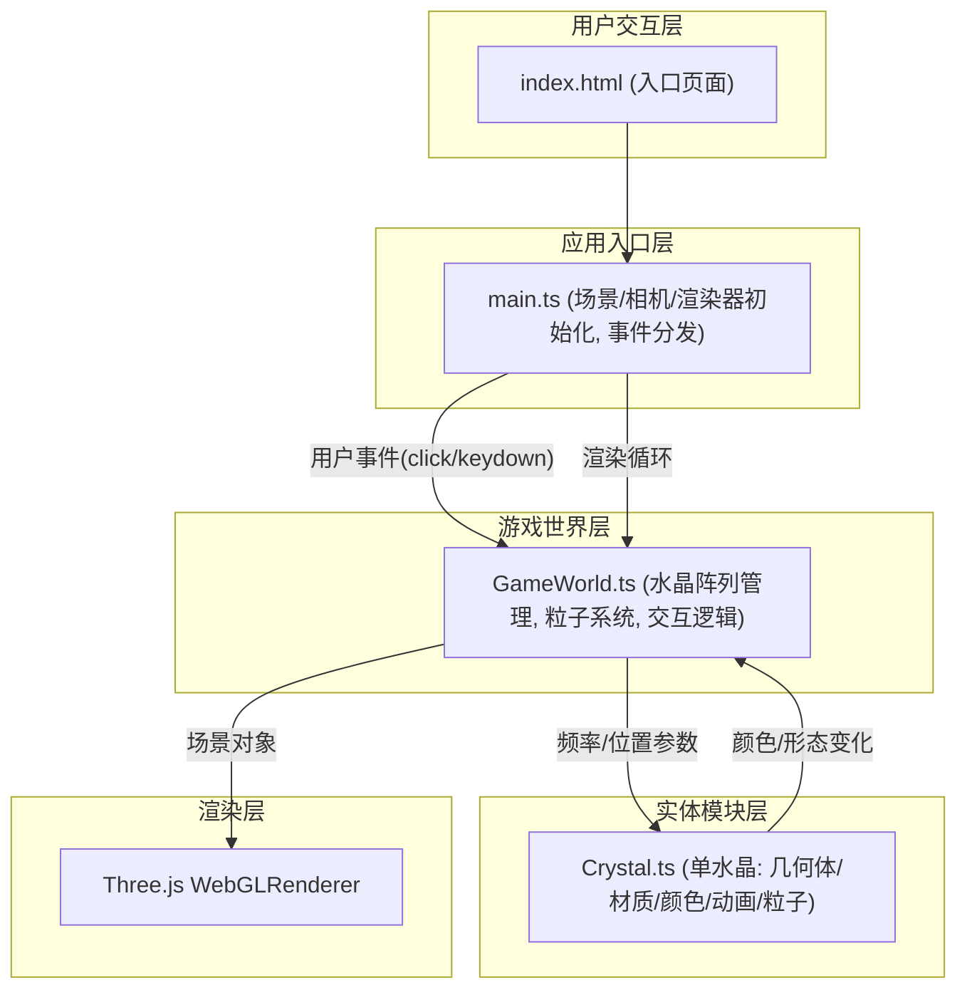

## 1. 架构设计



**数据流向**：
1. `main.ts` → `GameWorld.ts`：用户交互事件、每帧delta时间
2. `GameWorld.ts` → `Crystal.ts`：声波频率参数、位置信息
3. `Crystal.ts` → `GameWorld.ts`：水晶状态变化（颜色、能量、是否采集）
4. `GameWorld.ts` → Three.js Scene：水晶网格、粒子系统、传送门等渲染对象

## 2. 技术描述

- **前端框架**：原生TypeScript + Three.js (无React/Vue，按用户要求)
- **构建工具**：Vite@5.4.0
- **核心依赖**：
  - three@0.160.0 — 3D渲染引擎
  - simplex-noise@3.0.0 — 噪声算法（用于水晶脉动、粒子扰动）
  - typescript@5.5.0 — 类型系统
- **后端**：无，纯前端游戏
- **数据库**：无

## 3. 文件结构与职责

| 文件路径 | 职责 | 调用关系 |
|---------|------|---------|
| `package.json` | 依赖声明与脚本配置 | 被npm读取 |
| `vite.config.js` | Vite构建配置，TypeScript支持，静态资源路径 | 被Vite读取 |
| `tsconfig.json` | TypeScript严格模式配置，ES2020目标 | 被TSC读取 |
| `index.html` | 入口HTML，深紫渐变背景，Canvas容器 | 加载main.ts |
| `src/main.ts` | 初始化Scene/Camera/Renderer，注册事件监听，启动渲染循环，分发事件到GameWorld | 调用GameWorld |
| `src/GameWorld.ts` | 管理水晶阵列(50个)、声波粒子系统、传送门、共振光柱，处理交互逻辑，每帧更新 | 被main.ts调用，调用Crystal |
| `src/Crystal.ts` | 单个水晶类：混合几何体、渐变材质、声波感应动画、粒子发射器、能量累积 | 被GameWorld实例化 |

## 4. 核心数据模型

### Crystal 状态
```typescript
interface CrystalState {
  position: THREE.Vector3;    // 世界坐标
  size: number;               // 0.3-0.6
  energy: number;             // 0-100，累积声波能量
  collected: boolean;         // 是否已采集
  colorProgress: number;      // 0(冷色) - 1(暖色)
  pulsePhase: number;         // 自发脉动相位
  scaleAnimation: number;     // Y轴伸缩动画值
}
```

### SoundWave 声波
```typescript
interface SoundWave {
  center: THREE.Vector3;      // 发射中心
  radius: number;             // 当前半径(0-3)
  maxRadius: number;          // 最大半径=3
  life: number;               // 剩余生命周期(0-1秒)
  mesh: THREE.Mesh;           // 半透明球体
}
```

### Particle 粒子
```typescript
interface Particle {
  position: THREE.Vector3;
  velocity: THREE.Vector3;
  life: number;               // 剩余生命周期
  maxLife: number;
  size: number;
  color: THREE.Color;
}
```

## 5. 性能优化策略

1. **对象池**：声波粒子和采集粒子使用对象池复用，避免频繁GC
2. **合并几何体**：星辰背景使用单个BufferGeometry + Points
3. **材质复用**：同类水晶共享材质实例，仅修改uniforms
4. **距离剔除**：共振光柱检测仅遍历相邻水晶(空间哈希)
5. **帧率控制**：使用requestAnimationFrame + deltaTime，逻辑更新与渲染解耦
6. **粒子上限**：同时最多200个活动粒子，超出则回收最旧粒子
