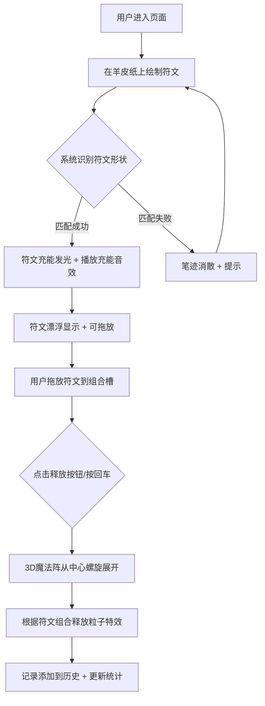

## 1. 产品概述

一款基于浏览器的虚拟咒语符文绘制与能量释放模拟器，用户可以像古代魔法师一样在虚拟羊皮纸上绘制符文符号，通过符文组合释放绚丽的魔法粒子特效。

- **核心价值**：提供沉浸式的魔法绘制体验，通过视觉、听觉的多重反馈让用户感受符文绘制与能量释放的乐趣
- **目标用户**：对魔法、神秘学主题感兴趣的普通用户，以及喜欢视觉特效和创意交互的用户

## 2. 核心功能

### 2.1 用户角色
无需注册登录，所有用户均为访客身份，直接使用全部功能。

### 2.2 功能模块
1. **符文绘制系统**：羊皮纸背景画布、金色笔触绘制、墨迹晕染动画、符文识别匹配
2. **能量释放系统**：六种基础符文特效、粒子动画、对象池管理
3. **连击组合系统**：符文拖放槽位、魔法阵展开动画、组合能量叠加效果
4. **历史记录统计**：绘制记录存档、统计面板、准确率计算
5. **音效反馈系统**：笔触声、充能声、释放爆炸声（Web Audio API 合成）

### 2.3 页面详情

| 页面名称 | 模块名称 | 功能描述 |
|----------|----------|----------|
| 主页面 | 羊皮纸绘制区 | 显示仿古羊皮纸背景，支持鼠标/触摸绘制符文，笔触带金色辉光，笔画结束有墨迹晕染 |
| 主页面 | 已绘制符文展示 | 绘制完成的符文漂浮在纸上，带柔和光晕和缓慢自转 |
| 主页面 | 符文组合槽 | 底部可拖放最多四个符文，支持排序和释放 |
| 主页面 | 3D魔法阵特效区 | 页面中央 Three.js 渲染的魔法阵和粒子特效 |
| 主页面 | 历史记录面板 | 左下角可滚动历史记录，显示时间戳、符文图标、能量类型 |
| 主页面 | 统计面板 | 右上角羊皮纸卷轴图标，点击展开显示总数、准确率、连击长度 |
| 主页面 | 背景层 | 夜晚星空渐变、闪烁星光、飘动极光薄雾 |

## 3. 核心流程

### 主流程：绘制符文 → 识别匹配 → 充能发光 → 拖入槽位 → 释放魔法

## 4. 用户界面设计

### 4.1 设计风格
- **主题风格**：中世纪魔法羊皮卷风格，神秘而华丽
- **主色调**：
  - 夜空背景：`#0a0020` → `#1a0050` 径向渐变
  - 羊皮纸色：`#eaddc0` → `#c8b896` 渐变
  - 金色笔触：`#ffd700` → `#ffaa00` 渐变
  - 符文充能色：红(`#ff4444`)、蓝(`#44aaff`)、黄(`#ffdd44`)、绿(`#44ff88`)、青(`#88ddff`)、紫(`#aa44ff`)
- **按钮**：带铜质纹理的圆形/矩形按钮，悬停有金属光泽动画
- **字体**：Georgia 衬线字体，营造古典氛围
- **动效**：所有过渡使用 ease-out 缓动，粒子动画 1.5 秒内完成

### 4.2 页面设计概览

| 页面名称 | 模块名称 | UI 元素 |
|----------|----------|---------|
| 主页面 | 夜空背景层 | 深蓝紫径向渐变、闪烁星光粒子、半透明极光曲线飘动（8秒周期） |
| 主页面 | 羊皮纸画布 | 仿古渐变+污渍噪声纹理+卷边阴影，占页面中央主要区域 |
| 主页面 | 符文组合槽 | 宽1200px × 高60px，半透明黑背景+金色边框，位于页面底部 |
| 主页面 | 历史记录区 | 宽300px × 高400px，可滚动，左下角，羊皮卷风格 |
| 主页面 | 统计面板 | 右上角羊皮纸卷轴图标，点击展开，显示统计数据 |
| 主页面 | 3D 特效层 | Three.js 全屏 Canvas，z-index 置于 UI 和背景之间 |

### 4.3 响应式
- 桌面端优先设计，主画布区域保持 4:3 比例
- 触摸设备支持手指绘制
- 符文槽在小屏幕自适应宽度

### 4.4 3D 场景指引
- **环境**：黑色透明背景，与夜空背景融合
- **光照**：AmbientLight + 对应符文颜色的 PointLight
- **相机**：PerspectiveCamera，固定位置正对魔法阵中心
- **魔法阵动画**：光芒纹路从中心螺旋扩散，0.8-1.2 秒 ease-out
- **粒子系统**：BufferGeometry + PointsMaterial，对象池管理，最多 800 个粒子
