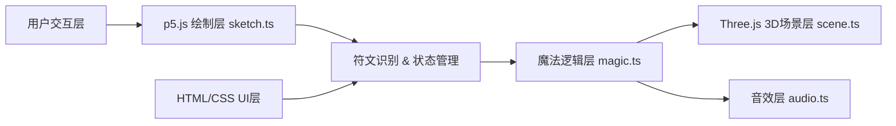

## 1. 架构设计



**分层说明**：
- **用户交互层**：鼠标/触摸事件，由 p5.js 和 DOM 事件处理
- **p5.js 绘制层**：羊皮纸背景、2D 符文绘制、UI 绘制、笔迹跟踪
- **魔法逻辑层**：符文数据定义、形状匹配、组合逻辑、粒子对象池
- **Three.js 3D场景层**：魔法阵渲染、3D 粒子系统
- **音效层**：Web Audio API 合成各种音效
- **HTML/CSS UI层**：符文槽、历史记录、统计面板的 DOM 结构和样式

## 2. 技术描述

- **前端框架**：无额外框架，使用原生 TypeScript
- **2D 绘制**：p5@1.9.0
- **3D 渲染**：three@0.160.0
- **开发语言**：TypeScript@5.5.0（严格模式，ES2020 目标）
- **构建工具**：Vite@5.4.0
- **音频**：Web Audio API（无外部音频文件）
- **样式**：原生 CSS（中世纪羊皮卷风格）

## 3. 文件结构

```
project-root/
├── package.json
├── tsconfig.json
├── vite.config.js
├── index.html
└── src/
    ├── sketch.ts      # p5.js 主绘制逻辑
    ├── magic.ts       # 符文数据、组合逻辑、粒子管理、对象池
    ├── scene.ts       # Three.js 场景、魔法阵、粒子渲染
    └── audio.ts       # Web Audio API 音效生成
```

## 4. 核心数据模型

### 4.1 符文类型定义

```typescript
type RuneType = 'fire' | 'ice' | 'lightning' | 'heal' | 'wind' | 'star';

interface RuneDef {
  type: RuneType;
  name: string;            // 中文名称
  shape: string;           // 几何形状描述 triangle/hexagon/lightning/heart/spiral/star
  color: string;           // 充能颜色 hex
  particles: number;       // 基础粒子数量
  effect: ParticleEffect;  // 粒子效果类型
}

interface DrawnRune {
  id: string;
  type: RuneType;
  points: Point[];         // 绘制的笔迹点
  center: { x: number; y: number };
  rotation: number;
  rotationSpeed: number;
  createdAt: number;
  matched: boolean;
}

interface HistoryItem {
  timestamp: number;
  runeTypes: RuneType[];   // 组合序列
  isCombo: boolean;
  success: boolean;
}

interface Stats {
  totalDrawn: number;
  totalReleased: number;
  successfulMatches: number;
  maxComboLength: number;
}
```

### 4.2 粒子对象池

```typescript
interface Particle {
  active: boolean;
  position: THREE.Vector3;
  velocity: THREE.Vector3;
  color: THREE.Color;
  size: number;
  life: number;       // 剩余寿命 0-1
  maxLife: number;
}

class ParticlePool {
  pool: Particle[];
  maxSize: 800;
  acquire(): Particle;
  release(p: Particle): void;
  update(dt: number): void;
}
```

## 5. 符文组合效果映射

| 组合 | 效果名称 | 颜色插值 | 粒子数 | 特殊效果 |
|------|----------|----------|--------|----------|
| 火焰 + 冰霜 | 蒸汽云 | 红→白插值 | 400 | 白色雾气扩散 |
| 治愈 + 星辰 | 金光雨 | 绿→金插值 | 350 | 金色光点下落 |
| 闪电 + 风 | 雷暴 | 黄→青插值 | 450 | 闪电链 + 涡流 |
| 任意三符文 | 元素风暴 | 多色混合 | 500 | 多彩粒子爆炸 |
| 任意四符文 | 终极魔法 | 全色光谱 | 600 | 魔法阵持续旋转 |

## 6. 性能优化策略

1. **粒子对象池**：预分配 800 个粒子，避免频繁 GC
2. **p5.js 离屏缓存**：羊皮纸背景绘制到 PGraphics 缓存
3. **Three.js BufferGeometry**：使用单个 Points 渲染所有粒子，减少 draw call
4. **帧率控制**：requestAnimationFrame 驱动，使用 dt 时间步长
5. **粒子生命周期**：1.5 秒内完成，自动回收
6. **触摸/鼠标事件节流**：避免事件处理过于频繁
