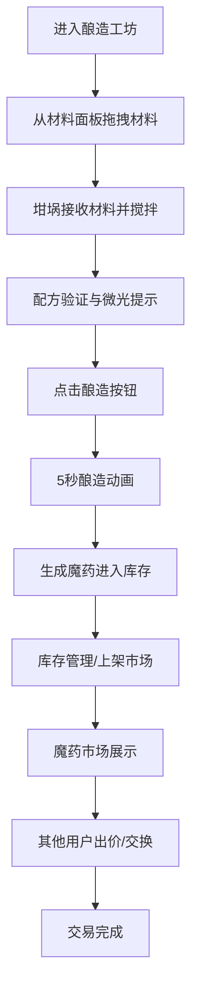

## 1. 产品概述

虚拟魔药工坊是一款基于浏览器的全栈模拟交易应用，让用户化身中世纪炼金术师，收集魔法材料、酿造魔药并在公共市场进行交易。核心目标是提供沉浸式的魔幻酿造体验和互动交易系统。

## 2. 核心功能

### 2.1 用户角色

| 角色 | 注册方式 | 核心权限 |
|------|----------|----------|
| 炼金术师 | 本地匿名登录 | 收集材料、酿造魔药、上架/购买/交换魔药、管理库存 |

### 2.2 功能模块

1. **酿造工坊页**：坩埚酿造、材料面板、配方面板、酿造动画
2. **魔药市场页**：魔药卡片展示、出价系统、配方交换、详情弹窗
3. **库存主页**：收藏柜展示、分类筛选、重命名、丢弃

### 2.3 页面详情

| 页面名称 | 模块名称 | 功能描述 |
|----------|----------|----------|
| 酿造工坊 | 石制坩埚 | 3D圆柱体、液体变色混合、气泡粒子、搅拌动画、微光提示 |
| 酿造工坊 | 材料面板 | 10种魔法材料、图标/名称/稀有度标识、拖拽操作 |
| 酿造工坊 | 古卷配方面板 | 羊皮纸风格、5个初始配方、配方正确性实时验证 |
| 魔药市场 | 魔药卡片列表 | 玻璃药瓶造型、3D瓶身、响应式横向滚动/网格布局 |
| 魔药市场 | 详情弹窗 | 魔药属性、配方来源、出价记录、出价提交、配方交换 |
| 库存主页 | 收藏柜 | 书架样式、翻页效果、6槽位/页、分类筛选 |
| 库存主页 | 魔药操作 | 右键菜单、重命名、丢弃碎瓶动画 |
| 全局 | 反馈系统 | 加载进度条、成功/错误提示、按钮交互动效、卡片涟漪效果 |

## 3. 核心流程

用户在酿造工坊拖拽魔法材料到坩埚中，系统根据配方验证材料组合，完成后点击酿造按钮触发酿造动画生成魔药。用户可将魔药上架至公共市场，其他炼金术师可浏览魔药卡片、查看详情、出价购买或发起配方交换。用户可在库存收藏柜中管理所有魔药，支持分类筛选、重命名和丢弃操作。

## 4. 用户界面设计

### 4.1 设计风格

- **主色调**：深紫 #1a0a2a、暗金 #b8860b、暗红 #8b0000
- **辅助色**：羊皮纸暖黄 #eaddc0、渐变橙 #ff7700→#ffaa00、成功绿 #33cc66、错误红 #cc3333
- **按钮风格**：圆角8px、悬停放大1.05倍（0.3秒缓动）、点击缩放至0.9还原
- **字体**：Georgia衬线字体，标题24px加粗，正文16px
- **布局风格**：左右分栏（70%主内容 / 30%右侧面板），卡片式设计，圆角8px，微弱阴影（扩散4px，不透明度0.3）
- **动效风格**：requestAnimationFrame驱动，粒子系统，涟漪效果，浮动动画

### 4.2 页面设计概述

| 页面名称 | 模块名称 | UI元素 |
|----------|----------|--------|
| 酿造工坊 | 坩埚区 | 3D圆柱体（高200px/直径160px）、深灰渐变纹理、裂纹叠加、液体变色、气泡粒子、金色微光呼吸动画、烟雾粒子、底部进度条 |
| 酿造工坊 | 材料面板 | 10个材料卡片、图标+名称+稀有度颜色标识、可拖拽、200px缓冲区 |
| 酿造工坊 | 配方面板 | 羊皮纸背景#eaddc0、卷边效果、5个配方列表、材料高亮指示 |
| 魔药市场 | 卡片列表 | 深木色背景#5a3a1a→#8b5e3c、横向滚动、玻璃药瓶（高80px）、瓶塞颜色类型、悬停上浮5px+增亮10%、涟漪效果 |
| 魔药市场 | 详情弹窗 | 半透明遮罩、魔药属性、配方来源、出价记录列表、价格输入框、出价按钮（点击缩放0.95）、交换按钮 |
| 库存主页 | 收藏柜 | 书架样式、翻页效果、6槽位/页、方形卡片缩略图、分类筛选器（效果/稀有度/材料） |
| 库存主页 | 操作菜单 | 右键菜单、重命名输入框、丢弃确认、碎瓶粒子消散动画（0.8秒） |

### 4.3 响应式

桌面优先设计，宽度<768px时市场页面横向滚动改为纵向网格布局，左右分栏改为上下堆叠。

### 4.4 视觉特效

- **坩埚搅拌**：液体颜色按配方比例混合渐变，气泡粒子大小渐变、颜色混合、2秒消失
- **配方正确**：坩埚边缘微光渐强至#ffd700，1.5秒呼吸动画
- **酿造动画**：液体旋转，烟雾粒子从深紫#4a0060渐变至透明，5秒
- **卡片悬停**：向上浮动5px，亮度增加10%
- **点击涟漪**：从点击中心扩散的波纹效果
- **碎瓶动画**：粒子四散消散，0.8秒
