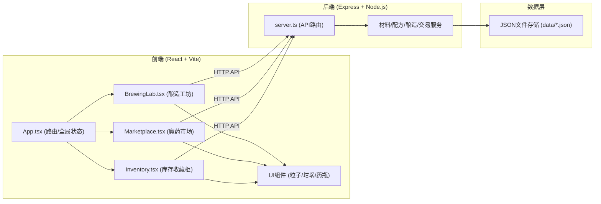
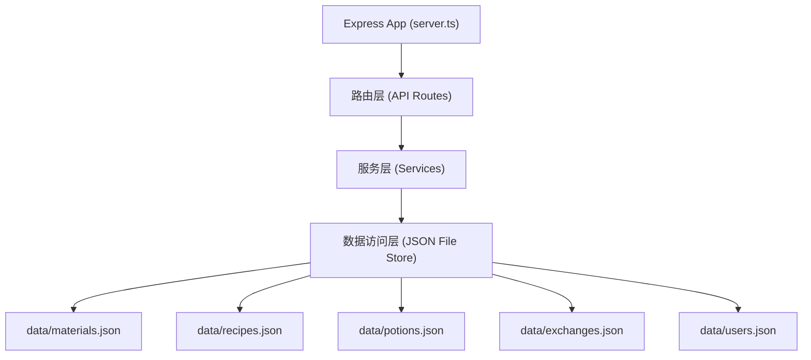
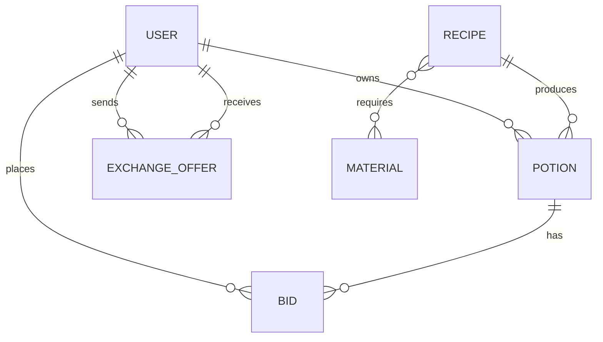

## 1. 架构设计



## 2. 技术说明

- **前端**：React@18.2.0 + React-DOM@18.2.0 + TypeScript@5.5.0 + Vite@5.4.0 + react-router-dom@6.20.0
- **构建工具**：Vite@5.4.0，使用 @vitejs/plugin-react@4.2.0 处理React和TypeScript
- **后端**：Express@4.18.2 + Node.js，使用cors@2.8.5处理跨域
- **数据存储**：JSON文件持久化（低延迟文件存储模拟数据库），使用uuid@9.0.0生成唯一ID
- **状态管理**：React Context + useReducer 实现全局状态
- **动画引擎**：requestAnimationFrame 驱动的自定义粒子系统
- **启动脚本**：npm run dev 同时启动前后端

## 3. 路由定义

| 路由 | 用途 |
|------|------|
| / | 酿造工坊主页 |
| /market | 魔药交易市场 |
| /inventory | 库存收藏柜 |

## 4. API定义

### 4.1 TypeScript类型定义

```typescript
// 魔法材料
interface Material {
  id: string;
  name: string;
  icon: string;
  rarity: 'common' | 'uncommon' | 'rare' | 'epic' | 'legendary';
  color: string;
  rarityColor: string;
}

// 配方
interface Recipe {
  id: string;
  name: string;
  description: string;
  materials: string[];
  resultPotion: {
    name: string;
    effect: string;
    color: string;
    rarity: string;
    basePrice: number;
  };
}

// 魔药
interface Potion {
  id: string;
  name: string;
  effect: string;
  color: string;
  rarity: string;
  volume: number;
  recipeId: string;
  ownerId: string;
  ownerName: string;
  createdAt: number;
  listed: boolean;
  price?: number;
  bidHistory: Bid[];
}

// 出价记录
interface Bid {
  id: string;
  bidderId: string;
  bidderName: string;
  price: number;
  timestamp: number;
}

// 配方交换邀请
interface ExchangeOffer {
  id: string;
  fromUserId: string;
  toUserId: string;
  offeredRecipeId: string;
  requestedRecipeId: string;
  status: 'pending' | 'accepted' | 'rejected';
  timestamp: number;
}

// 酿造请求
interface BrewRequest {
  materials: string[];
  userId: string;
}

// 酿造响应
interface BrewResponse {
  success: boolean;
  potion?: Potion;
  recipe?: Recipe;
  message?: string;
}

// 通用响应
interface ApiResponse<T> {
  success: boolean;
  data?: T;
  message?: string;
}
```

### 4.2 API端点

| 方法 | 路径 | 说明 |
|------|------|------|
| GET | /api/materials | 获取所有魔法材料列表 |
| GET | /api/recipes | 获取所有配方列表 |
| POST | /api/brew | 提交酿造请求，材料组合计算 |
| GET | /api/potions | 获取所有上架魔药列表 |
| GET | /api/potions/:id | 获取魔药详情 |
| GET | /api/users/:userId/potions | 获取用户库存魔药 |
| POST | /api/potions/:id/list | 将魔药上架至市场 |
| POST | /api/potions/:id/unlist | 将魔药从市场下架 |
| POST | /api/potions/:id/bid | 对魔药出价 |
| POST | /api/potions/:id/rename | 重命名魔药 |
| DELETE | /api/potions/:id | 丢弃魔药 |
| POST | /api/exchange | 发起配方交换邀请 |
| GET | /api/users/:userId/exchanges | 获取用户交换邀请列表 |

## 5. 服务端架构



## 6. 数据模型

### 6.1 ER图



### 6.2 JSON数据结构

#### materials.json
```json
{
  "materials": [
    {
      "id": "moonflower",
      "name": "月光花",
      "icon": "🌸",
      "rarity": "uncommon",
      "color": "#c0c0ff",
      "rarityColor": "#1eff00"
    }
  ]
}
```

#### recipes.json
```json
{
  "recipes": [
    {
      "id": "invisibility",
      "name": "隐身药剂",
      "description": "饮下后可隐匿身形30分钟",
      "materials": ["moonflower", "dragonscale", "nightdew"],
      "resultPotion": {
        "name": "隐身药剂",
        "effect": "隐身",
        "color": "#88ccff",
        "rarity": "rare",
        "basePrice": 150
      }
    }
  ]
}
```

#### potions.json
```json
{
  "potions": [
    {
      "id": "uuid-potion-1",
      "name": "隐身药剂",
      "effect": "隐身",
      "color": "#88ccff",
      "rarity": "rare",
      "volume": 100,
      "recipeId": "invisibility",
      "ownerId": "user-1",
      "ownerName": "炼金学徒",
      "createdAt": 1717900000000,
      "listed": true,
      "price": 200,
      "bidHistory": []
    }
  ]
}
```
